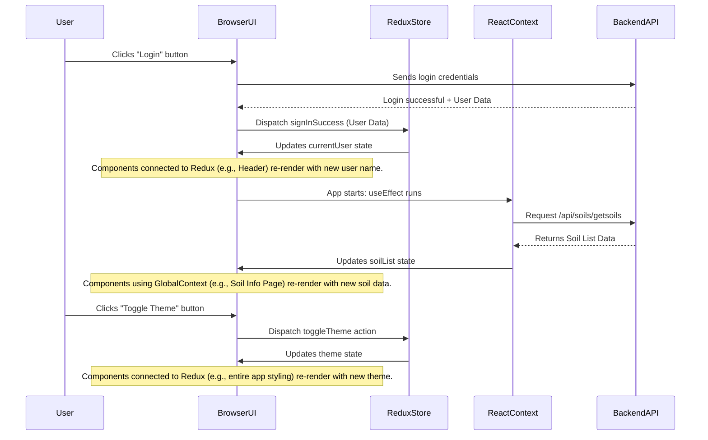

# Chapter 1: Client-Side State Management

Imagine you're using a website, and you log in. You expect your name to appear in the top corner, your personalized dashboard to load, and if you switch to dark mode, you want the whole site to change instantly. What if you close your browser tab and open it again? You'd probably expect to still be logged in, or at least for the dark mode setting to be remembered.

This is where **Client-Side State Management** comes in! Think of it as your web application's "short-term memory" right inside your web browser. It's how the application remembers important details about you, your preferences, and the data it's currently showing, so everything stays updated and synchronized as you use it.

## What is "State"?

In simple terms, "state" is any data that can change over time in your application. For `agri-credit`, this includes:

- **Who is logged in:** Is it an administrator, a farmer, or no one?
- **The theme:** Is the app currently in light mode or dark mode?
- **Lists of items:** What are the available types of soil, crops, or fertilizers?
- **Your location:** Where is the user currently located (latitude and longitude)?

Managing this "state" ensures that when one part of the app updates (e.g., you log in), other parts that need this information (like your profile picture in the header) automatically show the correct, up-to-date data.

The `agri-credit` project uses two main tools for managing this short-term memory: **Redux** and **React Context**. Let's explore why we use both and what each is good for.

## Redux: The Central Information Hub

Think of Redux as the **central library** for your entire `agri-credit` application. It holds all the really important, global information that many different parts of the app might need to access or change.

### Why Redux?

- **Global Data:** Best for data that needs to be available almost anywhere in your application, like user login status, the current theme, or global settings.
- **Predictable Changes:** It has strict rules for how data can be changed, which makes your app more predictable and easier to debug.
- **Scalability:** Great for larger applications with many different components sharing data.

### How it Works (Simplified)

Redux has a "store" that holds all the state. To change the state, you don't just directly edit it. Instead, you "dispatch" an "action" (like sending a request to the library). A "reducer" (like a librarian following instructions) then takes that action and updates the state in a specific way.

Let's look at how Redux manages your user's login status and the app's theme.

**Use Case: User Login and Theme Toggle**

Imagine a user logs into `agri-credit`. Their login status and details (like their name and ID) need to be known by the header (to show their name), the profile page, and potentially other parts of the app. Also, they might want to toggle between a light and dark theme, and this preference should also be known globally.

**Input:** User enters credentials and clicks "Login". User clicks a "Dark Mode" toggle.

**Output:**

- User's name appears in the navigation bar.
- The entire application's color scheme changes to dark.

### Code in Action (Redux Slices)

In Redux, we organize related pieces of state into "slices."

#### 1. User State Management (`client/src/redux/user/userSlice.js`)

This file defines how information about the `currentUser` (the logged-in user), any `error` during sign-in, and the `loading` status are managed.

```javascript
// client/src/redux/user/userSlice.js
import { createSlice } from "@reduxjs/toolkit";

const initialState = {
  currentUser: null, // No one logged in initially
  error: null,
  loading: false,
};

const userSlice = createSlice({
  name: "user", // Name of this slice
  initialState,
  reducers: {
    // When a sign-in is successful:
    signInSuccess: (state, action) => {
      state.currentUser = action.payload; // Store user data
      state.loading = false; // Stop loading
      state.error = null; // Clear any errors
    },
    // Other actions like signInStart, signInFailure, update, delete, signout...
  },
});

export const { signInSuccess } = userSlice.actions;
export default userSlice.reducer;
```

This code snippet shows a "slice" of our Redux state specifically for user-related information. The `signInSuccess` function is a "reducer" that tells Redux exactly how to update the `currentUser` data when a user successfully logs in.

#### 2. Theme State Management (`client/src/redux/theme/themeSlice.js`)

Similar to the user slice, this manages the application's theme.

```javascript
// client/src/redux/theme/themeSlice.js
import { createSlice } from "@reduxjs/toolkit";

const initialState = {
  theme: "light", // Default theme is light
};

const themeSlice = createSlice({
  name: "theme",
  initialState,
  reducers: {
    // When the theme needs to be toggled:
    toggleTheme: (state) => {
      // If current theme is light, change to dark, otherwise change to light
      state.theme = state.theme === "light" ? "dark" : "light";
    },
  },
});

export const { toggleTheme } = themeSlice.actions;
export default themeSlice.reducer;
```

Here, the `toggleTheme` reducer simply flips the `theme` value between 'light' and 'dark'. Any component in the app that cares about the `theme` will automatically re-render when this changes.

#### 3. Combining Slices into the Redux Store (`client/src/redux/store.js`)

All these individual slices (user, theme, and others you might add later) are combined into one big Redux "store." This `store.js` file also sets up something called `redux-persist`, which helps save your state to the browser's local storage so it remembers your login or theme even if you close and reopen the browser.

```javascript
// client/src/redux/store.js
import { combineReducers, configureStore } from "@reduxjs/toolkit";
import userReducer from "./user/userSlice";
import themeReducer from "./theme/themeSlice";
import { persistReducer, persistStore } from "redux-persist";
import storage from "redux-persist/lib/storage";

const rootReducer = combineReducers({
  user: userReducer, // User state handled by userReducer
  theme: themeReducer, // Theme state handled by themeReducer
});

const persistConfig = {
  key: "root", // Key for storing in local storage
  storage, // Use browser's local storage
  version: 1,
};

const persistedReducer = persistReducer(persistConfig, rootReducer);

export const store = configureStore({
  reducer: persistedReducer, // Our combined and persisted reducers
  // ... other middleware configurations
});

export const persistor = persistStore(store);
```

This code creates the main Redux `store`. `combineReducers` brings together all our "slices" (like `user` and `theme`) into a single state object. `redux-persist` then wraps this, making sure your Redux state can be saved and loaded from your browser's memory, so your theme or login status isn't lost when you close the tab.

#### 4. Making Redux Available (`client/src/main.jsx`)

Finally, to make the Redux store available to our entire application, we wrap our main `App` component with a `<Provider>` from `react-redux`. The `<PersistGate>` ensures that our Redux state is loaded from storage before the app fully renders.

```javascript
// client/src/main.jsx
import { createRoot } from "react-dom/client";
import App from "./App.jsx";
import "./index.css";
import { store, persistor } from "./redux/store"; // Import our Redux store
import { Provider } from "react-redux"; // Redux provider
import { PersistGate } from "redux-persist/integration/react"; // For persistent state
// ... other imports for ThemeProvider, ToastContainer, GlobalContext

createRoot(document.getElementById("root")).render(
  <StrictMode>
    <Provider store={store}>
      {" "}
      {/* Make Redux store available */}
      <PersistGate loading={null} persistor={persistor}>
        {" "}
        {/* Load persisted state */}
        {/* ... other context providers and App */}
        <App />
      </PersistGate>
    </Provider>
  </StrictMode>
);
```

By wrapping `<App />` with `<Provider store={store}>`, we make sure that any component within our `agri-credit` app can access the Redux state and dispatch actions to change it.

## React Context: Localized Information Boards

While Redux is great for global, application-wide data, sometimes you have information that's only needed by a specific group of components, or that changes very frequently. This is where **React Context** shines.

Think of React Context as a **local notice board** or a **family bulletin board**. It's perfect for sharing data among components that are related or nested together, without having to pass the data "props" down manually through many layers (a problem known as "prop drilling").

### Why React Context?

- **Local Sharing:** Ideal for data that's shared within a specific part of your component tree, but not necessarily across the entire application.
- **Simpler Setup:** Generally requires less setup compared to Redux for simpler data sharing.
- **Frequent Updates:** Good for data that changes often but only affects a limited scope.

### How it Works (Simplified)

You create a "Context" which is like an empty container for your data. Then, a "Provider" component wraps the parts of your app that need access to this data and provides the actual values. Any component inside the Provider can then "consume" (read) those values using a special React hook called `useContext`.

**Use Case: Sharing Agricultural Data and User Location**

The `agri-credit` app needs to display lists of soils, crops, fertilizers, and even the user's current location to calculate distances to nearby resources. This data might be fetched once when the app starts or when the user's location changes. This data is used by various pages, but it's not as "global" as the logged-in user or theme settings.

**Input:** Application loads, user allows location access.

**Output:**

- A list of available soil types is displayed on the "Soil Information" page.
- The user's current latitude and longitude are known, allowing the app to calculate distances to nearby resources like nurseries or tractors.

### Code in Action (React Context)

In `agri-credit`, we use a `GlobalContext` to manage various lists of agricultural data and user-specific information.

#### 1. Defining the Global Context (`client/src/context/GlobalState.jsx`)

This file creates a `GlobalContext` and a `GlobalProvider` component. The `GlobalProvider` fetches various lists (like soils, crops, fertilizers) and the user's location when the application starts (`useEffect`). It then makes all this data available to its child components.

```javascript
// client/src/context/GlobalState.jsx
import React, { createContext, useEffect, useState } from "react";
import { useSelector } from "react-redux"; // We can even access Redux state here!

const GlobalContext = createContext(); // Create the context

const GlobalProvider = ({ children }) => {
  const { currentUser } = useSelector((state) => state.user); // Get user from Redux

  // State variables for various lists and user location
  const [userLatitude, setUserLatitude] = useState(null);
  const [userLongitude, setUserLongitude] = useState(null);
  const [soilList, setSoilList] = useState([]);
  const [cropList, setCropList] = useState([]);
  // ... many other state variables for different lists

  useEffect(() => {
    // Functions to fetch initial data when component mounts
    getCurrentLocation(); // Get user's GPS location
    getAllSoils(); // Fetch list of soils from backend
    getAllCrops(); // Fetch list of crops from backend
    // ... call other data fetching functions
  }, []); // Run only once on mount

  // Example function to fetch soils
  const getAllSoils = async () => {
    try {
      const res = await fetch("/api/soils/getsoils");
      const soils = await res.json();
      if (res.ok) {
        setSoilList(soils); // Update the state
        console.log("Soil list fetched successfully");
      }
    } catch (error) {
      console.log(error);
    }
  };

  // ... other data fetching functions and utility functions like calculateDistance

  return (
    <GlobalContext.Provider
      value={{
        soilList, // Make soilList available
        cropList, // Make cropList available
        userLatitude, // Make userLatitude available
        userLongitude, // Make userLongitude available
        // ... make other states and functions available
      }}
    >
      {children} {/* Render child components that can access this context */}
    </GlobalContext.Provider>
  );
};

export default GlobalProvider;
export { GlobalContext }; // Export context for components to use
```

This `GlobalProvider` component acts as the "source" of our context data. It fetches initial data (like `soilList` or `userLatitude`) using `useEffect` when the app loads. Then, it uses `<GlobalContext.Provider>` to pass these values down to any component wrapped by it. Notice how it even uses `useSelector` to get `currentUser` from Redux, showing how Redux and Context can work together!

#### 2. Making Global Context Available (`client/src/main.jsx`)

Just like with Redux, the `GlobalContext` provider needs to wrap the `App` component so that all the components within the application can access the data it provides.

```javascript
// client/src/main.jsx (partial view, focusing on context providers)
import { StrictMode } from "react";
import { createRoot } from "react-dom/client";
import App from "./App.jsx";
// ... Redux imports

import GlobalContext from "./context/GlobalState.jsx"; // Import our GlobalContext provider

createRoot(document.getElementById("root")).render(
  <StrictMode>
    {/* Redux Provider */}
    <Provider store={store}>
      <PersistGate loading={null} persistor={persistor}>
        {/* Global Context Provider */}
        <GlobalContext>
          {" "}
          {/* Make GlobalContext data available */}
          {/* Theme Provider */}
          <ThemeProvider>
            <App />
            <ToastContainer />
          </ThemeProvider>
        </GlobalContext>
      </PersistGate>
    </Provider>
  </StrictMode>
);
```

Here, `GlobalContext` wraps `ThemeProvider` and `App`, meaning all the components inside `App` can now use the data provided by `GlobalContext` (like `soilList` or `userLatitude`).

## Redux vs. React Context: A Quick Comparison

Both Redux and React Context help manage state, but they are used for different scenarios.

| Feature        | Redux                                                         | React Context                                                                                          |
| :------------- | :------------------------------------------------------------ | :----------------------------------------------------------------------------------------------------- |
| **Analogy**    | Central Library/Global Database                               | Local Notice Board/Family Bulletin                                                                     |
| **Best For**   | Global, app-wide state (user, theme, app-wide settings)       | Local state, data shared between related components (e.g., specific lists, user location in a section) |
| **Complexity** | More initial setup/boilerplate, but powerful for complex apps | Simpler to set up for basic sharing, can become complex for very wide sharing                          |
| **Data Flow**  | Centralized, predictable changes via actions and reducers     | Top-down, within a specific component tree, direct state updates                                       |

In `agri-credit`, we use Redux for user authentication and theme (data that truly affects the _entire_ app) and React Context for more specific data lists (like soils, crops, user's current location) that are shared across various _sections_ or pages but might not need the full power of a global state management library for every single change.

## How it All Comes Together: A Simplified Flow

Let's trace how state changes happen in `agri-credit` using both Redux and React Context.



1.  **User Logs In (Redux Example):**

    - The `User` interacts with the `BrowserUI` (e.g., fills a login form).
    - The `BrowserUI` sends the login details to the `BackendAPI`.
    - The `BackendAPI` authenticates and sends back `User Data`.
    - The `BrowserUI` then "dispatches" an action (`signInSuccess`) to the `ReduxStore` with the `User Data`.
    - The `ReduxStore` updates its `currentUser` state.
    - Any part of the `BrowserUI` that "listens" to the `currentUser` state in Redux (like the user's name in the header) automatically updates.

2.  **App Loads and Fetches Data (React Context Example):**
    - When the `BrowserUI` first loads, the `useEffect` hook inside the `ReactContext` (our `GlobalProvider`) is triggered.
    - `ReactContext` requests `Soil List Data` from the `BackendAPI`.
    - The `BackendAPI` responds with the data.
    - `ReactContext` updates its `soilList` state.
    - Any part of the `BrowserUI` that uses this `GlobalContext` (like a page displaying soil types) automatically shows the fetched data.

## Looking Ahead

Understanding client-side state management is crucial because it forms the backbone of how your `agri-credit` application keeps track of everything happening on the user's screen. Whether it's knowing who's logged in or displaying the latest crop information, state management ensures a smooth and responsive user experience.

In the next chapter, we'll dive deeper into how `agri-credit` specifically handles [User Authentication & Authorization](02_user_authentication___authorization_.md), building upon the `currentUser` state we just learned about in Redux.

---

<sub><sup>**References**: [[1]](https://github.com/Manoj10211021/agri-credit/blob/9d43941dd9dfa32fef910d092ca049039ee713eb/client/src/context/GlobalState.jsx), [[2]](https://github.com/Manoj10211021/agri-credit/blob/9d43941dd9dfa32fef910d092ca049039ee713eb/client/src/main.jsx), [[3]](https://github.com/Manoj10211021/agri-credit/blob/9d43941dd9dfa32fef910d092ca049039ee713eb/client/src/redux/store.js), [[4]](https://github.com/Manoj10211021/agri-credit/blob/9d43941dd9dfa32fef910d092ca049039ee713eb/client/src/redux/theme/themeSlice.js), [[5]](https://github.com/Manoj10211021/agri-credit/blob/9d43941dd9dfa32fef910d092ca049039ee713eb/client/src/redux/user/userSlice.js)</sup></sub>
