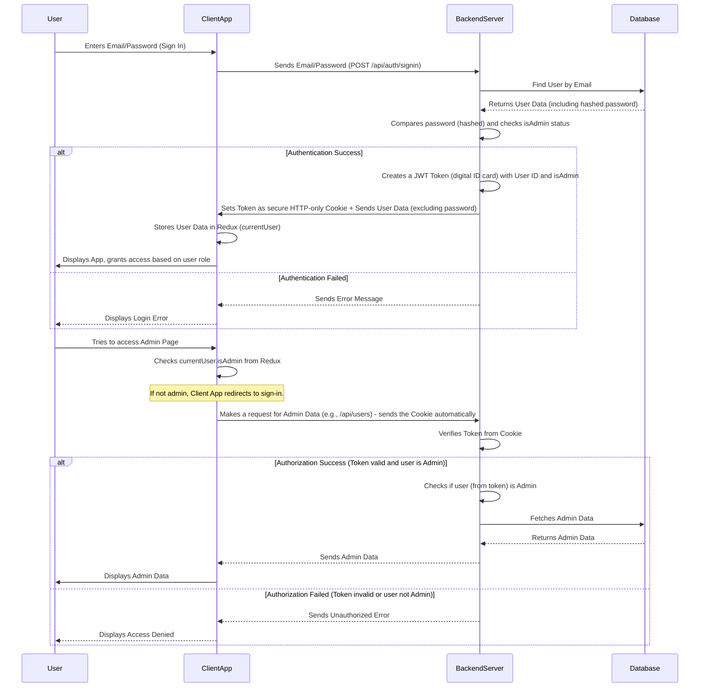

# Chapter 2: User Authentication & Authorization

In the previous chapter, [Client-Side State Management](01_client_side_state_management_.md), we learned how the `agri-credit` application keeps track of important information directly in your browser, like whether you're logged in (`currentUser` in Redux) or what theme you prefer. But how does the app _know_ who you are in the first place? And once it knows, how does it decide what you're allowed to do?

This is where **User Authentication & Authorization** comes in! Think of it as the highly secure "security checkpoint" for our `agri-credit` application. It's vital for protecting sensitive farming data, ensuring only the right people can access certain features, and keeping your information safe.

## What Problem Does it Solve?

Imagine `agri-credit` has different users: farmers, agricultural experts, and administrators.

- A farmer should be able to view their own crop data and resource bookings.
- An agricultural expert might be able to offer advice and view public crop information.
- An administrator should be able to manage all user accounts, add new crop types to the knowledge base, or modify system settings.

Without authentication and authorization, anyone could pretend to be an administrator and potentially delete important data or view private information. This system ensures that only verified users can access what they're permitted to.

## Key Concepts

User authentication and authorization are often talked about together, but they are two distinct steps:

1.  **Authentication: "Who Are You?"**
    This is the process of _verifying_ a user's identity. When you sign in to `agri-credit` with your email and password, the system is authenticating you. It's like showing your ID card at a checkpoint.

    - **Signing Up:** Creating a new account by providing details like username, email, and password. The password isn't stored directly; instead, a scrambled version (called a "hash") is saved securely.
    - **Signing In:** Proving you are who you say you are, usually by providing the correct username/email and password.
    - **Tokens:** Once authenticated, the server gives you a special "digital ID card" called a **token**. This token is like a temporary pass that proves you've been authenticated without having to re-enter your password for every single action.

2.  **Authorization: "What Are You Allowed To Do?"**
    Once you're authenticated (the system knows who you are), authorization determines _what actions_ you're permitted to perform and _what resources_ you can access. It's like the security guard checking your ID and then telling you which rooms you're allowed to enter.

    - **Roles:** Users often have different "roles" (e.g., `farmer`, `expert`, `admin`). Each role has a defined set of permissions.
    - **Permission Checks:** Every time you try to do something sensitive (like delete a user or add a new crop type), the system checks your role and permissions.

## Solving the Use Case: Logging In and Accessing Features

Let's trace what happens when a user signs in to `agri-credit` and how their permissions are managed.

**Input:** A user (e.g., `admin@example.com` with password `secretpassword`) enters their credentials on the sign-in page.

**Output:**

- The user is successfully logged in.
- Their username and profile picture appear in the navigation bar.
- If they are an administrator, they can see and access links to special admin-only dashboards or pages.

### Client-Side (What you see in the browser)

The client-side (your browser) uses the Redux state we discussed in Chapter 1 to manage the user's login status and role.

#### 1. Signing In (`client/src/pages/SignIn.jsx`)

When you type your email and password and click "Sign In", the `SignIn.jsx` component sends this information to the backend.

```javascript
// client/src/pages/SignIn.jsx (Simplified)
import {
  signInStart,
  signInSuccess,
  signInFailure,
} from "../redux/user/userSlice";
import { useDispatch, useSelector } from "react-redux"; // For Redux state

export default function SignIn() {
  const [formData, setFormData] = useState({});
  const dispatch = useDispatch(); // Tool to send actions to Redux

  const handleSubmit = async (e) => {
    e.preventDefault();
    dispatch(signInStart()); // Tell Redux: "Sign-in process started!"
    const res = await fetch("/api/auth/signin", {
      // Send data to backend
      method: "POST",
      headers: { "Content-Type": "application/json" },
      body: JSON.stringify(formData),
    });
    const responseData = await res.json();

    if (res.ok) {
      dispatch(signInSuccess(responseData)); // Tell Redux: "Sign-in successful!"
      // Redux now stores currentUser data (username, email, isAdmin, etc.)
      navigate("/"); // Go to homepage
    } else {
      dispatch(signInFailure(responseData.message)); // Tell Redux: "Sign-in failed!"
    }
  };
  // ... rest of the component
}
```

When the user clicks "Sign In", the `handleSubmit` function first tells our Redux store that the sign-in process has _started_ (`signInStart`). Then, it sends the user's email and password to the server. If the server responds successfully (`res.ok`), it dispatches `signInSuccess` with the user's data (username, email, `isAdmin` status, etc.), updating the `currentUser` in our Redux state.

#### 2. Protecting Routes (`client/src/components/PrivateRoute.jsx` and `OnlyAdminPrivateRoute.jsx`)

Now that the Redux state knows who the `currentUser` is, we can use this information to protect parts of our application.

```javascript
// client/src/components/PrivateRoute.jsx (For any logged-in user)
import { useSelector } from "react-redux";
import { Outlet, Navigate } from "react-router-dom";

export default function PrivateRoute() {
  const { currentUser } = useSelector((state) => state.user); // Get user from Redux
  return currentUser ? <Outlet /> : <Navigate to="/sign-in" />; // If logged in, show page, else redirect
}
```

This `PrivateRoute` component checks if `currentUser` exists in our Redux store. If a user is logged in, it allows them to see the content (`<Outlet />`). Otherwise, it redirects them to the `/sign-in` page. This protects pages that _any_ logged-in user should access (e.g., their profile page).

```javascript
// client/src/components/OnlyAdminPrivateRoute.jsx (For admin users only)
import { useSelector } from "react-redux";
import { Outlet, Navigate } from "react-router-dom";

export default function OnlyAdminPrivateRoute() {
  const { currentUser } = useSelector((state) => state.user); // Get user from Redux
  return currentUser.isAdmin ? <Outlet /> : <Navigate to="/sign-in" />; // If admin, show page, else redirect
}
```

Similar to `PrivateRoute`, `OnlyAdminPrivateRoute` specifically checks if `currentUser.isAdmin` is `true`. This ensures that only administrators can access routes like the user management dashboard.

### How it Works (Under the Hood)

Let's look at the "digital ID card" (token) and how the backend handles security.



Here's a step-by-step breakdown:

1.  **User Enters Credentials:** You type your email and password in the `SignIn.jsx` page.
2.  **Client Sends Request:** Your `ClientApp` sends this data to the `BackendServer`'s `/api/auth/signin` route.
3.  **Backend Authenticates:**
    - The `BackendServer` looks up the user in the `Database` using the provided email.
    - It then takes the password you entered, encrypts it (hashes it) in the same way the stored password was, and compares the two hashes. It _never_ decrypts the stored password.
    - If the hashes match, authentication is successful!
4.  **Backend Issues Token:**
    - The `BackendServer` creates a special `JWT (JSON Web Token)`. This token contains minimal information like your user ID and whether you are an administrator (`isAdmin: true/false`).
    - This token is then set as a secure **HTTP-only cookie** in your browser. "HTTP-only" means your browser's JavaScript cannot directly access or tamper with this cookie, making it very secure.
    - Along with the cookie, the server sends back your non-sensitive user data (username, email, profile picture, `isAdmin` status) to the `ClientApp`.
5.  **Client Stores User Data:** The `ClientApp` (specifically `SignIn.jsx` and Redux) receives this user data and updates the `currentUser` state in Redux. It doesn't store the token directly in Redux because the token is in the HTTP-only cookie, which the browser sends automatically with future requests to the server.
6.  **Client-Side Authorization:** When you try to access a protected page (like an admin dashboard), components like `OnlyAdminPrivateRoute.jsx` check the `isAdmin` flag stored in the Redux `currentUser` state. If `isAdmin` is false, access is denied _before_ even sending a request to the backend.
7.  **Server-Side Authorization (for every protected request):**
    - Whenever the `ClientApp` needs data from the `BackendServer` that requires a logged-in user (e.g., fetching a list of all users), your browser automatically includes the HTTP-only `access_token` cookie with the request.
    - The `BackendServer` uses a "middleware" function (`verifyToken`) to check if this token is valid and unexpired. If it's valid, the server can extract your user ID and `isAdmin` status from the token.
    - Before performing the requested action (e.g., `deleteUser`, `getUsers`), the `BackendServer` checks the `isAdmin` flag from the token. If you're trying to view all users and you're not an admin, the request is denied on the server. If you are an admin, the action proceeds.

## Code in Action (Server-Side)

Let's dive into the backend code that makes this happen.

#### 1. User Model (`api/models/user.model.js`)

This defines how user information is stored in our database, including the `isAdmin` field which is crucial for authorization.

```javascript
// api/models/user.model.js (Simplified)
import mongoose from "mongoose";

const userSchema = new mongoose.Schema(
  {
    username: { type: String, required: true, unique: true },
    email: { type: String, required: true, unique: true },
    password: { type: String, required: true }, // This will store the hashed password
    isAdmin: { type: Boolean, default: false }, // Crucial for authorization
    // ... other user fields like profilePicture, phone, isVerified
  },
  { timestamps: true } // Records when user was created/updated
);

const User = mongoose.model("User", userSchema);
export default User;
```

The `userSchema` defines the structure of a user document in our MongoDB database. The `password` field stores the securely hashed password, and the `isAdmin` boolean determines if a user has administrative privileges.

#### 2. Authentication Logic (`api/controllers/auth.controller.js`)

This file handles `signup` (creating an account) and `signin` (logging in).

```javascript
// api/controllers/auth.controller.js (Simplified signup)
import bcryptjs from "bcryptjs"; // For password hashing
import User from "../models/user.model.js";
import { errorHandler } from "../utils/error.js"; // Custom error handler

export const signup = async (req, res, next) => {
  const { username, email, password } = req.body;
  if (!username || !email || !password || username === "") {
    return next(errorHandler(400, "All fields are required"));
  }
  try {
    const hashedPassword = bcryptjs.hashSync(password, 10); // Hash password
    const newUser = new User({
      username,
      email,
      password: hashedPassword,
    });
    await newUser.save(); // Save new user to database
    return res.status(200).json({ message: "Signup successful !" });
  } catch (err) {
    next(err); // Pass error to global error handler
  }
};
// ... other functions like signin, google
```

In `signup`, `bcryptjs.hashSync` is used to scramble the user's password before storing it. This is a one-way process, meaning you can't get the original password back from the hash, making it very secure.

```javascript
// api/controllers/auth.controller.js (Simplified signin)
import bcryptjs from "bcryptjs";
import jwt from "jsonwebtoken"; // For creating tokens
import User from "../models/user.model.js";
import { errorHandler } from "../utils/error.js";

export const signin = async (req, res, next) => {
  const { email, password } = req.body;
  try {
    const validUser = await User.findOne({ email });
    if (!validUser) return next(errorHandler(404, "User Not found"));

    const validPassword = bcryptjs.compareSync(password, validUser.password); // Compare entered password with hashed one
    if (!validPassword) return next(errorHandler(401, "Invalid Password"));

    const token = jwt.sign(
      // Create a JWT token
      { id: validUser._id, isAdmin: validUser.isAdmin }, // Data to store in token
      process.env.JWT_SECRET // Secret key for signing
    );

    const { password: pass, ...others } = validUser._doc; // Remove password from response
    res
      .status(200)
      .cookie("access_token", token, {
        httpOnly: true,
        maxAge: 365 * 24 * 60 * 60 * 1000,
      }) // Set token as secure cookie
      .json(others); // Send user data (without password) to client
  } catch (err) {
    next(err);
  }
};
// ... other functions
```

In `signin`, after finding the user and verifying their password with `bcryptjs.compareSync`, a `jwt.sign` function creates a JSON Web Token. This token contains the user's ID and `isAdmin` status. The `res.cookie` method then sends this token back to the client as an `httpOnly` cookie, which is then automatically sent with subsequent requests.

#### 3. Token Verification Middleware (`api/utils/verifyUser.js`)

This crucial piece of code runs _before_ any protected route on the backend. It checks if the `access_token` cookie is present and valid.

```javascript
// api/utils/verifyUser.js (Simplified)
import jwt from "jsonwebtoken";
import { errorHandler } from "./error.js";

export const verifyToken = (req, res, next) => {
  const token = req.cookies.access_token; // Get token from cookie
  if (!token) {
    return next(errorHandler(401, "Unauthorized")); // No token, no access
  }
  jwt.verify(token, process.env.JWT_SECRET, (err, user) => {
    // Verify token
    if (err) {
      return next(errorHandler(401, "Unauthorized")); // Invalid token
    }
    req.user = user; // Attach user info (id, isAdmin) to the request
    next(); // Continue to the actual route handler
  });
};
```

The `verifyToken` function extracts the `access_token` from the incoming request's cookies. It then uses `jwt.verify` to check if the token is valid and hasn't been tampered with. If valid, the user's `id` and `isAdmin` status (which were embedded in the token during sign-in) are attached to the `req.user` object. This `req.user` object is then available to the next function in the request chain (the actual controller for the route).

#### 4. Authorization in Controllers (`api/controllers/user.controller.js`)

Now, in our controller functions, we can easily check the `req.user` object to implement authorization rules.

```javascript
// api/controllers/user.controller.js (Simplified getUser example)
import User from "../models/user.model.js";
import { errorHandler } from "../utils/error.js";

export const getUsers = async (req, res, next) => {
  if (!req.user.isAdmin) {
    // Check if the authenticated user is an admin
    return next(errorHandler(403, "You are not allowed to view users")); // Forbidden
  }
  try {
    const users = await User.find(); // Only admins can fetch all users
    const usersWithOutPassword = users.map((user) => {
      const { password, ...rest } = user._doc;
      return rest;
    });
    return res.status(200).json({ users: usersWithOutPassword });
  } catch (err) {
    next(err);
  }
};

export const deleteUser = async (req, res, next) => {
  // Allow admin to delete any user, or a regular user to delete their own account
  if (!req.user.isAdmin && req.user.id !== req.params.userId) {
    return next(errorHandler(403, "You are not allowed to delete this user"));
  }
  try {
    await User.findByIdAndDelete(req.params.userId); // Delete user from DB
    res.status(200).json({ message: "User has been Deleted" });
  } catch (err) {
    next(err);
  }
};
// ... other functions
```

In `getUsers`, the very first line `if (!req.user.isAdmin)` is a server-side authorization check. It ensures that only users identified as administrators (from the verified token) can access the full list of users. Similarly, in `deleteUser`, it checks if the user is an admin OR if they are trying to delete their _own_ account, preventing unauthorized deletions.

## Authentication vs. Authorization: A Quick Review

| Feature      | Authentication                     | Authorization                                                    |
| :----------- | :--------------------------------- | :--------------------------------------------------------------- |
| **Question** | Who are you?                       | What are you allowed to do?                                      |
| **Process**  | Verifying identity (Login, Signup) | Determining permissions/access                                   |
| **Example**  | Entering email/password            | Administrator can see all users; farmer can only see their crops |
| **Outcome**  | Successful login, valid token      | Access granted or denied to features/data                        |

## Conclusion

User authentication and authorization are foundational to building a secure and functional application like `agri-credit`. By understanding how passwords are hashed, tokens are used as digital ID cards, and roles like `isAdmin` govern access, you can ensure that your application's data is protected and users only perform actions they are permitted to.

Now that we understand how users can securely access `agri-credit`, let's move on to explore the core information the application provides: the [Agricultural Knowledge Base](03_agricultural_knowledge_base_.md).

---

<sub><sup>**References**: [[1]](https://github.com/Manoj10211021/agri-credit/blob/9d43941dd9dfa32fef910d092ca049039ee713eb/api/controllers/auth.controller.js), [[2]](https://github.com/Manoj10211021/agri-credit/blob/9d43941dd9dfa32fef910d092ca049039ee713eb/api/controllers/user.controller.js), [[3]](https://github.com/Manoj10211021/agri-credit/blob/9d43941dd9dfa32fef910d092ca049039ee713eb/api/models/user.model.js), [[4]](https://github.com/Manoj10211021/agri-credit/blob/9d43941dd9dfa32fef910d092ca049039ee713eb/api/utils/verifyUser.js), [[5]](https://github.com/Manoj10211021/agri-credit/blob/9d43941dd9dfa32fef910d092ca049039ee713eb/client/src/components/OAuth.jsx), [[6]](https://github.com/Manoj10211021/agri-credit/blob/9d43941dd9dfa32fef910d092ca049039ee713eb/client/src/components/OnlyAdminPrivateRoute.jsx), [[7]](https://github.com/Manoj10211021/agri-credit/blob/9d43941dd9dfa32fef910d092ca049039ee713eb/client/src/components/PrivateRoute.jsx), [[8]](https://github.com/Manoj10211021/agri-credit/blob/9d43941dd9dfa32fef910d092ca049039ee713eb/client/src/pages/SignIn.jsx), [[9]](https://github.com/Manoj10211021/agri-credit/blob/9d43941dd9dfa32fef910d092ca049039ee713eb/client/src/pages/SignUp.jsx)</sup></sub>
