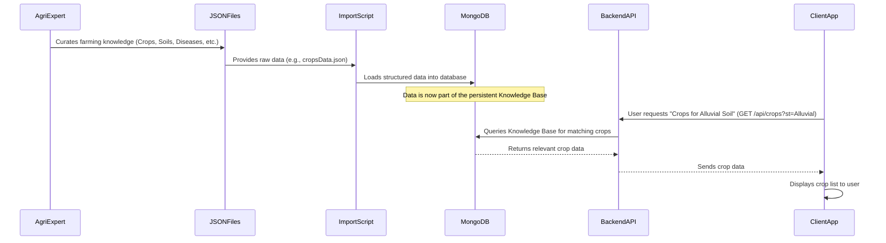

# Chapter 3: Agricultural Knowledge Base

In the previous chapter, [User Authentication & Authorization](02_user_authentication___authorization_.md), we learned how `agri-credit` knows who you are and what you're allowed to do. Once you're securely logged in, you can start using the app's features. One of the most powerful features for farmers is getting reliable agricultural advice. But where does this advice come from?

This is where the **Agricultural Knowledge Base** comes in! Think of it as `agri-credit`'s very own digital "encyclopedia of farming." Instead of asking a human expert every time, the app has a vast collection of pre-loaded, reliable information about everything a farmer might need to know.

## What Problem Does it Solve?

Imagine you're a farmer. You might have questions like:

- "What crops grow best in the black soil on my land?"
- "My wheat crop has rust-colored spots. What disease is it, and what pesticide should I use?"
- "What's the right fertilizer for rice during the Kharif season?"

Finding answers to these questions quickly and accurately is crucial for successful farming. The Agricultural Knowledge Base provides these answers instantly, helping farmers make informed decisions without needing to be an expert themselves.

## What is the Agricultural Knowledge Base?

It's a collection of **static, foundational data** that the `agri-credit` application uses to provide smart, relevant advice. Unlike your personal crop records or bookings, this information doesn't change based on individual user input. It's the core agricultural wisdom built into the app.

This knowledge base includes details about:

- **Crops:** Information like their sowing, duration, and harvesting periods.
- **Soils:** Which crops thrive in different types of soil.
- **Diseases:** Symptoms, how they spread, and how to prevent them.
- **Fertilizers:** Recommended application rates, physical form, and safety tips.
- **Pesticides:** What pests they target, application rates, and safety precautions.

This organized data powers the "AgriHelp" features of the application, making it a valuable tool for farmers.

## Solving the Use Case: Getting Farming Advice

Let's see how a farmer uses the `agri-credit` app to get specific advice from this knowledge base.

**Use Case:** A farmer wants to know what pesticides to use for a disease affecting their "Tomato" crop.

**Input:** The farmer navigates to the "Pesticides" section of the app and selects "Tomato" as the crop, then picks "Late Blight" as the disease.

**Output:**

- The app displays a list of recommended pesticides for "Tomato" crops with "Late Blight," including their application rates and safety cautions.

### Client-Side (What you see in the browser)

On the client-side (your web browser), specialized components interact with this knowledge base to display information and provide recommendations. Remember from [Chapter 1: Client-Side State Management](01_client_side_state_management_.md) how `GlobalContext` helps fetch initial lists? That's our starting point here.

#### 1. Crop and Disease Selection (`client/src/components/Pesticides.jsx`)

This component allows the user to select a crop and then a disease, and then fetches the relevant pesticides.

```javascript
// client/src/components/Pesticides.jsx (Simplified)
import React, { useContext, useEffect, useState } from "react";
import { GlobalContext } from "../context/GlobalState"; // Our shared context

export default function Pesticides() {
  const [selectedCropId, setSelectedCropId] = useState("");
  const [selectedDiseaseId, setSelectedDiseaseId] = useState("");
  const [diseaseOptions, setDiseaseOptions] = useState([]);
  const [pesticidesToShow, setPesticidesToShow] = useState([]);

  // Get the full list of crops from our GlobalContext
  const { cropList, getAllCrops } = useContext(GlobalContext);

  useEffect(() => {
    getAllCrops(); // Fetch all crops when the page loads
  }, []);

  const handleCropChange = async (event) => {
    const cropId = event.target.value;
    setSelectedCropId(cropId);
    // Fetch diseases related to the selected crop
    const response = await fetch(`/api/diseases/cropdiseases/${cropId}`);
    const data = await response.json();
    setDiseaseOptions(data); // Update disease dropdown
    setSelectedDiseaseId(""); // Reset disease selection
    setPesticidesToShow([]); // Clear previous pesticide results
  };

  const handleSubmit = async (event) => {
    event.preventDefault();
    // Fetch pesticides based on selected crop and disease
    const response = await fetch(
      `/api/pesticides/getpesticide/${selectedDiseaseId}/${selectedCropId}`
    );
    const data = await response.json();
    setPesticidesToShow(data); // Display the pesticides
  };

  return (
    <div className="max-w-4xl mx-auto">
      <form onSubmit={handleSubmit}>
        <select value={selectedCropId} onChange={handleCropChange}>
          <option value="">Select Crop Name</option>
          {cropList.map((crop) => (
            <option key={crop._id} value={crop._id}>
              {crop.crop_name}
            </option>
          ))}
        </select>

        <select
          value={selectedDiseaseId}
          onChange={(e) => setSelectedDiseaseId(e.target.value)}
        >
          <option value="">Select Disease Name</option>
          {diseaseOptions.map((diseaseRel) => (
            <option
              key={diseaseRel.disease_id._id}
              value={diseaseRel.disease_id._id}
            >
              {diseaseRel.disease_id.disease_name}
            </option>
          ))}
        </select>
        <button type="submit">Get Pesticides</button>
      </form>

      {/* Display pesticidesToShow here */}
      {pesticidesToShow.length > 0 && (
        <div>
          <h3>Recommended Pesticides:</h3>
          {pesticidesToShow.map((p) => (
            <p key={p.pesticide_id._id}>{p.pesticide_id.pesticide_name}</p>
          ))}
        </div>
      )}
    </div>
  );
}
```

In this simplified example, when the `Pesticides` component loads, it first uses `getAllCrops()` from `GlobalContext` to get a list of all crops for the first dropdown. When a user selects a crop, `handleCropChange` is triggered. It then sends a request to the backend (`/api/diseases/cropdiseases/{cropId}`) to get all diseases related to that crop, populating the second dropdown. Finally, when the user submits, `handleSubmit` makes another request (`/api/pesticides/getpesticide/{diseaseId}/{cropId}`) to fetch the exact pesticides for that crop and disease.

Similar logic is used in other components:

- **`client/src/components/FertiList.jsx`**: Selects Soil Type, then Crop Name, then gets relevant Fertilizers.
- **`client/src/components/Diseases.jsx`**: Selects Crop Name, then gets a list of Diseases for that crop.
- **`client/src/components/CropList.jsx`**: Selects Soil Type, then gets a list of Crops suitable for that soil.

All these components dynamically fetch information from the backend, which is the gateway to our Agricultural Knowledge Base.

### How it Works (Under the Hood)

The "knowledge" isn't magically created by the app. It's carefully collected and stored.



1.  **Data Curation (AgriExpert -> JSON Files):** Agricultural experts gather vast amounts of farming information (like which diseases affect which crops, or which fertilizers are best for certain soils). This raw information is organized into simple, easy-to-read JSON files (JavaScript Object Notation). You can see examples like `jsondata/cropsData.json`, `jsondata/soilDataTemplate.json`, `jsondata/fertilizerdata.json`, `jsondata/diseasesData.json`, and `jsondata/pesticidesData.json`.

2.  **Data Import (JSON Files -> Import Scripts -> MongoDB):** The `agri-credit` project has special "import scripts" (`api/importCrops.js`, `api/importAllData.js`, `api/importDiseasesPesticides.js`). These scripts read the data from the JSON files and carefully put it into the MongoDB database. This process happens when setting up the application, not every time a user logs in. This way, the data is "pre-loaded" and always available.

3.  **Data Storage (MongoDB):** MongoDB is our database, where all this structured farming knowledge is stored. Each type of information (crops, soils, diseases, etc.) has its own "collection" (like a table in a spreadsheet) in the database. We'll learn more about these "models" and how the data is organized in [Chapter 6: Data Models](06_data_models_.md).

4.  **Data Access (Backend API -> ClientApp):** When a user on the `ClientApp` (your browser) needs information (e.g., "show me all crops that grow in Red Soil"), the `ClientApp` sends a request to the `BackendAPI`. The `BackendAPI` then queries the `MongoDB` database for the requested information and sends it back to the `ClientApp` for display. This is handled by "routes" and "controllers" which we will explore in [Chapter 5: Backend API (Routes & Controllers)](05_backend_api__routes___controllers__.md).

Let's look at a quick example of how an import script works:

#### 1. Importing Crop Data (`api/importCrops.js`)

This script reads crop information from a JSON file and inserts it into the `Crops` collection in MongoDB.

```javascript
// api/importCrops.js (Simplified)
import mongoose from "mongoose";
import dotenv from "dotenv";
import Crops from "./models/crops.model.js"; // Our Crop data model
import fs from "fs";

dotenv.config();

async function importCrops() {
  try {
    await mongoose.connect(process.env.MONGO_URL); // Connect to database
    console.log("Connected to MongoDB");

    const data = JSON.parse(
      fs.readFileSync("jsondata/cropsData.json", "utf-8") // Read JSON file
    );

    await Crops.deleteMany({}); // Clear existing data (optional, for fresh import)
    await Crops.insertMany(data); // Insert all data from JSON
    console.log("Crops data imported successfully!");

    process.exit();
  } catch (err) {
    console.error("Error importing crops:", err);
    process.exit(1);
  }
}

importCrops();
```

This script connects to the MongoDB database, reads `cropsData.json` (which contains details for each crop), and then uses `Crops.insertMany(data)` to add all of that information into the `crops` collection in our database. This is how the static data becomes part of our digital encyclopedia. Similar scripts exist for importing diseases, fertilizers, and soils.

For example, `jsondata/cropsData.json` looks something like this (shortened):

```json
// jsondata/cropsData.json (Excerpt)
[
  {
    "crop_name": "Wheat",
    "sowing_period": "October to December",
    "duration_of_crop": "4-5 months",
    "harvesting_period": "March to May",
    "img_url": ""
  },
  {
    "crop_name": "Rice",
    "sowing_period": "June to July",
    "duration_of_crop": "3-6 months",
    "harvesting_period": "November to February",
    "img_url": ""
  }
]
```

Each entry in this JSON becomes a "document" (record) in our `crops` collection in MongoDB.

#### 2. Storing Relationships (e.g., `api/importDiseasesPesticides.js`)

Sometimes, the knowledge is about how different pieces of information are connected. For instance, which pesticide is effective for a specific disease on a particular crop. These are stored as "relationships."

```javascript
// api/importDiseasesPesticides.js (Simplified)
import mongoose from "mongoose";
import dotenv from "dotenv";
import Crops from "./models/crops.model.js";
import Diseases from "./models/diseases.model.js";
import DiseasesPesticides from "./models/diseasesPesticides.model.js"; // Relationship model
import fs from "fs";

dotenv.config();

async function importDiseasesPesticides() {
  try {
    await mongoose.connect(process.env.MONGO_URL);
    // ... connect to DB, get crop and disease IDs ...

    const rels = JSON.parse(
      fs.readFileSync("jsondata/diseasesPesticidesTemplate.json", "utf-8")
    );
    for (const rel of rels) {
      // Find the ID for the crop name and disease name
      const cropId = cropNameToId[rel.crop_name.trim().toLowerCase()];
      const diseaseId = diseaseNameToId[rel.disease_name.trim().toLowerCase()];
      if (cropId && diseaseId) {
        await DiseasesPesticides.create({
          crop_id: cropId, // Store the actual crop ID
          disease_id: diseaseId, // Store the actual disease ID
        });
      }
    }
    console.log("Disease-Pesticide relationships imported!");
    process.exit();
  } catch (err) {
    console.error("Error importing relationships:", err);
    process.exit(1);
  }
}

importDiseasesPesticides();
```

This script shows how relationships are created. Instead of just storing names, it stores the unique IDs of crops and diseases, linking them together in a separate collection called `DiseasesPesticides`. This makes it very efficient to find all diseases for a specific crop, or all pesticides for a specific disease.

## Conclusion

The Agricultural Knowledge Base is the brain of `agri-credit`. By pre-loading vast amounts of static, reliable farming data, the application can provide instant, accurate advice to farmers, helping them cultivate healthier crops and make better decisions. This foundational data is crucial for the "AgriHelp" features, which directly serve the farmer's needs.

In the next chapter, we'll shift our focus from static information to dynamic interactions by exploring the [Resource Booking & Management System](04_resource_booking___management_system_.md). This is where farmers can actually use the app to book tractors, hire labor, and manage their resources.

---

<sub><sup>**References**: [[1]](https://github.com/Manoj10211021/agri-credit/blob/9d43941dd9dfa32fef910d092ca049039ee713eb/api/importAllData.js), [[2]](https://github.com/Manoj10211021/agri-credit/blob/9d43941dd9dfa32fef910d092ca049039ee713eb/api/importCrops.js), [[3]](https://github.com/Manoj10211021/agri-credit/blob/9d43941dd9dfa32fef910d092ca049039ee713eb/api/importDiseasesPesticides.js), [[4]](https://github.com/Manoj10211021/agri-credit/blob/9d43941dd9dfa32fef910d092ca049039ee713eb/client/src/components/CropList.jsx), [[5]](https://github.com/Manoj10211021/agri-credit/blob/9d43941dd9dfa32fef910d092ca049039ee713eb/client/src/components/DIseases.jsx), [[6]](https://github.com/Manoj10211021/agri-credit/blob/9d43941dd9dfa32fef910d092ca049039ee713eb/client/src/components/FertiList.jsx), [[7]](https://github.com/Manoj10211021/agri-credit/blob/9d43941dd9dfa32fef910d092ca049039ee713eb/client/src/components/Pesticides.jsx), [[8]](https://github.com/Manoj10211021/agri-credit/blob/9d43941dd9dfa32fef910d092ca049039ee713eb/diseases.json), [[9]](https://github.com/Manoj10211021/agri-credit/blob/9d43941dd9dfa32fef910d092ca049039ee713eb/fertilizers.json), [[10]](https://github.com/Manoj10211021/agri-credit/blob/9d43941dd9dfa32fef910d092ca049039ee713eb/jsondata/cropFertilizerData.json), [[11]](https://github.com/Manoj10211021/agri-credit/blob/9d43941dd9dfa32fef910d092ca049039ee713eb/jsondata/cropsData.json), [[12]](https://github.com/Manoj10211021/agri-credit/blob/9d43941dd9dfa32fef910d092ca049039ee713eb/jsondata/diseasesData.json), [[13]](https://github.com/Manoj10211021/agri-credit/blob/9d43941dd9dfa32fef910d092ca049039ee713eb/jsondata/fertilizerdata.json), [[14]](https://github.com/Manoj10211021/agri-credit/blob/9d43941dd9dfa32fef910d092ca049039ee713eb/jsondata/pesticidesData.json), [[15]](https://github.com/Manoj10211021/agri-credit/blob/9d43941dd9dfa32fef910d092ca049039ee713eb/jsondata/soilData.json), [[16]](https://github.com/Manoj10211021/agri-credit/blob/9d43941dd9dfa32fef910d092ca049039ee713eb/jsondata/soilDataTemplate.json), [[17]](https://github.com/Manoj10211021/agri-credit/blob/9d43941dd9dfa32fef910d092ca049039ee713eb/pesticides.json)</sup></sub>
