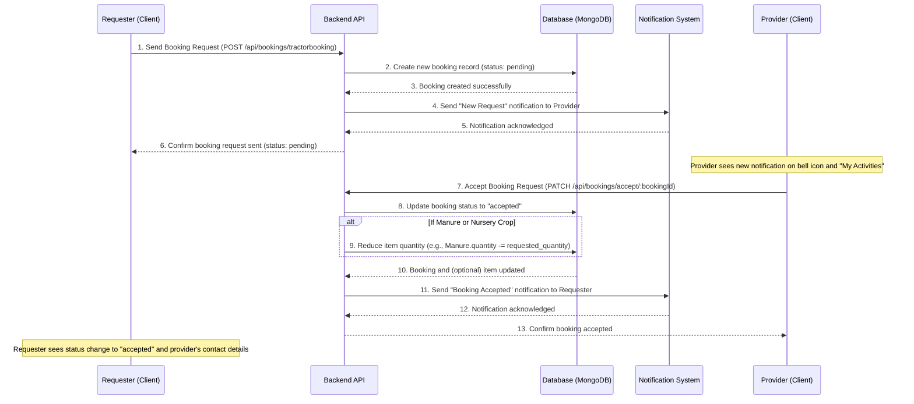

# Chapter 4: Resource Booking & Management System

In the previous chapter, [Agricultural Knowledge Base](03_agricultural_knowledge_base_.md), we explored how `agri-credit` provides valuable farming advice by acting as a digital encyclopedia. Now, imagine you've learned about the best fertilizers or a specific crop's needs, but you don't own a tractor for land preparation or enough organic manure for your fields. What if other farmers in your community have these resources available, but you don't know who or where they are?

This is where the **Resource Booking & Management System** steps in! Think of it as `agri-credit`'s "sharing platform" – like an Airbnb, but for farm equipment, natural fertilizers, and even nursery plants. It connects farmers who have resources (the "providers") with those who need them (the "requesters"), fostering a cooperative farming community.

## What Problem Does it Solve?

Not every farmer can afford expensive machinery like tractors, or always have surplus manure. This system solves several common challenges:

- **Resource Access:** Small farmers can easily find and book resources they need without large upfront investments.
- **Resource Utilization:** Providers can earn extra income by renting out their idle equipment or selling surplus produce/manure.
- **Efficiency:** It streamlines the process of finding and requesting resources, replacing manual inquiries and word-of-mouth.
- **Transparency:** Both parties (requester and provider) can track the status of their bookings (pending, accepted, rejected) and communicate effectively.

## Key Concepts

The Resource Booking & Management System has a few core ideas:

1.  **Resource Listing:**

    - **What it is:** Providers (farmers, nursery owners) can list their available resources like a specific type of organic manure, a tractor with its attachments, or nursery crops (seedlings).
    - **Why it's important:** This makes resources visible and searchable for others.

2.  **Booking Request:**

    - **What it is:** Requesters (farmers needing a resource) can send a formal request for a listed item, specifying quantity, date, purpose, etc.
    - **Why it's important:** It's the first step in the transaction, creating a pending interaction.

3.  **Booking Lifecycle & Status:**

    - **What it is:** Every booking goes through different stages:
      - `pending`: The request has been sent but not yet reviewed by the provider.
      - `accepted`: The provider has agreed to the request. At this point, the resource's quantity in the system is updated, and contact details might be shared.
      - `rejected`: The provider has declined the request.
    - **Why it's important:** It keeps both parties informed about the progress of their transaction.

4.  **Quantity Management:**

    - **What it is:** When a booking is `accepted`, the quantity of the requested resource (e.g., kilograms of manure, specific nursery crops) is automatically reduced in the system to reflect its availability.
    - **Why it's important:** Prevents overbooking and ensures the listed quantities are always accurate.

5.  **Notifications:**
    - **What it is:** Both providers and requesters receive automated messages (within the app or via email) about important updates related to their bookings.
    - **Why it's important:** Keeps everyone in the loop, ensuring timely responses and smooth transactions.

## Solving the Use Case: Booking a Tractor for Ploughing

Let's walk through a common scenario: A farmer needs a tractor to plough their land.

**Input:** A farmer logs into `agri-credit`, navigates to the "Tractor" section, finds an available tractor nearby, and submits a booking request for ploughing.

**Output:**

- The farmer (requester) sees their booking status as `pending`.
- The tractor owner (provider) receives a notification about a new booking request.
- Upon acceptance, the provider's and requester's contact details are shared.
- The tractor's availability might be updated (though tractors are often hourly/daily, so quantity management might be different than for manure).

### Client-Side (What you see in the browser)

On the client-side, the `agri-credit` app provides user interfaces to find, book, and manage resources. Remember how [Client-Side State Management](01_client_side_state_management_.md) helps the app remember things? Here, `GlobalContext` from Chapter 1 is used to fetch lists of available resources and manage bookings.

#### 1. Listing and Requesting Resources (e.g., `client/src/components/tractor/TractorManagement.jsx`)

When a user browses available tractors, they can click a "Book Now" button, which opens a form to capture booking details.

```javascript
// client/src/components/tractor/TractorManagement.jsx (Simplified)
import { useState, useEffect, useContext } from "react";
import { useSelector } from "react-redux"; // For current user info
import { GlobalContext } from "../../context/GlobalState"; // For global utilities

const TractorManagement = () => {
  const [availableTractors, setAvailableTractors] = useState([]);
  const [isBookingModalOpen, setIsBookingModalOpen] = useState(false);
  const [selectedTractor, setSelectedTractor] = useState(null);
  const [date, setDate] = useState("");
  const [purpose, setPurpose] = useState("");
  // ... other state for booking details
  const { currentUser } = useSelector((state) => state.user);
  const { sendNotification } = useContext(GlobalContext); // To send notifications

  useEffect(() => {
    // Fetches all available tractors when component loads
    const getTractors = async () => {
      /* ... fetch logic ... */
    };
    getTractors();
  }, []);

  const handleBookingClick = (tractor) => {
    setSelectedTractor(tractor);
    setIsBookingModalOpen(true); // Open the booking form
  };

  const handleBooking = async () => {
    const bookingDetails = {
      itemId: selectedTractor._id,
      itemType: "Tractor",
      requesterId: currentUser._id,
      providerId: selectedTractor.userId._id, // Tractor owner's ID
      date,
      purpose /* ... other details ... */,
    };

    try {
      const res = await fetch("/api/bookings/tractorbooking", {
        method: "POST",
        headers: { "Content-Type": "application/json" },
        body: JSON.stringify(bookingDetails),
      });

      if (res.ok) {
        // After successful booking, send a notification to the provider
        await sendNotification(
          selectedTractor.userId._id,
          "pending",
          res.json()
        );
        console.log("Booking successful!");
        // Navigate to "My Activities" to see the booking status
      }
    } catch (error) {
      console.log(error);
    }
    setIsBookingModalOpen(false); // Close the form
  };

  return (
    <div>
      {/* Display list of tractors with "Book Now" buttons */}
      {availableTractors.map((tractor) => (
        <li key={tractor._id}>
          {/* ... tractor details ... */}
          {!(tractor.userId._id === currentUser._id) && ( // Don't allow booking your own tractor
            <button onClick={() => handleBookingClick(tractor)}>
              Book Now
            </button>
          )}
        </li>
      ))}

      {/* Booking Modal (Form) */}
      {isBookingModalOpen && selectedTractor && (
        <div>
          {/* ... input fields for date, purpose, etc. ... */}
          <button onClick={handleBooking}>Book</button>
          <button onClick={() => setIsBookingModalOpen(false)}>Cancel</button>
        </div>
      )}
    </div>
  );
};

export default TractorManagement;
```

This component first fetches all available tractors. When a user clicks "Book Now" on a tractor (that isn't their own), a modal (pop-up form) appears. After the user fills in the details and clicks "Book", the `handleBooking` function sends all the booking information to our backend API. If successful, it uses `sendNotification` from our `GlobalContext` to inform the tractor's owner.

Similar logic applies to other resources:

- **`client/src/components/OrganicManure.jsx`**: Allows users to view available organic manures, specify the quantity they need, and send a request.
- **`client/src/components/Nursery/NurseryManagement.jsx`**: Manages the listing and availability of nursery crops.

#### 2. Managing Your Activities (`client/src/components/MyActivities.jsx`)

Both providers and requesters can see and manage their bookings from a central place called "My Activities" on their dashboard.

```javascript
// client/src/components/MyActivities.jsx (Simplified)
import React, { useContext, useEffect, useState } from "react";
import { useSelector } from "react-redux";
import { GlobalContext } from "../context/GlobalState"; // For booking data and notifications

const MyActivities = () => {
  const { bookingsList, getBookingsByUser, sendNotification } =
    useContext(GlobalContext);
  const { currentUser } = useSelector((state) => state.user);
  const [isModalOpen, setIsModalOpen] = useState(false);
  const [selectedBooking, setSelectedBooking] = useState(null);

  useEffect(() => {
    getBookingsByUser(); // Fetch all bookings related to the current user
  }, []);

  const acceptRequest = (booking) => {
    setSelectedBooking(booking);
    setIsModalOpen(true); // Show a confirmation modal
  };

  const handleConfirm = async (booking) => {
    setIsModalOpen(false);
    try {
      // API call to update booking status to "accepted"
      const response = await fetch(`/api/bookings/accept/${booking._id}`, {
        method: "PATCH",
      });
      if (response.ok) {
        // Send notification to the requester
        sendNotification(booking.requesterId._id, "accepted", booking);
        getBookingsByUser(); // Refresh the list of bookings
        console.log("Booking accepted!");
      }
    } catch (error) {
      console.error("Failed to accept:", error);
    }
  };

  const rejectRequest = async (booking) => {
    try {
      // API call to update booking status to "rejected"
      const response = await fetch(`/api/bookings/reject/${booking._id}`, {
        method: "PATCH",
      });
      if (response.ok) {
        sendNotification(booking.requesterId._id, "rejected", booking);
        getBookingsByUser(); // Refresh the list of bookings
        console.log("Booking rejected!");
      }
    } catch (error) {
      console.error("Failed to reject:", error);
    }
  };

  const handleCancel = async (bookingId) => {
    try {
      // API call to delete the booking (requester's side)
      const res = await fetch(`/api/bookings/delete/${bookingId}`, {
        method: "DELETE",
      });
      if (res.ok) {
        getBookingsByUser();
        console.log("Booking cancelled successfully");
      }
    } catch (error) {
      console.log(error);
    }
  };

  return (
    <div>
      <h1>Your Bookings</h1>
      {bookingsList.length === 0 && <p>You don't have any booking records</p>}
      {bookingsList.map((booking) => (
        <li key={booking._id}>
          {/* Display booking details */}
          <p>
            Item:{" "}
            {booking.itemType === "Tractor"
              ? booking.itemId.tractorBrand
              : booking.itemSnapshot.manure_type}
          </p>
          <p>Status: {booking.status}</p>

          {/* Provider's view: Accept/Reject buttons for pending requests */}
          {booking.providerId._id === currentUser._id &&
            booking.status === "pending" && (
              <div>
                <button onClick={() => acceptRequest(booking)}>Accept</button>
                <button onClick={() => rejectRequest(booking)}>Reject</button>
              </div>
            )}

          {/* Requester's view: Cancel button for pending requests */}
          {booking.requesterId._id === currentUser._id &&
            booking.status === "pending" && (
              <button onClick={() => handleCancel(booking._id)}>
                Cancel Request
              </button>
            )}

          {/* Requester's view: Show provider details if accepted */}
          {booking.requesterId._id === currentUser._id &&
            booking.status === "accepted" && (
              <p>
                Provider: {booking.providerId.username} (
                {booking.providerId.phone})
              </p>
            )}
        </li>
      ))}
      {/* Confirmation Modal logic (isModalOpen, handleConfirm) would go here */}
    </div>
  );
};

export default MyActivities;
```

This component is the "control center" for bookings. It displays all bookings where the current user is either the requester or the provider. If the user is the _provider_ and the booking is `pending`, they see "Accept" and "Reject" buttons. If the user is the _requester_ and the booking is `pending`, they see a "Cancel Request" button. Upon `accepted` status, contact information is revealed.

#### 3. Receiving Notifications (`client/src/components/NotificationBell.jsx`)

A small bell icon usually indicates new notifications.

```javascript
// client/src/components/NotificationBell.jsx (Simplified)
import React, { useContext, useEffect, useState } from "react";
import { GlobalContext } from "../context/GlobalState";
import { useSelector } from "react-redux";
import { Bell } from "lucide-react"; // A simple bell icon

const NotificationBell = () => {
  const { bookingsList } = useContext(GlobalContext); // Access all bookings
  const { currentUser } = useSelector((state) => state.user);

  // Filter for pending requests where the current user is the provider
  const pendingRequests = bookingsList.filter(
    (booking) =>
      booking.providerId._id === currentUser._id && booking.status === "pending"
  );

  useEffect(() => {
    // This effect runs when bookingsList or currentUser changes, keeping notification count updated
    // In a real app, you'd fetch notifications from the backend directly using getNotification
    // For simplicity, we are deriving it from bookingsList here.
  }, [bookingsList, currentUser?._id]);

  return (
    <div className="relative">
      <Link to="/dashboard?tab=myactivities" className="relative">
        <Bell className="w-7 h-7 text-gray-700 hover:text-green-600 cursor-pointer" />
        {pendingRequests.length > 0 && (
          <span className="absolute -top-1 -right-2 bg-red-500 text-white text-xs font-bold rounded-full px-2 py-1">
            {pendingRequests.length} {/* Display count of pending requests */}
          </span>
        )}
      </Link>
    </div>
  );
};

export default NotificationBell;
```

This component checks the `bookingsList` from `GlobalContext` to see how many `pending` requests the current user has as a _provider_. If there are any, it displays a red badge with the count, prompting the user to check their "My Activities" page.

### How it Works (Under the Hood)

The magic of the booking system happens on the backend, coordinating data between users and resources in the database.



Here's a step-by-step breakdown:

1.  **Requesting a Resource:**

    - The `Requester (Client)` sends a booking request (e.g., for a tractor) to the `Backend API`.
    - The `Backend API` creates a new booking record in the `Database (MongoDB)` with a `pending` status.
    - The `Backend API` then uses a `Notification System` (which might send an email or an in-app alert) to inform the `Provider (Client)` that a new request has arrived.
    - The `Requester (Client)` receives a confirmation that their request is `pending`.

2.  **Accepting/Rejecting a Request:**
    - The `Provider (Client)` sees the notification and navigates to "My Activities."
    - They decide to `Accept` the booking and send this action to the `Backend API`.
    - The `Backend API` updates the booking status to `accepted` in the `Database`.
    - **Crucially**, if the item is a quantity-based resource like organic manure or nursery crops, the `Backend API` also reduces the `quantity` of that item in the `Database`. This prevents double-booking and keeps inventory accurate.
    - Finally, the `Backend API` sends another notification, this time to the `Requester (Client)`, informing them that their booking has been `accepted`. At this point, the `Requester (Client)` can view the `Provider`'s contact information (like phone number) to coordinate. (If the provider `rejects`, a similar flow occurs, but no quantity changes).

Let's look at the server-side code that manages these operations.

#### 1. Booking Data Model (`api/models/bookings.model.js`)

This model defines the structure for how each booking is stored in the database.

```javascript
// api/models/bookings.model.js (Simplified)
import mongoose from "mongoose";

const bookingSchema = new mongoose.Schema({
  itemId: {
    type: mongoose.Schema.Types.ObjectId,
    refPath: "itemType", // Reference to the actual resource (Tractor, Manure, NurseryCrop)
    required: true,
  },
  itemType: { type: String, required: true }, // "Tractor", "Manure", or "NurseryCrop"
  itemSnapshot: {
    type: Object, // Stores a copy of the item's details at booking time
    required: false, // Useful if the original item is deleted later
  },
  requesterId: {
    type: mongoose.Schema.Types.ObjectId,
    ref: "User",
    required: true,
  },
  providerId: {
    type: mongoose.Schema.Types.ObjectId,
    ref: "User",
    required: true,
  },
  requested_quantity: {
    type: Number,
    required: function () {
      return this.itemType === "Manure";
    }, // Required only for manure
  },
  acres: {
    type: Number,
    required: function () {
      return this.itemType === "Tractor" && this.purpose === "Ploughing";
    },
  },
  purpose: { type: String, enum: ["Ploughing", "Load Transport"] },
  date: { type: Date },
  cost: { type: String },
  status: {
    type: String,
    enum: ["pending", "accepted", "rejected"],
    default: "pending",
  },
  // ... other fields for tracking
});

const Booking = mongoose.model("Booking", bookingSchema);
export default Booking;
```

This `bookingSchema` is crucial. It links to the actual resource (`itemId` and `itemType`) and to both the `requesterId` and `providerId` (which are users, as discussed in [User Authentication & Authorization](02_user_authentication___authorization_.md)). It includes fields specific to different `itemType`s (like `quantity` for manure, or `acres` and `purpose` for tractors) and, importantly, tracks the `status` of the booking. The `itemSnapshot` is a clever detail: it stores a copy of the item's information at the time of booking, so if the original manure listing is later deleted, the booking record still retains its details.

Other relevant models that define the resources themselves are:

- `api/models/tractor.model.js`
- `api/models/organicManure.model.js`
- `api/models/nurseryCrop.model.js`
- `api/models/notification.model.js` (for storing notifications)

#### 2. Booking Routes (`api/routes/booking-route.js`)

These routes are the entry points for all booking-related actions.

```javascript
// api/routes/booking-route.js (Simplified)
import express from "express";
import {
  newBooking,
  tractorBooking,
  cropBooking,
  getBookingsByUser,
  acceptRequest,
  rejectRequest,
  deleteBooking,
  // ... other booking controllers
} from "../controllers/bookings.controller.js";
import { verifyToken } from "../utils/verifyUser.js"; // For authenticated access

const router = express.Router();

router.post("/new-booking", newBooking); // For organic manure
router.post("/tractorbooking", tractorBooking); // For tractor requests
router.post("/cropbooking", cropBooking); // For nursery crop requests

router.get("/bookingsbyuser/:userId", verifyToken, getBookingsByUser); // Get user's bookings
router.patch("/accept/:bookingId", acceptRequest); // Accept a booking
router.patch("/reject/:bookingId", rejectRequest); // Reject a booking
router.delete("/delete/:bookingId", deleteBooking); // Cancel/delete a booking

export default router;
```

This file defines different URLs (routes) that the client-side uses to send or receive booking data. Notice how `verifyToken` (from Chapter 2) is used for `getBookingsByUser` to ensure only logged-in users can fetch their booking history.

#### 3. Booking Controllers (`api/controllers/bookings.controller.js`)

These functions handle the logic behind each booking route.

```javascript
// api/controllers/bookings.controller.js (Simplified newBooking for Manure)
import Booking from "../models/bookings.model.js";
import sendEmail from "../utils/email.js"; // For sending notifications via email
import User from "../models/user.model.js"; // To get user details for email

export const newBooking = async (req, res) => {
  const { itemId, itemType, requesterId, providerId, quantity } = req.body;
  try {
    const booking = await Booking.create({
      // Create the new booking
      itemId,
      itemType,
      requesterId,
      providerId,
      requested_quantity: +quantity,
    });

    const providerUser = await User.findById(providerId); // Get provider's info
    // Prepare email message for the provider
    const emailMessage = {
      intro: "You have a new booking request!",
      instructions: "Please check your dashboard to accept or reject.",
      buttonText: "Go to My Activities",
      buttonLink: "http://localhost:5173/dashboard?tab=myactivities",
      subject: "New Booking Request on Agri-Credit",
    };
    await sendEmail(providerUser, emailMessage, "accept"); // Send email to provider
    res.json(booking); // Send booking confirmation back to requester
  } catch (error) {
    console.log(error);
    res.status(500).json({ error: "Failed to create booking" });
  }
};
// ... similar logic for tractorBooking and cropBooking
```

The `newBooking` function receives the booking details, creates a new `Booking` record in the database, and then uses the `sendEmail` utility (from `api/utils/email.js`) to notify the `provider` (the user who owns the item) about the new request.

```javascript
// api/controllers/bookings.controller.js (Simplified acceptRequest)
import mongoose from "mongoose";
import Booking from "../models/bookings.model.js";
import Manure from "../models/organicManure.model.js"; // For updating manure quantity
import NurseryCrop from "../models/nurseryCrop.model.js"; // For updating nursery crop quantity
import sendEmail from "../utils/email.js";

export const acceptRequest = async (req, res) => {
  try {
    const updatedBooking = await Booking.findByIdAndUpdate(
      req.params.bookingId,
      { $set: { status: "accepted" } }, // Change status to 'accepted'
      { new: true } // Return the updated booking
    );

    if (!updatedBooking) {
      return res.status(404).json({ error: "Booking not found" });
    }

    // Logic to reduce item quantity based on itemType
    if (
      updatedBooking.itemType === "Manure" ||
      updatedBooking.itemType === "NurseryCrop"
    ) {
      await updateItemQuantity(updatedBooking); // Call helper function to reduce quantity
    }

    // Send email notification to the requester
    const requesterUser = await User.findById(updatedBooking.requesterId);
    const emailMessage = {
      /* ... accepted message details ... */
    };
    await sendEmail(requesterUser, emailMessage, "success");

    res.status(200).json({
      message: "Booking accepted successfully",
      booking: updatedBooking,
    });
  } catch (error) {
    console.error(error);
    res.status(500).json({ error: "Error accepting booking" });
  }
};

// Helper function to update item quantity after a booking is accepted
const updateItemQuantity = async (booking) => {
  let itemModel;
  let quantityField;

  if (booking.itemType === "Manure") {
    itemModel = Manure;
    quantityField = "quantity";
  } else if (booking.itemType === "NurseryCrop") {
    itemModel = NurseryCrop;
    quantityField = "quantityAvailable";
  } else {
    return;
  } // Not a quantity-based item

  const item = await itemModel.findById(booking.itemId);
  if (!item) {
    console.error("Item not found for quantity update.");
    return;
  }

  const newQuantity = item[quantityField] - booking.requested_quantity;
  await itemModel.findByIdAndUpdate(
    booking.itemId,
    { $set: { [quantityField]: newQuantity } }, // Update the quantity
    { new: true }
  );
  console.log(`Updated ${booking.itemType} quantity for ${item._id}`);
};

// ... rejectRequest, deleteBooking, getBookingsByUser, etc.
```

The `acceptRequest` function first updates the booking's status. Then, it calls `updateItemQuantity` to reduce the available stock of the manure or nursery crop in the database. Finally, it sends a confirmation email to the `requester`. The `rejectRequest` function follows a similar flow but without the quantity update.

## Conclusion

The Resource Booking & Management System is a cornerstone of the `agri-credit` project, bringing the "sharing economy" to the agricultural sector. It empowers farmers to efficiently find and utilize essential resources, manage transactions, and stay informed through a robust booking lifecycle and notification system. This system transforms the application from a knowledge provider into an active facilitator of resource sharing within the farming community.

In the next chapter, we'll take a broader look at the **Backend API (Routes & Controllers)**, understanding how all these different client-side actions and database interactions are orchestrated on the server.

[Backend API (Routes & Controllers)](05_backend_api__routes___controllers__.md)

---

<sub><sup>**References**: [[1]](https://github.com/Manoj10211021/agri-credit/blob/9d43941dd9dfa32fef910d092ca049039ee713eb/api/controllers/bookings.controller.js), [[2]](https://github.com/Manoj10211021/agri-credit/blob/9d43941dd9dfa32fef910d092ca049039ee713eb/api/controllers/notification.controller.js), [[3]](https://github.com/Manoj10211021/agri-credit/blob/9d43941dd9dfa32fef910d092ca049039ee713eb/api/controllers/nursery.controller.js), [[4]](https://github.com/Manoj10211021/agri-credit/blob/9d43941dd9dfa32fef910d092ca049039ee713eb/api/controllers/organicManure.controller.js), [[5]](https://github.com/Manoj10211021/agri-credit/blob/9d43941dd9dfa32fef910d092ca049039ee713eb/api/controllers/tractor.controller.js), [[6]](https://github.com/Manoj10211021/agri-credit/blob/9d43941dd9dfa32fef910d092ca049039ee713eb/api/models/bookings.model.js), [[7]](https://github.com/Manoj10211021/agri-credit/blob/9d43941dd9dfa32fef910d092ca049039ee713eb/api/models/notification.model.js), [[8]](https://github.com/Manoj10211021/agri-credit/blob/9d43941dd9dfa32fef910d092ca049039ee713eb/api/models/nursery.model.js), [[9]](https://github.com/Manoj10211021/agri-credit/blob/9d43941dd9dfa32fef910d092ca049039ee713eb/api/models/nurseryCrop.model.js), [[10]](https://github.com/Manoj10211021/agri-credit/blob/9d43941dd9dfa32fef910d092ca049039ee713eb/api/models/organicManure.model.js), [[11]](https://github.com/Manoj10211021/agri-credit/blob/9d43941dd9dfa32fef910d092ca049039ee713eb/api/models/tractor.model.js), [[12]](https://github.com/Manoj10211021/agri-credit/blob/9d43941dd9dfa32fef910d092ca049039ee713eb/api/routes/booking-route.js), [[13]](https://github.com/Manoj10211021/agri-credit/blob/9d43941dd9dfa32fef910d092ca049039ee713eb/api/routes/notification-route.js), [[14]](https://github.com/Manoj10211021/agri-credit/blob/9d43941dd9dfa32fef910d092ca049039ee713eb/api/routes/nursery.route.js), [[15]](https://github.com/Manoj10211021/agri-credit/blob/9d43941dd9dfa32fef910d092ca049039ee713eb/api/routes/organicManure.route.js), [[16]](https://github.com/Manoj10211021/agri-credit/blob/9d43941dd9dfa32fef910d092ca049039ee713eb/api/routes/tractor.route.js), [[17]](https://github.com/Manoj10211021/agri-credit/blob/9d43941dd9dfa32fef910d092ca049039ee713eb/api/utils/email.js), [[18]](https://github.com/Manoj10211021/agri-credit/blob/9d43941dd9dfa32fef910d092ca049039ee713eb/client/src/components/MyActivities.jsx), [[19]](https://github.com/Manoj10211021/agri-credit/blob/9d43941dd9dfa32fef910d092ca049039ee713eb/client/src/components/NotificationBell.jsx), [[20]](https://github.com/Manoj10211021/agri-credit/blob/9d43941dd9dfa32fef910d092ca049039ee713eb/client/src/components/Nursery/NurseryManagement.jsx), [[21]](https://github.com/Manoj10211021/agri-credit/blob/9d43941dd9dfa32fef910d092ca049039ee713eb/client/src/components/OrganicManure.jsx), [[22]](https://github.com/Manoj10211021/agri-credit/blob/9d43941dd9dfa32fef910d092ca049039ee713eb/client/src/components/tractor/TractorManagement.jsx)</sup></sub>
