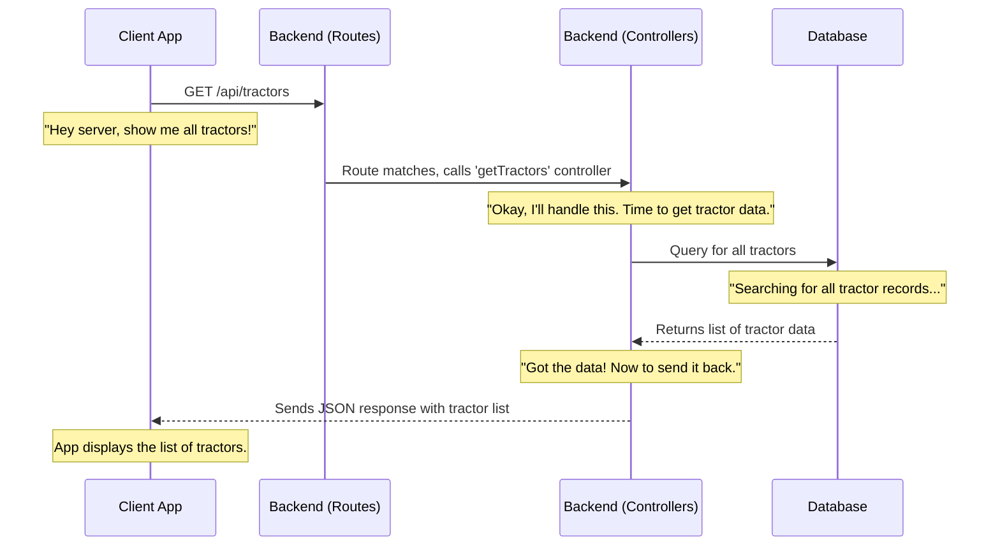

# Chapter 5: Backend API (Routes & Controllers)

In the last chapter, [Resource Booking & Management System](04_resource_booking___management_system_.md), we saw how `agri-credit` allows farmers to list and book resources like tractors or organic manure. You learned how the client-side (your browser) sends requests (like "Book this tractor!") and how it updates the screen based on whether the booking is `pending`, `accepted`, or `rejected`. But how does the server actually _receive_ these requests? And once it gets a request, how does it know what to do with it?

This is where the **Backend API (Routes & Controllers)** comes in! Think of it as the "command center" or "traffic director" for your entire `agri-credit` application on the server side. It's the brain that sits between your browser (the frontend) and the database, making sure every request goes to the right place and gets processed correctly.

## What Problem Does it Solve?

Imagine the `agri-credit` server as a busy office building. Many people (your browser) are sending in different requests:

- "Log me in!"
- "Give me a list of all available crops."
- "I want to book this tractor."
- "Show me my current bookings."

Without a clear system, these requests would get lost or mishandled. The Backend API solves this by providing:

- **Organized Endpoints:** Clear "addresses" for different types of requests.
- **Request Handling:** Specific "workers" ready to process each type of request.
- **Business Logic Execution:** The place where the app's rules (like "reduce manure quantity when booked") are applied.
- **Database Interaction:** The gateway to save and fetch information from the database.

It ensures that when you click a button in your browser, the right action happens on the server.

## Key Concepts

The Backend API is built around two main ideas: **Routes** and **Controllers**.

### 1. Routes: The Addresses

Think of **Routes** as different "addresses" or "paths" that you can type into your web browser, or that your frontend application sends requests to. Each address tells the server what kind of information or action you're looking for.

- **Analogy:** If `agri-credit` were a physical building, routes would be the different doors or departments, each labeled for a specific purpose (e.g., "Login Desk," "Tractor Rentals," "Crop Information").
- **In Code:** Routes are defined by a specific URL path (like `/api/tractors` or `/api/auth/signin`) and an HTTP method (like `GET`, `POST`, `PUT`, `DELETE`).
  - `GET /api/tractors`: "Give me (GET) a list of all available tractors."
  - `POST /api/bookings/tractorbooking`: "Create (POST) a new tractor booking."
  - `DELETE /api/manures/:manureId`: "Remove (DELETE) this specific manure listing."

### 2. Controllers: The Workers

Once a request arrives at a specific "address" (a route), a **Controller** is the actual "worker" or function that springs into action. The controller's job is to:

1.  **Receive the Request:** Understand what the client is asking for (e.g., "what tractor details are in the request body?").
2.  **Process Business Logic:** Perform the necessary steps, like checking if a user is logged in ([User Authentication & Authorization](02_user_authentication___authorization_.md)), validating data, or applying rules (e.g., calculating the cost of a booking).
3.  **Interact with Data Models:** Talk to the database ([Data Models](06_data_models_.md)) to fetch, save, update, or delete information.
4.  **Send a Response:** Send back data (e.g., a list of tractors, a success message) to the frontend, often in JSON format.

- **Analogy:** If a route is the "Tractor Rentals" department, the controller is the actual person working there. They receive your request (e.g., "I want to rent a tractor"), check their records (database), handle the paperwork (business logic), and tell you if it's possible or not (send a response).
- **In Code:** A controller is typically a JavaScript function that takes `req` (the incoming request) and `res` (the outgoing response) as arguments.

## Solving the Use Case: Getting a List of Tractors

Let's revisit our farmer who wants to book a tractor. The first step is to see _which_ tractors are available.

**Use Case:** A farmer opens the `agri-credit` app and navigates to the "Tractor" section to view available tractors.

**Input:** The farmer's browser (frontend) sends a `GET` request to the server at the address `/api/tractors`.

**Output:** The server responds with a list of all tractors stored in the database, including their brand, model, and location.

### How it Works (Under the Hood)

Let's see the journey of this request from the browser to the database and back.



1.  **Request from Client App:** When the farmer opens the "Tractor" section, the `Client App` (running in their browser) sends an HTTP `GET` request to the server, targeting the `/api/tractors` address.
2.  **Route Matching:** The `Backend` (specifically the `Routes` configuration) receives this incoming request. It looks at the `/api/tractors` path and the `GET` method, and finds the matching rule that says, "When someone `GET`s `/api/tractors`, call the `getTractors` function."
3.  **Controller Execution:** The `getTractors` `Controller` function is then invoked. This function is designed to handle this specific request.
4.  **Database Interaction:** Inside the `getTractors` controller, it communicates with our `Database` (MongoDB). It asks the database to "find all tractor records."
5.  **Data Retrieval:** The `Database` fetches all the stored tractor information and sends it back to the `getTractors` controller.
6.  **Response to Client App:** The `getTractors` controller then packages this tractor data into a standard format (usually JSON) and sends it back as a response to the `Client App`. The `Client App` receives this JSON, parses it, and displays the list of tractors to the farmer.

### Routes vs. Controllers: A Quick Comparison

| Feature     | Routes                                  | Controllers                                          |
| :---------- | :-------------------------------------- | :--------------------------------------------------- |
| **Analogy** | Addresses / Departments                 | Workers / Handlers at an address                     |
| **Purpose** | Map URLs and HTTP methods to functions  | Execute logic, interact with database, send response |
| **Role**    | Traffic director, defines API endpoints | Executes specific tasks, business logic              |
| **Example** | `GET /api/crops`                        | `getAllCrops` function that fetches from DB          |

## Code in Action (Server-Side)

Let's look at the actual code that orchestrates this in `agri-credit`.

### 1. The Main Server File (`api/index.js`)

This is the very first file that runs when our `agri-credit` backend starts. It sets up the server and tells it _which routes belong to which parts of the application_.

```javascript
// api/index.js (Simplified)
import express from "express";
import mongoose from "mongoose";
import dotenv from "dotenv";
import tractorRoutes from "./routes/tractor.route.js"; // Import tractor-specific routes
import authRoutes from "./routes/auth.route.js"; // For authentication routes
// ... other route imports

dotenv.config({}); // Load environment variables

mongoose
  .connect(process.env.MONGO_URL) // Connect to our database
  .then(() => console.log("Database Connected"))
  .catch((err) => console.log(err));

const app = express();
app.use(express.json()); // Allow server to understand JSON requests

app.listen(3000, () => {
  console.log("Server is running on Port 3000"); // Start the server
});

// Link specific URLs to their respective route files
app.use("/api/tractors", tractorRoutes); // Any request to /api/tractors goes to tractorRoutes
app.use("/api/auth", authRoutes); // Any request to /api/auth goes to authRoutes
// ... other app.use for other routes

// Error handling middleware (catches errors from controllers)
app.use((err, req, res, next) => {
  const statusCode = err.statusCode || 500;
  const message = err.message || "Internal Server Error";
  res.status(statusCode).json({ success: false, statusCode, message });
});
```

This `api/index.js` file is like the main entry point for all server traffic. It uses `express` to create the server. The key lines here are `app.use("/api/tractors", tractorRoutes);`. This tells the server: "If any request comes in starting with `/api/tractors`, send it to the `tractorRoutes` file to handle." This keeps our application organized, as each `route` file can focus on its own set of addresses.

### 2. Defining Specific Routes (`api/routes/tractor.route.js`)

This file is responsible for defining all the possible "addresses" related to tractors.

```javascript
// api/routes/tractor.route.js (Simplified)
import express from "express";
import {
  addTractor,
  getTractors,
  // ... other tractor-related controllers
} from "../controllers/tractor.controller.js"; // Import our controller functions
import { verifyToken } from "../utils/verifyUser.js"; // Import middleware for security

const router = express.Router(); // Create a new router for tractor routes

router.post("/addtractor", verifyToken, addTractor); // POST request to /api/tractors/addtractor
router.get("/", getTractors); // GET request to /api/tractors/ (our use case!)
// ... other tractor routes like router.put, router.delete

export default router;
```

Here, `router.get("/", getTractors);` is the star for our use case. It says: "When a `GET` request comes to the base path (`/`) _of this router_ (which is `/api/tractors` because of `app.use` in `index.js`), call the `getTractors` function."

Notice `verifyToken` in the `addTractor` route. This is a special function called **middleware**. It's like a bouncer at the "Add Tractor" door. It runs _before_ the `addTractor` controller to check if the user is [authenticated and authorized](02_user_authentication___authorization_.md) before letting them create a new listing. This ensures only logged-in users can add tractors.

### 3. The Tractor Controller (`api/controllers/tractor.controller.js`)

This is the actual "worker" function that gets called when a request for tractors comes in.

```javascript
// api/controllers/tractor.controller.js (Simplified)
import Tractor from "../models/tractor.model.js"; // Our Data Model for tractors

export const getTractors = async (req, res) => {
  try {
    // 1. Interact with the Database (using the Tractor Data Model)
    const tractors = await Tractor.find({}).populate("userId"); // Find all tractors and get user info
    // console.log("Fetched Tractors:", tractors); // Log for debugging

    // 2. Send a Response back to the frontend
    res.json(tractors); // Send the list of tractors as JSON
  } catch (error) {
    // 3. Handle any errors
    console.error("Error fetching tractors:", error);
    res.status(500).json({ error: "Failed to fetch tractors" }); // Send an error response
  }
};

export const addTractor = async (req, res) => {
  const { tractorBrand, modelNumber /* ...other details... */ } = req.body;
  try {
    // Check for existing tractor, validate data (business logic)
    const existingTractor = await Tractor.findOne({
      registrationNumber: req.body.registrationNumber,
    });
    if (existingTractor) {
      return res.status(400).json({ message: "Tractor already exists" });
    }

    // Create a new tractor record in the database
    const newTractor = await Tractor.create({
      userId: req.user.id, // Comes from verifyToken middleware
      tractorBrand,
      modelNumber /* ...other details... */,
    });
    res.status(201).json({
      message: "Tractor registered successfully",
      tractor: newTractor,
    });
  } catch (error) {
    console.error("Error adding tractor:", error);
    res.status(500).json({ message: "Internal server error" });
  }
};
```

The `getTractors` function is very simple for our use case. It uses the `Tractor` [Data Model](06_data_models_.md) to `find({})` all tractor records in the database. Once it gets the data, it sends it back to the client using `res.json(tractors)`.

The `addTractor` controller shows more business logic: it first checks if a tractor with the same registration number already exists before creating a new one. It also uses `req.user.id` which was attached by the `verifyToken` middleware (from [Chapter 2: User Authentication & Authorization](02_user_authentication___authorization_.md)), ensuring that the `userId` of the person adding the tractor is correctly recorded.

## Conclusion

The Backend API, through its well-defined **Routes** and powerful **Controllers**, is the core engine of the `agri-credit` application. Routes provide the structure and addresses for interaction, while controllers are the intelligent functions that process requests, apply business rules, communicate with the database, and send back meaningful responses. Together, they ensure that every action initiated by the user in the frontend is efficiently handled and coordinated on the server.

Now that you understand how requests are received and processed, the next logical step is to dive deeper into the actual structure of the data these controllers are managing. In the next chapter, we'll explore **[Data Models](06_data_models_.md)**, which define how information like crops, soils, and tractors are organized and stored in our database.

---

<sub><sup>**References**: [[1]](https://github.com/Manoj10211021/agri-credit/blob/9d43941dd9dfa32fef910d092ca049039ee713eb/api/controllers/auth.controller.js), [[2]](https://github.com/Manoj10211021/agri-credit/blob/9d43941dd9dfa32fef910d092ca049039ee713eb/api/controllers/bookings.controller.js), [[3]](https://github.com/Manoj10211021/agri-credit/blob/9d43941dd9dfa32fef910d092ca049039ee713eb/api/controllers/crops.controller.js), [[4]](https://github.com/Manoj10211021/agri-credit/blob/9d43941dd9dfa32fef910d092ca049039ee713eb/api/controllers/disease.controller.js), [[5]](https://github.com/Manoj10211021/agri-credit/blob/9d43941dd9dfa32fef910d092ca049039ee713eb/api/controllers/email.controller.js), [[6]](https://github.com/Manoj10211021/agri-credit/blob/9d43941dd9dfa32fef910d092ca049039ee713eb/api/controllers/fertilizer.controller.js), [[7]](https://github.com/Manoj10211021/agri-credit/blob/9d43941dd9dfa32fef910d092ca049039ee713eb/api/controllers/notification.controller.js), [[8]](https://github.com/Manoj10211021/agri-credit/blob/9d43941dd9dfa32fef910d092ca049039ee713eb/api/controllers/nursery.controller.js), [[9]](https://github.com/Manoj10211021/agri-credit/blob/9d43941dd9dfa32fef910d092ca049039ee713eb/api/controllers/organicManure.controller.js), [[10]](https://github.com/Manoj10211021/agri-credit/blob/9d43941dd9dfa32fef910d092ca049039ee713eb/api/controllers/pesticide.controller.js), [[11]](https://github.com/Manoj10211021/agri-credit/blob/9d43941dd9dfa32fef910d092ca049039ee713eb/api/controllers/soil.controller.js), [[12]](https://github.com/Manoj10211021/agri-credit/blob/9d43941dd9dfa32fef910d092ca049039ee713eb/api/controllers/tractor.controller.js), [[13]](https://github.com/Manoj10211021/agri-credit/blob/9d43941dd9dfa32fef910d092ca049039ee713eb/api/controllers/user.controller.js), [[14]](https://github.com/Manoj10211021/agri-credit/blob/9d43941dd9dfa32fef910d092ca049039ee713eb/api/index.js), [[15]](https://github.com/Manoj10211021/agri-credit/blob/9d43941dd9dfa32fef910d092ca049039ee713eb/api/routes/auth.route.js), [[16]](https://github.com/Manoj10211021/agri-credit/blob/9d43941dd9dfa32fef910d092ca049039ee713eb/api/routes/booking-route.js), [[17]](https://github.com/Manoj10211021/agri-credit/blob/9d43941dd9dfa32fef910d092ca049039ee713eb/api/routes/crop.route.js), [[18]](https://github.com/Manoj10211021/agri-credit/blob/9d43941dd9dfa32fef910d092ca049039ee713eb/api/routes/disease.route.js), [[19]](https://github.com/Manoj10211021/agri-credit/blob/9d43941dd9dfa32fef910d092ca049039ee713eb/api/routes/email.route.js), [[20]](https://github.com/Manoj10211021/agri-credit/blob/9d43941dd9dfa32fef910d092ca049039ee713eb/api/routes/fertilizer.route.js), [[21]](https://github.com/Manoj10211021/agri-credit/blob/9d43941dd9dfa32fef910d092ca049039ee713eb/api/routes/notification-route.js), [[22]](https://github.com/Manoj10211021/agri-credit/blob/9d43941dd9dfa32fef910d092ca049039ee713eb/api/routes/nursery.route.js), [[23]](https://github.com/Manoj10211021/agri-credit/blob/9d43941dd9dfa32fef910d092ca049039ee713eb/api/routes/organicManure.route.js), [[24]](https://github.com/Manoj10211021/agri-credit/blob/9d43941dd9dfa32fef910d092ca049039ee713eb/api/routes/pesticide.route.js), [[25]](https://github.com/Manoj10211021/agri-credit/blob/9d43941dd9dfa32fef910d092ca049039ee713eb/api/routes/soil.route.js), [[26]](https://github.com/Manoj10211021/agri-credit/blob/9d43941dd9dfa32fef910d092ca049039ee713eb/api/routes/tractor.route.js), [[27]](https://github.com/Manoj10211021/agri-credit/blob/9d43941dd9dfa32fef910d092ca049039ee713eb/api/routes/user.route.js)</sup></sub>
