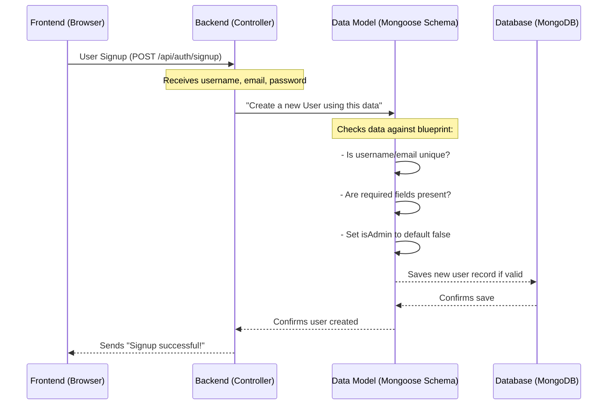

# Chapter 6: Data Models

In the previous chapter, [Backend API (Routes & Controllers)](05_backend_api__routes___controllers__.md), we learned how your `agri-credit` application handles requests on the server, acting as a "command center" that directs traffic to the right "workers" (controllers). These controllers often need to store or retrieve information, like details about users, crops, or tractors. But how does the server know exactly _how_ to organize this information when saving it, or _what to expect_ when fetching it?

This is where **Data Models** come in! Think of Data Models as the "blueprints" or "templates" for all the different types of information your `agri-credit` app stores in its database. Just like a house blueprint defines where the walls, doors, and windows go, a data model defines what kind of information each "item" (like a user or a crop) should have, what type of data it is (text, numbers, dates), and how different items might be connected.

## What Problem Do Data Models Solve?

Imagine trying to build a house without a blueprint. You'd have walls appearing in random places, no consistent room sizes, and doors that lead nowhere! It would be a mess.

The same applies to data. Without a consistent structure:

- You might save a user's name as "John" sometimes and "john_doe" other times.
- A crop's "sowing period" might be saved as text in one place and as a number in another.
- It would be impossible to reliably find all crops that grow in "Red Soil" if you don't know where to look or what format the soil type is stored in.

Data models solve this by:

- **Ensuring Consistency:** Every piece of data of a certain type (e.g., every "User") will have the same set of fields (e.g., `username`, `email`, `password`).
- **Defining Data Types:** Specifying if a field should be text (`String`), a number (`Number`), a true/false value (`Boolean`), or a date (`Date`).
- **Enforcing Rules:** Setting rules like a field being `required` (must be present), `unique` (no two items can have the same value), or having `default` values.
- **Establishing Relationships:** Showing how different "blueprints" are connected (e.g., a "Tractor" is owned by a "User").

In `agri-credit`, we use **Mongoose**, a library that helps us work with MongoDB (our database), to define these data models.

## Key Concepts: Building Blocks of a Model

A data model in Mongoose is defined using a `Schema`. A `Schema` describes the shape of the documents within a MongoDB collection.

1.  **Schema:** The overall blueprint for a collection of data.
2.  **Fields (Properties):** Each piece of information within a document.
    - `username`: A field for the user's name.
    - `crop_name`: A field for the name of a crop.
3.  **Data Types:** What kind of information the field holds. Common types include `String`, `Number`, `Boolean`, `Date`, `ObjectId` (for linking to other models).
4.  **Validation Rules:** Extra rules for a field.
    - `required: true`: This field _must_ have a value.
    - `unique: true`: No two documents can have the same value for this field.
    - `default: false`: If no value is provided, use this one.
    - `ref: 'User'`: This field actually stores the ID of a document from the "User" collection, creating a link.
5.  **Collection:** In MongoDB, a "collection" is like a table in a traditional database. Our `User` model creates a `users` collection, the `Tractor` model creates a `tractors` collection, and so on.

## Solving the Use Case: Storing a New User or Crop

Let's imagine you're signing up for `agri-credit` for the first time, or an agricultural expert is adding a new type of crop to the knowledge base. Data models ensure this information is saved correctly.

**Use Case:** A new user signs up for `agri-credit`.

**Input:** The user provides a `username`, `email`, and `password`.

**Output:** A new `User` record is created in the database, with all required fields filled and formatted correctly, and an `isAdmin` flag set to `false` by default.

### How it Works (Under the Hood)

When a controller (from [Chapter 5: Backend API (Routes & Controllers)](05_backend_api__routes___controllers__.md)) wants to save or retrieve data, it interacts directly with these data models.



1.  **Request from Frontend:** When a user clicks "Sign Up," the `Frontend` sends their details to a `Controller` on the `Backend`.
2.  **Controller Uses Data Model:** The `Controller` then tells the `User` `Data Model` to create a new user record with the provided information.
3.  **Model Validation & Formatting:** The `Data Model` (Mongoose) acts as a gatekeeper. It checks if the incoming data matches its `Schema` (blueprint): Are all `required` fields present? Is the email `unique`? If the data is missing a field like `isAdmin`, it automatically sets the `default` value (`false`).
4.  **Database Interaction:** If all checks pass, the `Data Model` then sends the properly structured data to the `Database` (MongoDB) to be saved as a new document.
5.  **Confirmation:** The `Database` confirms the save, and this confirmation travels back through the `Data Model` to the `Controller`, and finally back to the `Frontend`.

## Code in Action (Server-Side)

Let's look at some actual `agri-credit` data models. These files are typically found in the `api/models` folder.

### 1. User Model (`api/models/user.model.js`)

This blueprint defines how every user's information is structured in our database.

```javascript
// api/models/user.model.js
import mongoose from "mongoose";

const userSchema = new mongoose.Schema(
  {
    username: {
      type: String,
      required: true,
      unique: true,
    },
    email: {
      type: String,
      required: true,
      unique: true,
    },
    password: {
      type: String,
      required: true, // Stores the hashed password
    },
    isAdmin: {
      type: Boolean,
      default: false, // Default is a regular user
    },
  },
  { timestamps: true } // Adds createdAt and updatedAt fields automatically
);

const User = mongoose.model("User", userSchema); // Creates the 'User' model

export default User;
```

- **`username`**: A `String` that is `required` and must be `unique` for each user.
- **`email`**: Also a `String`, `required`, and `unique`.
- **`password`**: A `String` that is `required`. Remember, this stores the _hashed_ password, not the plain text one, as discussed in [Chapter 2: User Authentication & Authorization](02_user_authentication___authorization_.md).
- **`isAdmin`**: A `Boolean` that defaults to `false`. This is critical for [User Authentication & Authorization](02_user_authentication___authorization_.md).
- **`timestamps: true`**: This is a handy Mongoose option that automatically adds `createdAt` and `updatedAt` fields to your documents, tracking when they were created and last modified.

### 2. Crops Model (`api/models/crops.model.js`)

This model defines the blueprint for different types of crops in our [Agricultural Knowledge Base](03_agricultural_knowledge_base_.md).

```javascript
// api/models/crops.model.js
import mongoose, { Schema, model } from "mongoose";

const crops = Schema({
  crop_name: {
    type: String,
    required: true,
  },
  sowing_period: {
    type: String,
    required: true,
  },
  duration_of_crop: {
    type: String,
    required: true,
  },
  harvesting_period: {
    type: String,
    required: true,
  },
  img_url: {
    type: String,
  },
});

const Crops = model("Crops", crops); // Creates the 'Crops' model

export default Crops;
```

This schema defines various text fields (`String`) that are `required` for every crop entry, like its `crop_name`, `sowing_period`, and `harvesting_period`. An optional `img_url` is also included.

### 3. Tractor Model (`api/models/tractor.model.js`)

This model defines the structure for individual tractor listings in the [Resource Booking & Management System](04_resource_booking___management_system_.md).

```javascript
// api/models/tractor.model.js
import mongoose from "mongoose";

const TractorSchema = new mongoose.Schema(
  {
    userId: {
      type: mongoose.Schema.Types.ObjectId, // This is a special ID type
      ref: "User", // It refers to a document in the 'User' collection
      required: true,
    },
    tractorBrand: {
      type: String,
      required: true,
    },
    modelNumber: {
      type: String,
      required: true,
    },
    registrationNumber: {
      type: String,
      required: true,
      unique: true,
    },
    tractor_lat: {
      type: Number,
      required: true,
    },
    tractor_long: {
      type: Number,
      required: true,
    },
  },
  { timestamps: true }
);

const Tractor = mongoose.model("Tractor", TractorSchema);

export default Tractor;
```

Here's where relationships shine:

- **`userId`**: This field has `type: mongoose.Schema.Types.ObjectId` and `ref: "User"`. This tells Mongoose that the `userId` field in a `Tractor` document will store the unique ID of a document from the `User` collection. This creates a direct link, so we know _which user owns_ or _posted_ this tractor. When fetching tractor details, we can often "populate" this `userId` field to get the full user details, not just their ID.
- It also includes specific `String` and `Number` fields for tractor details and location (`tractor_lat`, `tractor_long`).

### 4. Other Models and Relationships

`agri-credit` uses many other models, all following similar principles:

| Model                | File                                     | Purpose                                          | Key Fields / Relationships                                                                                                                                                     |
| :------------------- | :--------------------------------------- | :----------------------------------------------- | :----------------------------------------------------------------------------------------------------------------------------------------------------------------------------- |
| `Soil`               | `api/models/soil.model.js`               | Defines types of soil                            | `soil_type`, `crops_grown` (array of `ObjectId` referencing `Crops` model)                                                                                                     |
| `Pesticides`         | `api/models/pesticides.model.js`         | Details about pesticides                         | `pesticide_name`, `application_rate`, `target_pest`                                                                                                                            |
| `Diseases`           | `api/models/diseases.model.js`           | Information on crop diseases                     | `disease_name`, `symptoms`, `transmission_mode`                                                                                                                                |
| `Fertilizers`        | `api/models/fertilizers.model.js`        | Information on fertilizers                       | `fertilizer_name`, `application_rate`, `growing_season`                                                                                                                        |
| `OrganicManure`      | `api/models/organicManure.model.js`      | Listings for organic manure available for sale   | `manure_type`, `quantity`, `cost_per_kg`, `posted_by` (`ObjectId` referencing `User`)                                                                                          |
| `NurseryCrop`        | `api/models/nurseryCrop.model.js`        | Details on crops available from nurseries        | `name`, `quantityAvailable`, `costPerCrop`, `createdBy` (`ObjectId` referencing `User`), `nursery` (`ObjectId` referencing `Nursery`)                                          |
| `Nursery`            | `api/models/nursery.model.js`            | Information about plant nurseries                | `user_id` (`ObjectId` referencing `User`), `name`, `place`                                                                                                                     |
| `Notification`       | `api/models/notification.model.js`       | Stores in-app notifications                      | `userId` (`ObjectId` referencing `User`), `message`, `type`                                                                                                                    |
| `Bookings`           | `api/models/bookings.model.js`           | Records all booking requests for resources       | `itemId` (`ObjectId` referencing `Tractor`, `Manure`, etc.), `itemType`, `requesterId` (`ObjectId` referencing `User`), `providerId` (`ObjectId` referencing `User`), `status` |
| `DiseasesPesticides` | `api/models/diseasesPesticides.model.js` | Links diseases to pesticides and crops           | `crop_id`, `disease_id`, `pesticide_id` (all `ObjectId`s linking to respective models)                                                                                         |
| `CropFertilizers`    | `api/models/cropFertilizers.model.js`    | Links crops and soils to recommended fertilizers | `soil_id`, `crop_id`, `fertilizer_id` (array of `ObjectId`s referencing `Fertilizers`)                                                                                         |

As you can see, these models work together, creating a well-organized and interconnected database for all of `agri-credit`'s information. This structured approach allows the application to store, retrieve, and manage complex farming data efficiently.

## Conclusion

Data Models are the backbone of your `agri-credit` application's data storage. By acting as clear "blueprints," they ensure that all information—from user profiles and crop details to tractor listings and booking requests—is consistently organized, validated, and interconnected in the database. This robust structure makes it possible for the backend controllers to reliably fetch and manipulate data, ultimately powering all the features you see on the frontend.

Understanding data models is key to building any powerful and scalable application. It's the foundation upon which all dynamic features, like resource booking, knowledge base lookups, and user management, are built.

---

<sub><sup>**References**: [[1]](https://github.com/Manoj10211021/agri-credit/blob/9d43941dd9dfa32fef910d092ca049039ee713eb/api/models/bookings.model.js), [[2]](https://github.com/Manoj10211021/agri-credit/blob/9d43941dd9dfa32fef910d092ca049039ee713eb/api/models/cropFertilizers.model.js), [[3]](https://github.com/Manoj10211021/agri-credit/blob/9d43941dd9dfa32fef910d092ca049039ee713eb/api/models/crops.model.js), [[4]](https://github.com/Manoj10211021/agri-credit/blob/9d43941dd9dfa32fef910d092ca049039ee713eb/api/models/diseases.model.js), [[5]](https://github.com/Manoj10211021/agri-credit/blob/9d43941dd9dfa32fef910d092ca049039ee713eb/api/models/diseasesPesticides.model.js), [[6]](https://github.com/Manoj10211021/agri-credit/blob/9d43941dd9dfa32fef910d092ca049039ee713eb/api/models/fertilizers.model.js), [[7]](https://github.com/Manoj10211021/agri-credit/blob/9d43941dd9dfa32fef910d092ca049039ee713eb/api/models/notification.model.js), [[8]](https://github.com/Manoj10211021/agri-credit/blob/9d43941dd9dfa32fef910d092ca049039ee713eb/api/models/nursery.model.js), [[9]](https://github.com/Manoj10211021/agri-credit/blob/9d43941dd9dfa32fef910d092ca049039ee713eb/api/models/nurseryCrop.model.js), [[10]](https://github.com/Manoj10211021/agri-credit/blob/9d43941dd9dfa32fef910d092ca049039ee713eb/api/models/organicManure.model.js), [[11]](https://github.com/Manoj10211021/agri-credit/blob/9d43941dd9dfa32fef910d092ca049039ee713eb/api/models/pesticides.model.js), [[12]](https://github.com/Manoj10211021/agri-credit/blob/9d43941dd9dfa32fef910d092ca049039ee713eb/api/models/soil.model.js), [[13]](https://github.com/Manoj10211021/agri-credit/blob/9d43941dd9dfa32fef910d092ca049039ee713eb/api/models/tractor.model.js), [[14]](https://github.com/Manoj10211021/agri-credit/blob/9d43941dd9dfa32fef910d092ca049039ee713eb/api/models/user.model.js)</sup></sub>
