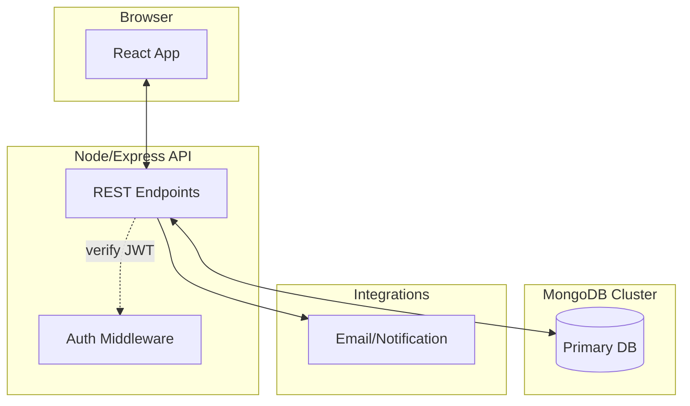
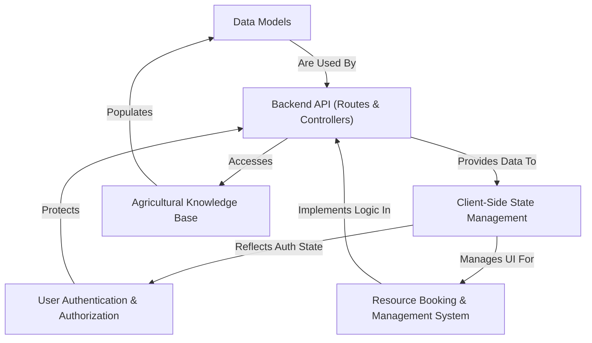
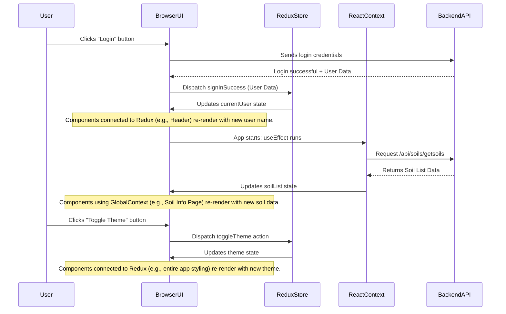
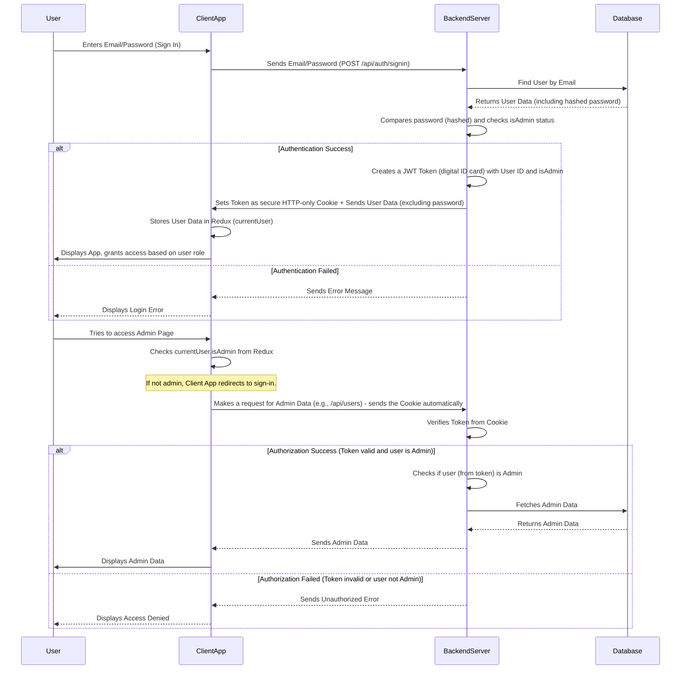
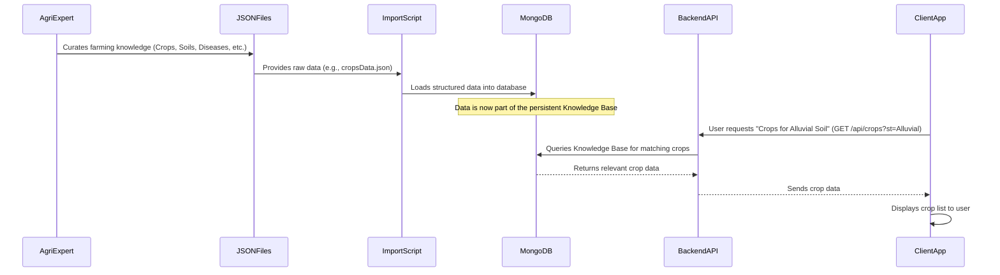
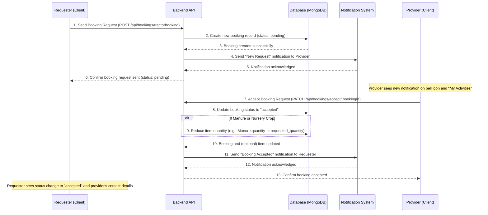
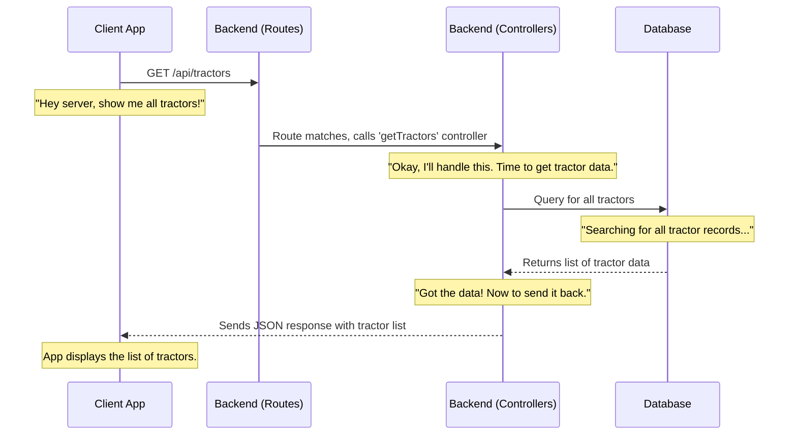
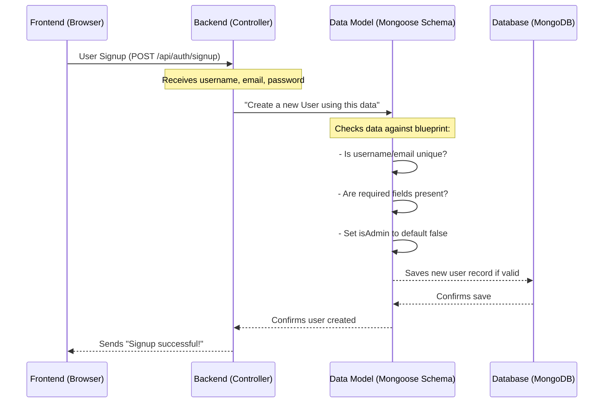

# Farmer Assistance (agri-credit) — Full Architecture Documentation

_Last updated: August 22, 2025_

This document consolidates and expands the uploaded chapters into a single, end‑to‑end architecture reference for the **Farmer Assistance (agri-credit)** platform. It includes a system context, logical and deployment views, core modules, data models, API surface, security model, and end‑to‑end flows.

> Note: Mermaid diagrams can be viewed in compatible Markdown renderers.

## Table of Contents

1. System Context & Views
2. Client-Side State Management
3. Authentication & Authorization
4. Agricultural Knowledge Base
5. Resource Booking & Management
6. Backend API (Routes & Controllers)
7. Data Models
8. Non-Functional Considerations
9. Appendix: Source Chapters

## System Context (C4 Level 1)

```mermaid
flowchart LR
    user((Farmer / Expert / Admin))
    subgraph Client ["Web Client (React + Redux + Context)"]
      ui[UI Components]
      context[GlobalContext]
      redux[Redux Store]
    end

    subgraph Server ["Backend API (Node.js + Express)"]
      routes[Routes]
      controllers[Controllers]
      auth[Auth & Token Verification]
      services[Business Logic]
      models[Data Models (Mongoose) ]
    end

    db[(MongoDB)]
    email[Email/Notification Service]

    user --> ui
    ui <--> context
    ui <--> redux
    ui --> routes
    routes --> controllers
    controllers --> services
    services --> models
    models --> db
    services --> email
    auth -. protects .- routes
```

## Deployment View (C4 Level 2)



<!-- BEGIN index.md -->

# Tutorial: agri-credit

Agri-credit is a comprehensive **digital platform** designed to _empower farmers_ by providing a central hub for agricultural information and resource management. It offers an **Agricultural Knowledge Base** for crop, soil, disease, and fertilizer advice, and facilitates **resource sharing and booking** of items like organic manures, tractors, and nursery crops within the farming community.

## Visual Overview



## Chapters

1. [Client-Side State Management
   ](01_client_side_state_management_.md)
2. [User Authentication & Authorization
   ](02_user_authentication___authorization_.md)
3. [Agricultural Knowledge Base
   ](03_agricultural_knowledge_base_.md)
4. [Resource Booking & Management System
   ](04_resource_booking___management_system_.md)
5. [Backend API (Routes & Controllers)
   ](05_backend_api__routes___controllers__.md)
6. [Data Models
   ](06_data_models_.md)

---

<!-- END index.md -->

<!-- BEGIN 01_client_side_state_management_.md -->

# Chapter 1: Client-Side State Management

Imagine you're using a website, and you log in. You expect your name to appear in the top corner, your personalized dashboard to load, and if you switch to dark mode, you want the whole site to change instantly. What if you close your browser tab and open it again? You'd probably expect to still be logged in, or at least for the dark mode setting to be remembered.

This is where **Client-Side State Management** comes in! Think of it as your web application's "short-term memory" right inside your web browser. It's how the application remembers important details about you, your preferences, and the data it's currently showing, so everything stays updated and synchronized as you use it.

## What is "State"?

In simple terms, "state" is any data that can change over time in your application. For `agri-credit`, this includes:

- **Who is logged in:** Is it an administrator, a farmer, or no one?
- **The theme:** Is the app currently in light mode or dark mode?
- **Lists of items:** What are the available types of soil, crops, or fertilizers?
- **Your location:** Where is the user currently located (latitude and longitude)?

Managing this "state" ensures that when one part of the app updates (e.g., you log in), other parts that need this information (like your profile picture in the header) automatically show the correct, up-to-date data.

The `agri-credit` project uses two main tools for managing this short-term memory: **Redux** and **React Context**. Let's explore why we use both and what each is good for.

## Redux: The Central Information Hub

Think of Redux as the **central library** for your entire `agri-credit` application. It holds all the really important, global information that many different parts of the app might need to access or change.

### Why Redux?

- **Global Data:** Best for data that needs to be available almost anywhere in your application, like user login status, the current theme, or global settings.
- **Predictable Changes:** It has strict rules for how data can be changed, which makes your app more predictable and easier to debug.
- **Scalability:** Great for larger applications with many different components sharing data.

### How it Works (Simplified)

Redux has a "store" that holds all the state. To change the state, you don't just directly edit it. Instead, you "dispatch" an "action" (like sending a request to the library). A "reducer" (like a librarian following instructions) then takes that action and updates the state in a specific way.

Let's look at how Redux manages your user's login status and the app's theme.

**Use Case: User Login and Theme Toggle**

Imagine a user logs into `agri-credit`. Their login status and details (like their name and ID) need to be known by the header (to show their name), the profile page, and potentially other parts of the app. Also, they might want to toggle between a light and dark theme, and this preference should also be known globally.

**Input:** User enters credentials and clicks "Login". User clicks a "Dark Mode" toggle.

**Output:**

- User's name appears in the navigation bar.
- The entire application's color scheme changes to dark.

### Code in Action (Redux Slices)

In Redux, we organize related pieces of state into "slices."

#### 1. User State Management (`client/src/redux/user/userSlice.js`)

This file defines how information about the `currentUser` (the logged-in user), any `error` during sign-in, and the `loading` status are managed.

```javascript
// client/src/redux/user/userSlice.js
import { createSlice } from "@reduxjs/toolkit";

const initialState = {
  currentUser: null, // No one logged in initially
  error: null,
  loading: false,
};

const userSlice = createSlice({
  name: "user", // Name of this slice
  initialState,
  reducers: {
    // When a sign-in is successful:
    signInSuccess: (state, action) => {
      state.currentUser = action.payload; // Store user data
      state.loading = false; // Stop loading
      state.error = null; // Clear any errors
    },
    // Other actions like signInStart, signInFailure, update, delete, signout...
  },
});

export const { signInSuccess } = userSlice.actions;
export default userSlice.reducer;
```

This code snippet shows a "slice" of our Redux state specifically for user-related information. The `signInSuccess` function is a "reducer" that tells Redux exactly how to update the `currentUser` data when a user successfully logs in.

#### 2. Theme State Management (`client/src/redux/theme/themeSlice.js`)

Similar to the user slice, this manages the application's theme.

```javascript
// client/src/redux/theme/themeSlice.js
import { createSlice } from "@reduxjs/toolkit";

const initialState = {
  theme: "light", // Default theme is light
};

const themeSlice = createSlice({
  name: "theme",
  initialState,
  reducers: {
    // When the theme needs to be toggled:
    toggleTheme: (state) => {
      // If current theme is light, change to dark, otherwise change to light
      state.theme = state.theme === "light" ? "dark" : "light";
    },
  },
});

export const { toggleTheme } = themeSlice.actions;
export default themeSlice.reducer;
```

Here, the `toggleTheme` reducer simply flips the `theme` value between 'light' and 'dark'. Any component in the app that cares about the `theme` will automatically re-render when this changes.

#### 3. Combining Slices into the Redux Store (`client/src/redux/store.js`)

All these individual slices (user, theme, and others you might add later) are combined into one big Redux "store." This `store.js` file also sets up something called `redux-persist`, which helps save your state to the browser's local storage so it remembers your login or theme even if you close and reopen the browser.

```javascript
// client/src/redux/store.js
import { combineReducers, configureStore } from "@reduxjs/toolkit";
import userReducer from "./user/userSlice";
import themeReducer from "./theme/themeSlice";
import { persistReducer, persistStore } from "redux-persist";
import storage from "redux-persist/lib/storage";

const rootReducer = combineReducers({
  user: userReducer, // User state handled by userReducer
  theme: themeReducer, // Theme state handled by themeReducer
});

const persistConfig = {
  key: "root", // Key for storing in local storage
  storage, // Use browser's local storage
  version: 1,
};

const persistedReducer = persistReducer(persistConfig, rootReducer);

export const store = configureStore({
  reducer: persistedReducer, // Our combined and persisted reducers
  // ... other middleware configurations
});

export const persistor = persistStore(store);
```

This code creates the main Redux `store`. `combineReducers` brings together all our "slices" (like `user` and `theme`) into a single state object. `redux-persist` then wraps this, making sure your Redux state can be saved and loaded from your browser's memory, so your theme or login status isn't lost when you close the tab.

#### 4. Making Redux Available (`client/src/main.jsx`)

Finally, to make the Redux store available to our entire application, we wrap our main `App` component with a `<Provider>` from `react-redux`. The `<PersistGate>` ensures that our Redux state is loaded from storage before the app fully renders.

```javascript
// client/src/main.jsx
import { createRoot } from "react-dom/client";
import App from "./App.jsx";
import "./index.css";
import { store, persistor } from "./redux/store"; // Import our Redux store
import { Provider } from "react-redux"; // Redux provider
import { PersistGate } from "redux-persist/integration/react"; // For persistent state
// ... other imports for ThemeProvider, ToastContainer, GlobalContext

createRoot(document.getElementById("root")).render(
  <StrictMode>
    <Provider store={store}>
      {" "}
      {/* Make Redux store available */}
      <PersistGate loading={null} persistor={persistor}>
        {" "}
        {/* Load persisted state */}
        {/* ... other context providers and App */}
        <App />
      </PersistGate>
    </Provider>
  </StrictMode>
);
```

By wrapping `<App />` with `<Provider store={store}>`, we make sure that any component within our `agri-credit` app can access the Redux state and dispatch actions to change it.

## React Context: Localized Information Boards

While Redux is great for global, application-wide data, sometimes you have information that's only needed by a specific group of components, or that changes very frequently. This is where **React Context** shines.

Think of React Context as a **local notice board** or a **family bulletin board**. It's perfect for sharing data among components that are related or nested together, without having to pass the data "props" down manually through many layers (a problem known as "prop drilling").

### Why React Context?

- **Local Sharing:** Ideal for data that's shared within a specific part of your component tree, but not necessarily across the entire application.
- **Simpler Setup:** Generally requires less setup compared to Redux for simpler data sharing.
- **Frequent Updates:** Good for data that changes often but only affects a limited scope.

### How it Works (Simplified)

You create a "Context" which is like an empty container for your data. Then, a "Provider" component wraps the parts of your app that need access to this data and provides the actual values. Any component inside the Provider can then "consume" (read) those values using a special React hook called `useContext`.

**Use Case: Sharing Agricultural Data and User Location**

The `agri-credit` app needs to display lists of soils, crops, fertilizers, and even the user's current location to calculate distances to nearby resources. This data might be fetched once when the app starts or when the user's location changes. This data is used by various pages, but it's not as "global" as the logged-in user or theme settings.

**Input:** Application loads, user allows location access.

**Output:**

- A list of available soil types is displayed on the "Soil Information" page.
- The user's current latitude and longitude are known, allowing the app to calculate distances to nearby resources like nurseries or tractors.

### Code in Action (React Context)

In `agri-credit`, we use a `GlobalContext` to manage various lists of agricultural data and user-specific information.

#### 1. Defining the Global Context (`client/src/context/GlobalState.jsx`)

This file creates a `GlobalContext` and a `GlobalProvider` component. The `GlobalProvider` fetches various lists (like soils, crops, fertilizers) and the user's location when the application starts (`useEffect`). It then makes all this data available to its child components.

```javascript
// client/src/context/GlobalState.jsx
import React, { createContext, useEffect, useState } from "react";
import { useSelector } from "react-redux"; // We can even access Redux state here!

const GlobalContext = createContext(); // Create the context

const GlobalProvider = ({ children }) => {
  const { currentUser } = useSelector((state) => state.user); // Get user from Redux

  // State variables for various lists and user location
  const [userLatitude, setUserLatitude] = useState(null);
  const [userLongitude, setUserLongitude] = useState(null);
  const [soilList, setSoilList] = useState([]);
  const [cropList, setCropList] = useState([]);
  // ... many other state variables for different lists

  useEffect(() => {
    // Functions to fetch initial data when component mounts
    getCurrentLocation(); // Get user's GPS location
    getAllSoils(); // Fetch list of soils from backend
    getAllCrops(); // Fetch list of crops from backend
    // ... call other data fetching functions
  }, []); // Run only once on mount

  // Example function to fetch soils
  const getAllSoils = async () => {
    try {
      const res = await fetch("/api/soils/getsoils");
      const soils = await res.json();
      if (res.ok) {
        setSoilList(soils); // Update the state
        console.log("Soil list fetched successfully");
      }
    } catch (error) {
      console.log(error);
    }
  };

  // ... other data fetching functions and utility functions like calculateDistance

  return (
    <GlobalContext.Provider
      value={{
        soilList, // Make soilList available
        userLatitude, // Make userLatitude available
        userLongitude, // Make userLongitude available
        // ... make other states and functions available
      }}
    >
      {children} {/* Render child components that can access this context */}
    </GlobalContext.Provider>
  );
};

export default GlobalProvider;
export { GlobalContext }; // Export context for components to use
```

This `GlobalProvider` component acts as the "source" of our context data. It fetches initial data (like `soilList` or `userLatitude`) using `useEffect` when the app loads. Then, it uses `<GlobalContext.Provider>` to pass these values down to any component wrapped by it. Notice how it even uses `useSelector` to get `currentUser` from Redux, showing how Redux and Context can work together!

#### 2. Making Global Context Available (`client/src/main.jsx`)

Just like with Redux, the `GlobalContext` provider needs to wrap the `App` component so that all the components within the application can access the data it provides.

```javascript
// client/src/main.jsx (partial view, focusing on context providers)
import { StrictMode } from "react";
import { createRoot } from "react-dom/client";
import App from "./App.jsx";
// ... Redux imports

import GlobalContext from "./context/GlobalState.jsx"; // Import our GlobalContext provider

createRoot(document.getElementById("root")).render(
  <StrictMode>
    {/* Redux Provider */}
    <Provider store={store}>
      <PersistGate loading={null} persistor={persistor}>
        {/* Global Context Provider */}
        <GlobalContext>
          {" "}
          {/* Make GlobalContext data available */}
          {/* Theme Provider */}
          <ThemeProvider>
            <App />
            <ToastContainer />
          </ThemeProvider>
        </GlobalContext>
      </PersistGate>
    </Provider>
  </StrictMode>
);
```

Here, `GlobalContext` wraps `ThemeProvider` and `App`, meaning all the components inside `App` can now use the data provided by `GlobalContext` (like `soilList` or `userLatitude`).

## Redux vs. React Context: A Quick Comparison

Both Redux and React Context help manage state, but they are used for different scenarios.

| Feature        | Redux                                                         | React Context                                                                                          |
| :------------- | :------------------------------------------------------------ | :----------------------------------------------------------------------------------------------------- |
| **Analogy**    | Central Library/Global Database                               | Local Notice Board/Family Bulletin                                                                     |
| **Best For**   | Global, app-wide state (user, theme, app-wide settings)       | Local state, data shared between related components (e.g., specific lists, user location in a section) |
| **Complexity** | More initial setup/boilerplate, but powerful for complex apps | Simpler to set up for basic sharing, can become complex for very wide sharing                          |
| **Data Flow**  | Centralized, predictable changes via actions and reducers     | Top-down, within a specific component tree, direct state updates                                       |

In `agri-credit`, we use Redux for user authentication and theme (data that truly affects the _entire_ app) and React Context for more specific data lists (like soils, crops, user's current location) that are shared across various _sections_ or pages but might not need the full power of a global state management library for every single change.

## How it All Comes Together: A Simplified Flow

Let's trace how state changes happen in `agri-credit` using both Redux and React Context.



1.  **User Logs In (Redux Example):**

    - The `User` interacts with the `BrowserUI` (e.g., fills a login form).
    - The `BrowserUI` sends the login details to the `BackendAPI`.
    - The `BackendAPI` authenticates and sends back `User Data`.
    - The `BrowserUI` then "dispatches" an action (`signInSuccess`) to the `ReduxStore` with the `User Data`.
    - The `ReduxStore` updates its `currentUser` state.
    - Any part of the `BrowserUI` that "listens" to the `currentUser` state in Redux (like the user's name in the header) automatically updates.

2.  **App Loads and Fetches Data (React Context Example):**
    - When the `BrowserUI` first loads, the `useEffect` hook inside the `ReactContext` (our `GlobalProvider`) is triggered.
    - `ReactContext` requests `Soil List Data` from the `BackendAPI`.
    - The `BackendAPI` responds with the data.
    - `ReactContext` updates its `soilList` state.
    - Any part of the `BrowserUI` that uses this `GlobalContext` (like a page displaying soil types) automatically shows the fetched data.

## Looking Ahead

Understanding client-side state management is crucial because it forms the backbone of how your `agri-credit` application keeps track of everything happening on the user's screen. Whether it's knowing who's logged in or displaying the latest crop information, state management ensures a smooth and responsive user experience.

In the next chapter, we'll dive deeper into how `agri-credit` specifically handles [User Authentication & Authorization](02_user_authentication___authorization_.md), building upon the `currentUser` state we just learned about in Redux.

---

<sub><sup>**References**: [[1]](https://github.com/Manoj10211021/agri-credit/blob/9d43941dd9dfa32fef910d092ca049039ee713eb/client/src/context/GlobalState.jsx), [[2]](https://github.com/Manoj10211021/agri-credit/blob/9d43941dd9dfa32fef910d092ca049039ee713eb/client/src/main.jsx), [[3]](https://github.com/Manoj10211021/agri-credit/blob/9d43941dd9dfa32fef910d092ca049039ee713eb/client/src/redux/store.js), [[4]](https://github.com/Manoj10211021/agri-credit/blob/9d43941dd9dfa32fef910d092ca049039ee713eb/client/src/redux/theme/themeSlice.js), [[5]](https://github.com/Manoj10211021/agri-credit/blob/9d43941dd9dfa32fef910d092ca049039ee713eb/client/src/redux/user/userSlice.js)</sup></sub>

<!-- END 01_client_side_state_management_.md -->

<!-- BEGIN 02_user_authentication___authorization_.md -->

# Chapter 2: User Authentication & Authorization

In the previous chapter, [Client-Side State Management](01_client_side_state_management_.md), we learned how the `agri-credit` application keeps track of important information directly in your browser, like whether you're logged in (`currentUser` in Redux) or what theme you prefer. But how does the app _know_ who you are in the first place? And once it knows, how does it decide what you're allowed to do?

This is where **User Authentication & Authorization** comes in! Think of it as the highly secure "security checkpoint" for our `agri-credit` application. It's vital for protecting sensitive farming data, ensuring only the right people can access certain features, and keeping your information safe.

## What Problem Does it Solve?

Imagine `agri-credit` has different users: farmers, agricultural experts, and administrators.

- A farmer should be able to view their own crop data and resource bookings.
- An agricultural expert might be able to offer advice and view public crop information.
- An administrator should be able to manage all user accounts, add new crop types to the knowledge base, or modify system settings.

Without authentication and authorization, anyone could pretend to be an administrator and potentially delete important data or view private information. This system ensures that only verified users can access what they're permitted to.

## Key Concepts

User authentication and authorization are often talked about together, but they are two distinct steps:

1.  **Authentication: "Who Are You?"**
    This is the process of _verifying_ a user's identity. When you sign in to `agri-credit` with your email and password, the system is authenticating you. It's like showing your ID card at a checkpoint.

    - **Signing Up:** Creating a new account by providing details like username, email, and password. The password isn't stored directly; instead, a scrambled version (called a "hash") is saved securely.
    - **Signing In:** Proving you are who you say you are, usually by providing the correct username/email and password.
    - **Tokens:** Once authenticated, the server gives you a special "digital ID card" called a **token**. This token is like a temporary pass that proves you've been authenticated without having to re-enter your password for every single action.

2.  **Authorization: "What Are You Allowed To Do?"**
    Once you're authenticated (the system knows who you are), authorization determines _what actions_ you're permitted to perform and _what resources_ you can access. It's like the security guard checking your ID and then telling you which rooms you're allowed to enter.

    - **Roles:** Users often have different "roles" (e.g., `farmer`, `expert`, `admin`). Each role has a defined set of permissions.
    - **Permission Checks:** Every time you try to do something sensitive (like delete a user or add a new crop type), the system checks your role and permissions.

## Solving the Use Case: Logging In and Accessing Features

Let's trace what happens when a user signs in to `agri-credit` and how their permissions are managed.

**Input:** A user (e.g., `admin@example.com` with password `secretpassword`) enters their credentials on the sign-in page.

**Output:**

- The user is successfully logged in.
- Their username and profile picture appear in the navigation bar.
- If they are an administrator, they can see and access links to special admin-only dashboards or pages.

### Client-Side (What you see in the browser)

The client-side (your browser) uses the Redux state we discussed in Chapter 1 to manage the user's login status and role.

#### 1. Signing In (`client/src/pages/SignIn.jsx`)

When you type your email and password and click "Sign In", the `SignIn.jsx` component sends this information to the backend.

```javascript
// client/src/pages/SignIn.jsx (Simplified)
import {
  signInStart,
  signInSuccess,
  signInFailure,
} from "../redux/user/userSlice";
import { useDispatch, useSelector } from "react-redux"; // For Redux state

export default function SignIn() {
  const [formData, setFormData] = useState({});
  const dispatch = useDispatch(); // Tool to send actions to Redux

  const handleSubmit = async (e) => {
    e.preventDefault();
    dispatch(signInStart()); // Tell Redux: "Sign-in process started!"
    const res = await fetch("/api/auth/signin", {
      // Send data to backend
      method: "POST",
      headers: { "Content-Type": "application/json" },
      body: JSON.stringify(formData),
    });
    const responseData = await res.json();

    if (res.ok) {
      dispatch(signInSuccess(responseData)); // Tell Redux: "Sign-in successful!"
      // Redux now stores currentUser data (username, email, isAdmin, etc.)
      navigate("/"); // Go to homepage
    } else {
      dispatch(signInFailure(responseData.message)); // Tell Redux: "Sign-in failed!"
    }
  };
  // ... rest of the component
}
```

When the user clicks "Sign In", the `handleSubmit` function first tells our Redux store that the sign-in process has _started_ (`signInStart`). Then, it sends the user's email and password to the server. If the server responds successfully (`res.ok`), it dispatches `signInSuccess` with the user's data (username, email, `isAdmin` status, etc.), updating the `currentUser` in our Redux state.

#### 2. Protecting Routes (`client/src/components/PrivateRoute.jsx` and `OnlyAdminPrivateRoute.jsx`)

Now that the Redux state knows who the `currentUser` is, we can use this information to protect parts of our application.

```javascript
// client/src/components/PrivateRoute.jsx (For any logged-in user)
import { useSelector } from "react-redux";
import { Outlet, Navigate } from "react-router-dom";

export default function PrivateRoute() {
  const { currentUser } = useSelector((state) => state.user); // Get user from Redux
  return currentUser ? <Outlet /> : <Navigate to="/sign-in" />; // If logged in, show page, else redirect
}
```

This `PrivateRoute` component checks if `currentUser` exists in our Redux store. If a user is logged in, it allows them to see the content (`<Outlet />`). Otherwise, it redirects them to the `/sign-in` page. This protects pages that _any_ logged-in user should access (e.g., their profile page).

```javascript
// client/src/components/OnlyAdminPrivateRoute.jsx (For admin users only)
import { useSelector } from "react-redux";
import { Outlet, Navigate } from "react-router-dom";

export default function OnlyAdminPrivateRoute() {
  const { currentUser } = useSelector((state) => state.user); // Get user from Redux
  return currentUser.isAdmin ? <Outlet /> : <Navigate to="/sign-in" />; // If admin, show page, else redirect
}
```

Similar to `PrivateRoute`, `OnlyAdminPrivateRoute` specifically checks if `currentUser.isAdmin` is `true`. This ensures that only administrators can access routes like the user management dashboard.

### How it Works (Under the Hood)

Let's look at the "digital ID card" (token) and how the backend handles security.



Here's a step-by-step breakdown:

1.  **User Enters Credentials:** You type your email and password in the `SignIn.jsx` page.
2.  **Client Sends Request:** Your `ClientApp` sends this data to the `BackendServer`'s `/api/auth/signin` route.
3.  **Backend Authenticates:**
    - The `BackendServer` looks up the user in the `Database` using the provided email.
    - It then takes the password you entered, encrypts it (hashes it) in the same way the stored password was, and compares the two hashes. It _never_ decrypts the stored password.
    - If the hashes match, authentication is successful!
4.  **Backend Issues Token:**
    - The `BackendServer` creates a special `JWT (JSON Web Token)`. This token contains minimal information like your user ID and whether you are an administrator (`isAdmin: true/false`).
    - This token is then set as a secure **HTTP-only cookie** in your browser. "HTTP-only" means your browser's JavaScript cannot directly access or tamper with this cookie, making it very secure.
    - Along with the cookie, the server sends back your non-sensitive user data (username, email, profile picture, `isAdmin` status) to the `ClientApp`.
5.  **Client Stores User Data:** The `ClientApp` (specifically `SignIn.jsx` and Redux) receives this user data and updates the `currentUser` state in Redux. It doesn't store the token directly in Redux because the token is in the HTTP-only cookie, which the browser sends automatically with future requests to the server.
6.  **Client-Side Authorization:** When you try to access a protected page (like an admin dashboard), components like `OnlyAdminPrivateRoute.jsx` check the `isAdmin` flag stored in the Redux `currentUser` state. If `isAdmin` is false, access is denied _before_ even sending a request to the backend.
7.  **Server-Side Authorization (for every protected request):**
    - Whenever the `ClientApp` needs data from the `BackendServer` that requires a logged-in user (e.g., fetching a list of all users), your browser automatically includes the HTTP-only `access_token` cookie with the request.
    - The `BackendServer` uses a "middleware" function (`verifyToken`) to check if this token is valid and unexpired. If it's valid, the server can extract your user ID and `isAdmin` status from the token.
    - Before performing the requested action (e.g., `deleteUser`, `getUsers`), the `BackendServer` checks the `isAdmin` flag from the token. If you're trying to view all users and you're not an admin, the request is denied on the server. If you are an admin, the action proceeds.

## Code in Action (Server-Side)

Let's dive into the backend code that makes this happen.

#### 1. User Model (`api/models/user.model.js`)

This defines how user information is stored in our database, including the `isAdmin` field which is crucial for authorization.

```javascript
// api/models/user.model.js (Simplified)
import mongoose from "mongoose";

const userSchema = new mongoose.Schema(
  {
    username: { type: String, required: true, unique: true },
    email: { type: String, required: true, unique: true },
    password: { type: String, required: true }, // This will store the hashed password
    isAdmin: { type: Boolean, default: false }, // Crucial for authorization
    // ... other user fields like profilePicture, phone, isVerified
  },
  { timestamps: true } // Records when user was created/updated
);

const User = mongoose.model("User", userSchema);
export default User;
```

The `userSchema` defines the structure of a user document in our MongoDB database. The `password` field stores the securely hashed password, and the `isAdmin` boolean determines if a user has administrative privileges.

#### 2. Authentication Logic (`api/controllers/auth.controller.js`)

This file handles `signup` (creating an account) and `signin` (logging in).

```javascript
// api/controllers/auth.controller.js (Simplified signup)
import bcryptjs from "bcryptjs"; // For password hashing
import User from "../models/user.model.js";
import { errorHandler } from "../utils/error.js"; // Custom error handler

export const signup = async (req, res, next) => {
  const { username, email, password } = req.body;
  if (!username || !email || !password || username === "") {
    return next(errorHandler(400, "All fields are required"));
  }
  try {
    const hashedPassword = bcryptjs.hashSync(password, 10); // Hash password
    const newUser = new User({
      username,
      email,
      password: hashedPassword,
    });
    await newUser.save(); // Save new user to database
    return res.status(200).json({ message: "Signup successful !" });
  } catch (err) {
    next(err); // Pass error to global error handler
  }
};
// ... other functions like signin, google
```

In `signup`, `bcryptjs.hashSync` is used to scramble the user's password before storing it. This is a one-way process, meaning you can't get the original password back from the hash, making it very secure.

```javascript
// api/controllers/auth.controller.js (Simplified signin)
import bcryptjs from "bcryptjs";
import jwt from "jsonwebtoken"; // For creating tokens
import User from "../models/user.model.js";
import { errorHandler } from "../utils/error.js";

export const signin = async (req, res, next) => {
  const { email, password } = req.body;
  try {
    const validUser = await User.findOne({ email });
    if (!validUser) return next(errorHandler(404, "User Not found"));

    const validPassword = bcryptjs.compareSync(password, validUser.password); // Compare entered password with hashed one
    if (!validPassword) return next(errorHandler(401, "Invalid Password"));

    const token = jwt.sign(
      // Create a JWT token
      { id: validUser._id, isAdmin: validUser.isAdmin }, // Data to store in token
      process.env.JWT_SECRET // Secret key for signing
    );

    const { password: pass, ...others } = validUser._doc; // Remove password from response
    res
      .status(200)
      .cookie("access_token", token, {
        httpOnly: true,
        maxAge: 365 * 24 * 60 * 60 * 1000,
      }) // Set token as secure cookie
      .json(others); // Send user data (without password) to client
  } catch (err) {
    next(err);
  }
};
// ... other functions
```

In `signin`, after finding the user and verifying their password with `bcryptjs.compareSync`, a `jwt.sign` function creates a JSON Web Token. This token contains the user's ID and `isAdmin` status. The `res.cookie` method then sends this token back to the client as an `httpOnly` cookie, which is then automatically sent with subsequent requests.

#### 3. Token Verification Middleware (`api/utils/verifyUser.js`)

This crucial piece of code runs _before_ any protected route on the backend. It checks if the `access_token` cookie is present and valid.

```javascript
// api/utils/verifyUser.js (Simplified)
import jwt from "jsonwebtoken";
import { errorHandler } from "./error.js";

export const verifyToken = (req, res, next) => {
  const token = req.cookies.access_token; // Get token from cookie
  if (!token) {
    return next(errorHandler(401, "Unauthorized")); // No token, no access
  }
  jwt.verify(token, process.env.JWT_SECRET, (err, user) => {
    // Verify token
    if (err) {
      return next(errorHandler(401, "Unauthorized")); // Invalid token
    }
    req.user = user; // Attach user info (id, isAdmin) to the request
    next(); // Continue to the actual route handler
  });
};
```

The `verifyToken` function extracts the `access_token` from the incoming request's cookies. It then uses `jwt.verify` to check if the token is valid and hasn't been tampered with. If valid, the user's `id` and `isAdmin` status (which were embedded in the token during sign-in) are attached to the `req.user` object. This `req.user` object is then available to the next function in the request chain (the actual controller for the route).

#### 4. Authorization in Controllers (`api/controllers/user.controller.js`)

Now, in our controller functions, we can easily check the `req.user` object to implement authorization rules.

```javascript
// api/controllers/user.controller.js (Simplified getUser example)
import User from "../models/user.model.js";
import { errorHandler } from "../utils/error.js";

export const getUsers = async (req, res, next) => {
  if (!req.user.isAdmin) {
    // Check if the authenticated user is an admin
    return next(errorHandler(403, "You are not allowed to view users")); // Forbidden
  }
  try {
    const users = await User.find(); // Only admins can fetch all users
    const usersWithOutPassword = users.map((user) => {
      const { password, ...rest } = user._doc;
      return rest;
    });
    return res.status(200).json({ users: usersWithOutPassword });
  } catch (err) {
    next(err);
  }
};

export const deleteUser = async (req, res, next) => {
  // Allow admin to delete any user, or a regular user to delete their own account
  if (!req.user.isAdmin && req.user.id !== req.params.userId) {
    return next(errorHandler(403, "You are not allowed to delete this user"));
  }
  try {
    await User.findByIdAndDelete(req.params.userId); // Delete user from DB
    res.status(200).json({ message: "User has been Deleted" });
  } catch (err) {
    next(err);
  }
};
// ... other functions
```

In `getUsers`, the very first line `if (!req.user.isAdmin)` is a server-side authorization check. It ensures that only users identified as administrators (from the verified token) can access the full list of users. Similarly, in `deleteUser`, it checks if the user is an admin OR if they are trying to delete their _own_ account, preventing unauthorized deletions.

## Authentication vs. Authorization: A Quick Review

| Feature      | Authentication                     | Authorization                                                    |
| :----------- | :--------------------------------- | :--------------------------------------------------------------- |
| **Question** | Who are you?                       | What are you allowed to do?                                      |
| **Process**  | Verifying identity (Login, Signup) | Determining permissions/access                                   |
| **Example**  | Entering email/password            | Administrator can see all users; farmer can only see their crops |
| **Outcome**  | Successful login, valid token      | Access granted or denied to features/data                        |

## Conclusion

User authentication and authorization are foundational to building a secure and functional application like `agri-credit`. By understanding how passwords are hashed, tokens are used as digital ID cards, and roles like `isAdmin` govern access, you can ensure that your application's data is protected and users only perform actions they are permitted to.

Now that we understand how users can securely access `agri-credit`, let's move on to explore the core information the application provides: the [Agricultural Knowledge Base](03_agricultural_knowledge_base_.md).

---

<sub><sup>**References**: [[1]](https://github.com/Manoj10211021/agri-credit/blob/9d43941dd9dfa32fef910d092ca049039ee713eb/api/controllers/auth.controller.js), [[2]](https://github.com/Manoj10211021/agri-credit/blob/9d43941dd9dfa32fef910d092ca049039ee713eb/api/controllers/user.controller.js), [[3]](https://github.com/Manoj10211021/agri-credit/blob/9d43941dd9dfa32fef910d092ca049039ee713eb/api/models/user.model.js), [[4]](https://github.com/Manoj10211021/agri-credit/blob/9d43941dd9dfa32fef910d092ca049039ee713eb/api/utils/verifyUser.js), [[5]](https://github.com/Manoj10211021/agri-credit/blob/9d43941dd9dfa32fef910d092ca049039ee713eb/client/src/components/OAuth.jsx), [[6]](https://github.com/Manoj10211021/agri-credit/blob/9d43941dd9dfa32fef910d092ca049039ee713eb/client/src/components/OnlyAdminPrivateRoute.jsx), [[7]](https://github.com/Manoj10211021/agri-credit/blob/9d43941dd9dfa32fef910d092ca049039ee713eb/client/src/components/PrivateRoute.jsx), [[8]](https://github.com/Manoj10211021/agri-credit/blob/9d43941dd9dfa32fef910d092ca049039ee713eb/client/src/pages/SignIn.jsx), [[9]](https://github.com/Manoj10211021/agri-credit/blob/9d43941dd9dfa32fef910d092ca049039ee713eb/client/src/pages/SignUp.jsx)</sup></sub>

<!-- END 02_user_authentication___authorization_.md -->

<!-- BEGIN 03_agricultural_knowledge_base_.md -->

# Chapter 3: Agricultural Knowledge Base

In the previous chapter, [User Authentication & Authorization](02_user_authentication___authorization_.md), we learned how `agri-credit` knows who you are and what you're allowed to do. Once you're securely logged in, you can start using the app's features. One of the most powerful features for farmers is getting reliable agricultural advice. But where does this advice come from?

This is where the **Agricultural Knowledge Base** comes in! Think of it as `agri-credit`'s very own digital "encyclopedia of farming." Instead of asking a human expert every time, the app has a vast collection of pre-loaded, reliable information about everything a farmer might need to know.

## What Problem Does it Solve?

Imagine you're a farmer. You might have questions like:

- "What crops grow best in the black soil on my land?"
- "My wheat crop has rust-colored spots. What disease is it, and what pesticide should I use?"
- "What's the right fertilizer for rice during the Kharif season?"

Finding answers to these questions quickly and accurately is crucial for successful farming. The Agricultural Knowledge Base provides these answers instantly, helping farmers make informed decisions without needing to be an expert themselves.

## What is the Agricultural Knowledge Base?

It's a collection of **static, foundational data** that the `agri-credit` application uses to provide smart, relevant advice. Unlike your personal crop records or bookings, this information doesn't change based on individual user input. It's the core agricultural wisdom built into the app.

This knowledge base includes details about:

- **Crops:** Information like their sowing, duration, and harvesting periods.
- **Soils:** Which crops thrive in different types of soil.
- **Diseases:** Symptoms, how they spread, and how to prevent them.
- **Fertilizers:** Recommended application rates, physical form, and safety tips.
- **Pesticides:** What pests they target, application rates, and safety precautions.

This organized data powers the "AgriHelp" features of the application, making it a valuable tool for farmers.

## Solving the Use Case: Getting Farming Advice

Let's see how a farmer uses the `agri-credit` app to get specific advice from this knowledge base.

**Use Case:** A farmer wants to know what pesticides to use for a disease affecting their "Tomato" crop.

**Input:** The farmer navigates to the "Pesticides" section of the app and selects "Tomato" as the crop, then picks "Late Blight" as the disease.

**Output:**

- The app displays a list of recommended pesticides for "Tomato" crops with "Late Blight," including their application rates and safety cautions.

### Client-Side (What you see in the browser)

On the client-side (your web browser), specialized components interact with this knowledge base to display information and provide recommendations. Remember from [Chapter 1: Client-Side State Management](01_client_side_state_management_.md) how `GlobalContext` helps fetch initial lists? That's our starting point here.

#### 1. Crop and Disease Selection (`client/src/components/Pesticides.jsx`)

This component allows the user to select a crop and then a disease, and then fetches the relevant pesticides.

```javascript
// client/src/components/Pesticides.jsx (Simplified)
import React, { useContext, useEffect, useState } from "react";
import { GlobalContext } from "../context/GlobalState"; // Our shared context

export default function Pesticides() {
  const [selectedCropId, setSelectedCropId] = useState("");
  const [selectedDiseaseId, setSelectedDiseaseId] = useState("");
  const [diseaseOptions, setDiseaseOptions] = useState([]);
  const [pesticidesToShow, setPesticidesToShow] = useState([]);

  // Get the full list of crops from our GlobalContext
  const { cropList, getAllCrops } = useContext(GlobalContext);

  useEffect(() => {
    getAllCrops(); // Fetch all crops when the page loads
  }, []);

  const handleCropChange = async (event) => {
    const cropId = event.target.value;
    setSelectedCropId(cropId);
    // Fetch diseases related to the selected crop
    const response = await fetch(`/api/diseases/cropdiseases/${cropId}`);
    const data = await response.json();
    setDiseaseOptions(data); // Update disease dropdown
    setSelectedDiseaseId(""); // Reset disease selection
    setPesticidesToShow([]); // Clear previous pesticide results
  };

  const handleSubmit = async (event) => {
    event.preventDefault();
    // Fetch pesticides based on selected crop and disease
    const response = await fetch(
      `/api/pesticides/getpesticide/${selectedDiseaseId}/${selectedCropId}`
    );
    const data = await response.json();
    setPesticidesToShow(data); // Display the pesticides
  };

  return (
    <div className="max-w-4xl mx-auto">
      <form onSubmit={handleSubmit}>
        <select value={selectedCropId} onChange={handleCropChange}>
          <option value="">Select Crop Name</option>
          {cropList.map((crop) => (
            <option key={crop._id} value={crop._id}>
              {crop.crop_name}
            </option>
          ))}
        </select>

        <select
          value={selectedDiseaseId}
          onChange={(e) => setSelectedDiseaseId(e.target.value)}
        >
          <option value="">Select Disease Name</option>
          {diseaseOptions.map((diseaseRel) => (
            <option
              key={diseaseRel.disease_id._id}
              value={diseaseRel.disease_id._id}
            >
              {diseaseRel.disease_id.disease_name}
            </option>
          ))}
        </select>
        <button type="submit">Get Pesticides</button>
      </form>

      {/* Display pesticidesToShow here */}
      {pesticidesToShow.length > 0 && (
        <div>
          <h3>Recommended Pesticides:</h3>
          {pesticidesToShow.map((p) => (
            <p key={p.pesticide_id._id}>{p.pesticide_id.pesticide_name}</p>
          ))}
        </div>
      )}
    </div>
  );
}
```

In this simplified example, when the `Pesticides` component loads, it first uses `getAllCrops()` from `GlobalContext` to get a list of all crops for the first dropdown. When a user selects a crop, `handleCropChange` is triggered. It then sends a request to the backend (`/api/diseases/cropdiseases/{cropId}`) to get all diseases related to that crop, populating the second dropdown. Finally, when the user submits, `handleSubmit` makes another request (`/api/pesticides/getpesticide/{diseaseId}/{cropId}`) to fetch the exact pesticides for that crop and disease.

Similar logic is used in other components:

- **`client/src/components/FertiList.jsx`**: Selects Soil Type, then Crop Name, then gets relevant Fertilizers.
- **`client/src/components/Diseases.jsx`**: Selects Crop Name, then gets a list of Diseases for that crop.
- **`client/src/components/CropList.jsx`**: Selects Soil Type, then gets a list of Crops suitable for that soil.

All these components dynamically fetch information from the backend, which is the gateway to our Agricultural Knowledge Base.

### How it Works (Under the Hood)

The "knowledge" isn't magically created by the app. It's carefully collected and stored.



1.  **Data Curation (AgriExpert -> JSON Files):** Agricultural experts gather vast amounts of farming information (like which diseases affect which crops, or which fertilizers are best for certain soils). This raw information is organized into simple, easy-to-read JSON files (JavaScript Object Notation). You can see examples like `jsondata/cropsData.json`, `jsondata/soilDataTemplate.json`, `jsondata/fertilizerdata.json`, `jsondata/diseasesData.json`, and `jsondata/pesticidesData.json`.

2.  **Data Import (JSON Files -> Import Scripts -> MongoDB):** The `agri-credit` project has special "import scripts" (`api/importCrops.js`, `api/importAllData.js`, `api/importDiseasesPesticides.js`). These scripts read the data from the JSON files and carefully put it into the MongoDB database. This process happens when setting up the application, not every time a user logs in. This way, the data is "pre-loaded" and always available.

3.  **Data Storage (MongoDB):** MongoDB is our database, where all this structured farming knowledge is stored. Each type of information (crops, soils, diseases, etc.) has its own "collection" (like a table in a spreadsheet) in the database. We'll learn more about these "models" and how the data is organized in [Chapter 6: Data Models](06_data_models_.md).

4.  **Data Access (Backend API -> ClientApp):** When a user on the `ClientApp` (your browser) needs information (e.g., "show me all crops that grow in Red Soil"), the `ClientApp` sends a request to the `BackendAPI`. The `BackendAPI` then queries the `MongoDB` database for the requested information and sends it back to the `ClientApp` for display. This is handled by "routes" and "controllers" which we will explore in [Chapter 5: Backend API (Routes & Controllers)](05_backend_api__routes___controllers__.md).

Let's look at a quick example of how an import script works:

#### 1. Importing Crop Data (`api/importCrops.js`)

This script reads crop information from a JSON file and inserts it into the `Crops` collection in MongoDB.

```javascript
// api/importCrops.js (Simplified)
import mongoose from "mongoose";
import dotenv from "dotenv";
import Crops from "./models/crops.model.js"; // Our Crop data model
import fs from "fs";

dotenv.config();

async function importCrops() {
  try {
    await mongoose.connect(process.env.MONGO_URL); // Connect to database
    console.log("Connected to MongoDB");

    const data = JSON.parse(
      fs.readFileSync("jsondata/cropsData.json", "utf-8") // Read JSON file
    );

    await Crops.deleteMany({}); // Clear existing data (optional, for fresh import)
    await Crops.insertMany(data); // Insert all data from JSON
    console.log("Crops data imported successfully!");

    process.exit();
  } catch (err) {
    console.error("Error importing crops:", err);
    process.exit(1);
  }
}

importCrops();
```

This script connects to the MongoDB database, reads `cropsData.json` (which contains details for each crop), and then uses `Crops.insertMany(data)` to add all of that information into the `crops` collection in our database. This is how the static data becomes part of our digital encyclopedia. Similar scripts exist for importing diseases, fertilizers, and soils.

For example, `jsondata/cropsData.json` looks something like this (shortened):

```json
// jsondata/cropsData.json (Excerpt)
[
  {
    "crop_name": "Wheat",
    "sowing_period": "October to December",
    "duration_of_crop": "4-5 months",
    "harvesting_period": "March to May",
    "img_url": ""
  },
  {
    "crop_name": "Rice",
    "sowing_period": "June to July",
    "duration_of_crop": "3-6 months",
    "harvesting_period": "November to February",
    "img_url": ""
  }
]
```

Each entry in this JSON becomes a "document" (record) in our `crops` collection in MongoDB.

#### 2. Storing Relationships (e.g., `api/importDiseasesPesticides.js`)

Sometimes, the knowledge is about how different pieces of information are connected. For instance, which pesticide is effective for a specific disease on a particular crop. These are stored as "relationships."

```javascript
// api/importDiseasesPesticides.js (Simplified)
import mongoose from "mongoose";
import dotenv from "dotenv";
import Crops from "./models/crops.model.js";
import Diseases from "./models/diseases.model.js";
import DiseasesPesticides from "./models/diseasesPesticides.model.js"; // Relationship model
import fs from "fs";

dotenv.config();

async function importDiseasesPesticides() {
  try {
    await mongoose.connect(process.env.MONGO_URL);
    // ... connect to DB, get crop and disease IDs ...

    const rels = JSON.parse(
      fs.readFileSync("jsondata/diseasesPesticidesTemplate.json", "utf-8")
    );
    for (const rel of rels) {
      // Find the ID for the crop name and disease name
      const cropId = cropNameToId[rel.crop_name.trim().toLowerCase()];
      const diseaseId = diseaseNameToId[rel.disease_name.trim().toLowerCase()];
      if (cropId && diseaseId) {
        await DiseasesPesticides.create({
          crop_id: cropId, // Store the actual crop ID
          disease_id: diseaseId, // Store the actual disease ID
        });
      }
    }
    console.log("Disease-Pesticide relationships imported!");
    process.exit();
  } catch (err) {
    console.error("Error importing relationships:", err);
    process.exit(1);
  }
}

importDiseasesPesticides();
```

This script shows how relationships are created. Instead of just storing names, it stores the unique IDs of crops and diseases, linking them together in a separate collection called `DiseasesPesticides`. This makes it very efficient to find all diseases for a specific crop, or all pesticides for a specific disease.

## Conclusion

The Agricultural Knowledge Base is the brain of `agri-credit`. By pre-loading vast amounts of static, reliable farming data, the application can provide instant, accurate advice to farmers, helping them cultivate healthier crops and make better decisions. This foundational data is crucial for the "AgriHelp" features, which directly serve the farmer's needs.

In the next chapter, we'll shift our focus from static information to dynamic interactions by exploring the [Resource Booking & Management System](04_resource_booking___management_system_.md). This is where farmers can actually use the app to book tractors, hire labor, and manage their resources.

---

<sub><sup>**References**: [[1]](https://github.com/Manoj10211021/agri-credit/blob/9d43941dd9dfa32fef910d092ca049039ee713eb/api/importAllData.js), [[2]](https://github.com/Manoj10211021/agri-credit/blob/9d43941dd9dfa32fef910d092ca049039ee713eb/api/importCrops.js), [[3]](https://github.com/Manoj10211021/agri-credit/blob/9d43941dd9dfa32fef910d092ca049039ee713eb/api/importDiseasesPesticides.js), [[4]](https://github.com/Manoj10211021/agri-credit/blob/9d43941dd9dfa32fef910d092ca049039ee713eb/client/src/components/CropList.jsx), [[5]](https://github.com/Manoj10211021/agri-credit/blob/9d43941dd9dfa32fef910d092ca049039ee713eb/client/src/components/DIseases.jsx), [[6]](https://github.com/Manoj10211021/agri-credit/blob/9d43941dd9dfa32fef910d092ca049039ee713eb/client/src/components/FertiList.jsx), [[7]](https://github.com/Manoj10211021/agri-credit/blob/9d43941dd9dfa32fef910d092ca049039ee713eb/client/src/components/Pesticides.jsx), [[8]](https://github.com/Manoj10211021/agri-credit/blob/9d43941dd9dfa32fef910d092ca049039ee713eb/diseases.json), [[9]](https://github.com/Manoj10211021/agri-credit/blob/9d43941dd9dfa32fef910d092ca049039ee713eb/fertilizers.json), [[10]](https://github.com/Manoj10211021/agri-credit/blob/9d43941dd9dfa32fef910d092ca049039ee713eb/jsondata/cropFertilizerData.json), [[11]](https://github.com/Manoj10211021/agri-credit/blob/9d43941dd9dfa32fef910d092ca049039ee713eb/jsondata/cropsData.json), [[12]](https://github.com/Manoj10211021/agri-credit/blob/9d43941dd9dfa32fef910d092ca049039ee713eb/jsondata/diseasesData.json), [[13]](https://github.com/Manoj10211021/agri-credit/blob/9d43941dd9dfa32fef910d092ca049039ee713eb/jsondata/fertilizerdata.json), [[14]](https://github.com/Manoj10211021/agri-credit/blob/9d43941dd9dfa32fef910d092ca049039ee713eb/jsondata/pesticidesData.json), [[15]](https://github.com/Manoj10211021/agri-credit/blob/9d43941dd9dfa32fef910d092ca049039ee713eb/jsondata/soilData.json), [[16]](https://github.com/Manoj10211021/agri-credit/blob/9d43941dd9dfa32fef910d092ca049039ee713eb/jsondata/soilDataTemplate.json), [[17]](https://github.com/Manoj10211021/agri-credit/blob/9d43941dd9dfa32fef910d092ca049039ee713eb/pesticides.json)</sup></sub>

<!-- END 03_agricultural_knowledge_base_.md -->

<!-- BEGIN 04_resource_booking___management_system_.md -->

# Chapter 4: Resource Booking & Management System

In the previous chapter, [Agricultural Knowledge Base](03_agricultural_knowledge_base_.md), we explored how `agri-credit` provides valuable farming advice by acting as a digital encyclopedia. Now, imagine you've learned about the best fertilizers or a specific crop's needs, but you don't own a tractor for land preparation or enough organic manure for your fields. What if other farmers in your community have these resources available, but you don't know who or where they are?

This is where the **Resource Booking & Management System** steps in! Think of it as `agri-credit`'s "sharing platform" – like an Airbnb, but for farm equipment, natural fertilizers, and even nursery plants. It connects farmers who have resources (the "providers") with those who need them (the "requesters"), fostering a cooperative farming community.

## What Problem Does it Solve?

Not every farmer can afford expensive machinery like tractors, or always have surplus manure. This system solves several common challenges:

- **Resource Access:** Small farmers can easily find and book resources they need without large upfront investments.
- **Resource Utilization:** Providers can earn extra income by renting out their idle equipment or selling surplus produce/manure.
- **Efficiency:** It streamlines the process of finding and requesting resources, replacing manual inquiries and word-of-mouth.
- **Transparency:** Both parties (requester and provider) can track the status of their bookings (pending, accepted, rejected) and communicate effectively.

## Key Concepts

The Resource Booking & Management System has a few core ideas:

1.  **Resource Listing:**

    - **What it is:** Providers (farmers, nursery owners) can list their available resources like a specific type of organic manure, a tractor with its attachments, or nursery crops (seedlings).
    - **Why it's important:** This makes resources visible and searchable for others.

2.  **Booking Request:**

    - **What it is:** Requesters (farmers needing a resource) can send a formal request for a listed item, specifying quantity, date, purpose, etc.
    - **Why it's important:** It's the first step in the transaction, creating a pending interaction.

3.  **Booking Lifecycle & Status:**

    - **What it is:** Every booking goes through different stages:
      - `pending`: The request has been sent but not yet reviewed by the provider.
      - `accepted`: The provider has agreed to the request. At this point, the resource's quantity in the system is updated, and contact details might be shared.
      - `rejected`: The provider has declined the request.
    - **Why it's important:** It keeps both parties informed about the progress of their transaction.

4.  **Quantity Management:**

    - **What it is:** When a booking is `accepted`, the quantity of the requested resource (e.g., kilograms of manure, specific nursery crops) is automatically reduced in the system to reflect its availability.
    - **Why it's important:** Prevents overbooking and ensures the listed quantities are always accurate.

5.  **Notifications:**
    - **What it is:** Both providers and requesters receive automated messages (within the app or via email) about important updates related to their bookings.
    - **Why it's important:** Keeps everyone in the loop, ensuring timely responses and smooth transactions.

## Solving the Use Case: Booking a Tractor for Ploughing

Let's walk through a common scenario: A farmer needs a tractor to plough their land.

**Input:** A farmer logs into `agri-credit`, navigates to the "Tractor" section, finds an available tractor nearby, and submits a booking request for ploughing.

**Output:**

- The farmer (requester) sees their booking status as `pending`.
- The tractor owner (provider) receives a notification about a new booking request.
- Upon acceptance, the provider's and requester's contact details are shared.
- The tractor's availability might be updated (though tractors are often hourly/daily, so quantity management might be different than for manure).

### Client-Side (What you see in the browser)

On the client-side, the `agri-credit` app provides user interfaces to find, book, and manage resources. Remember how [Client-Side State Management](01_client_side_state_management_.md) helps the app remember things? Here, `GlobalContext` from Chapter 1 is used to fetch lists of available resources and manage bookings.

#### 1. Listing and Requesting Resources (e.g., `client/src/components/tractor/TractorManagement.jsx`)

When a user browses available tractors, they can click a "Book Now" button, which opens a form to capture booking details.

```javascript
// client/src/components/tractor/TractorManagement.jsx (Simplified)
import { useState, useEffect, useContext } from "react";
import { useSelector } from "react-redux"; // For current user info
import { GlobalContext } from "../../context/GlobalState"; // For global utilities

const TractorManagement = () => {
  const [availableTractors, setAvailableTractors] = useState([]);
  const [isBookingModalOpen, setIsBookingModalOpen] = useState(false);
  const [selectedTractor, setSelectedTractor] = useState(null);
  const [date, setDate] = useState("");
  const [purpose, setPurpose] = useState("");
  // ... other state for booking details
  const { currentUser } = useSelector((state) => state.user);
  const { sendNotification } = useContext(GlobalContext); // To send notifications

  useEffect(() => {
    // Fetches all available tractors when component loads
    const getTractors = async () => {
      /* ... fetch logic ... */
    };
    getTractors();
  }, []);

  const handleBookingClick = (tractor) => {
    setSelectedTractor(tractor);
    setIsBookingModalOpen(true); // Open the booking form
  };

  const handleBooking = async () => {
    const bookingDetails = {
      itemId: selectedTractor._id,
      itemType: "Tractor",
      requesterId: currentUser._id,
      providerId: selectedTractor.userId._id, // Tractor owner's ID
      date,
      purpose /* ... other details ... */,
    };

    try {
      const res = await fetch("/api/bookings/tractorbooking", {
        method: "POST",
        headers: { "Content-Type": "application/json" },
        body: JSON.stringify(bookingDetails),
      });

      if (res.ok) {
        // After successful booking, send a notification to the provider
        await sendNotification(
          selectedTractor.userId._id,
          "pending",
          res.json()
        );
        console.log("Booking successful!");
        // Navigate to "My Activities" to see the booking status
      }
    } catch (error) {
      console.log(error);
    }
    setIsBookingModalOpen(false); // Close the form
  };

  return (
    <div>
      {/* Display list of tractors with "Book Now" buttons */}
      {availableTractors.map((tractor) => (
        <li key={tractor._id}>
          {/* ... tractor details ... */}
          {!(tractor.userId._id === currentUser._id) && ( // Don't allow booking your own tractor
            <button onClick={() => handleBookingClick(tractor)}>
              Book Now
            </button>
          )}
        </li>
      ))}

      {/* Booking Modal (Form) */}
      {isBookingModalOpen && selectedTractor && (
        <div>
          {/* ... input fields for date, purpose, etc. ... */}
          <button onClick={handleBooking}>Book</button>
          <button onClick={() => setIsBookingModalOpen(false)}>Cancel</button>
        </div>
      )}
    </div>
  );
};

export default TractorManagement;
```

This component first fetches all available tractors. When a user clicks "Book Now" on a tractor (that isn't their own), a modal (pop-up form) appears. After the user fills in the details and clicks "Book", the `handleBooking` function sends all the booking information to our backend API. If successful, it uses `sendNotification` from our `GlobalContext` to inform the tractor's owner.

Similar logic applies to other resources:

- **`client/src/components/OrganicManure.jsx`**: Allows users to view available organic manures, specify the quantity they need, and send a request.
- **`client/src/components/Nursery/NurseryManagement.jsx`**: Manages the listing and availability of nursery crops.

#### 2. Managing Your Activities (`client/src/components/MyActivities.jsx`)

Both providers and requesters can see and manage their bookings from a central place called "My Activities" on their dashboard.

```javascript
// client/src/components/MyActivities.jsx (Simplified)
import React, { useContext, useEffect, useState } from "react";
import { useSelector } from "react-redux";
import { GlobalContext } from "../context/GlobalState"; // For booking data and notifications

const MyActivities = () => {
  const { bookingsList, getBookingsByUser, sendNotification } =
    useContext(GlobalContext);
  const { currentUser } = useSelector((state) => state.user);
  const [isModalOpen, setIsModalOpen] = useState(false);
  const [selectedBooking, setSelectedBooking] = useState(null);

  useEffect(() => {
    getBookingsByUser(); // Fetch all bookings related to the current user
  }, []);

  const acceptRequest = (booking) => {
    setSelectedBooking(booking);
    setIsModalOpen(true); // Show a confirmation modal
  };

  const handleConfirm = async (booking) => {
    setIsModalOpen(false);
    try {
      // API call to update booking status to "accepted"
      const response = await fetch(`/api/bookings/accept/${booking._id}`, {
        method: "PATCH",
      });
      if (response.ok) {
        // Send notification to the requester
        sendNotification(booking.requesterId._id, "accepted", booking);
        getBookingsByUser(); // Refresh the list of bookings
        console.log("Booking accepted!");
      }
    } catch (error) {
      console.error("Failed to accept:", error);
    }
  };

  const rejectRequest = async (booking) => {
    try {
      // API call to update booking status to "rejected"
      const response = await fetch(`/api/bookings/reject/${booking._id}`, {
        method: "PATCH",
      });
      if (response.ok) {
        sendNotification(booking.requesterId._id, "rejected", booking);
        getBookingsByUser(); // Refresh the list of bookings
        console.log("Booking rejected!");
      }
    } catch (error) {
      console.error("Failed to reject:", error);
    }
  };

  const handleCancel = async (bookingId) => {
    try {
      // API call to delete the booking (requester's side)
      const res = await fetch(`/api/bookings/delete/${bookingId}`, {
        method: "DELETE",
      });
      if (res.ok) {
        getBookingsByUser();
        console.log("Booking cancelled successfully");
      }
    } catch (error) {
      console.log(error);
    }
  };

  return (
    <div>
      <h1>Your Bookings</h1>
      {bookingsList.length === 0 && <p>You don't have any booking records</p>}
      {bookingsList.map((booking) => (
        <li key={booking._id}>
          {/* Display booking details */}
          <p>
            Item:{" "}
            {booking.itemType === "Tractor"
              ? booking.itemId.tractorBrand
              : booking.itemSnapshot.manure_type}
          </p>
          <p>Status: {booking.status}</p>

          {/* Provider's view: Accept/Reject buttons for pending requests */}
          {booking.providerId._id === currentUser._id &&
            booking.status === "pending" && (
              <div>
                <button onClick={() => acceptRequest(booking)}>Accept</button>
                <button onClick={() => rejectRequest(booking)}>Reject</button>
              </div>
            )}

          {/* Requester's view: Cancel button for pending requests */}
          {booking.requesterId._id === currentUser._id &&
            booking.status === "pending" && (
              <button onClick={() => handleCancel(booking._id)}>
                Cancel Request
              </button>
            )}

          {/* Requester's view: Show provider details if accepted */}
          {booking.requesterId._id === currentUser._id &&
            booking.status === "accepted" && (
              <p>
                Provider: {booking.providerId.username} (
                {booking.providerId.phone})
              </p>
            )}
        </li>
      ))}
      {/* Confirmation Modal logic (isModalOpen, handleConfirm) would go here */}
    </div>
  );
};

export default MyActivities;
```

This component is the "control center" for bookings. It displays all bookings where the current user is either the requester or the provider. If the user is the _provider_ and the booking is `pending`, they see "Accept" and "Reject" buttons. If the user is the _requester_ and the booking is `pending`, they see a "Cancel Request" button. Upon `accepted` status, contact information is revealed.

#### 3. Receiving Notifications (`client/src/components/NotificationBell.jsx`)

A small bell icon usually indicates new notifications.

```javascript
// client/src/components/NotificationBell.jsx (Simplified)
import React, { useContext, useEffect, useState } from "react";
import { GlobalContext } from "../context/GlobalState";
import { useSelector } from "react-redux";
import { Bell } from "lucide-react"; // A simple bell icon

const NotificationBell = () => {
  const { bookingsList } = useContext(GlobalContext); // Access all bookings
  const { currentUser } = useSelector((state) => state.user);

  // Filter for pending requests where the current user is the provider
  const pendingRequests = bookingsList.filter(
    (booking) =>
      booking.providerId._id === currentUser._id && booking.status === "pending"
  );

  useEffect(() => {
    // This effect runs when bookingsList or currentUser changes, keeping notification count updated
    // In a real app, you'd fetch notifications from the backend directly using getNotification
    // For simplicity, we are deriving it from bookingsList here.
  }, [bookingsList, currentUser?._id]);

  return (
    <div className="relative">
      <Link to="/dashboard?tab=myactivities" className="relative">
        <Bell className="w-7 h-7 text-gray-700 hover:text-green-600 cursor-pointer" />
        {pendingRequests.length > 0 && (
          <span className="absolute -top-1 -right-2 bg-red-500 text-white text-xs font-bold rounded-full px-2 py-1">
            {pendingRequests.length} {/* Display count of pending requests */}
          </span>
        )}
      </Link>
    </div>
  );
};

export default NotificationBell;
```

This component checks the `bookingsList` from `GlobalContext` to see how many `pending` requests the current user has as a _provider_. If there are any, it displays a red badge with the count, prompting the user to check their "My Activities" page.

### How it Works (Under the Hood)

The magic of the booking system happens on the backend, coordinating data between users and resources in the database.



Here's a step-by-step breakdown:

1.  **Requesting a Resource:**

    - The `Requester (Client)` sends a booking request (e.g., for a tractor) to the `Backend API`.
    - The `Backend API` creates a new booking record in the `Database (MongoDB)` with a `pending` status.
    - The `Backend API` then uses a `Notification System` (which might send an email or an in-app alert) to inform the `Provider (Client)` that a new request has arrived.
    - The `Requester (Client)` receives a confirmation that their request is `pending`.

2.  **Accepting/Rejecting a Request:**
    - The `Provider (Client)` sees the notification and navigates to "My Activities."
    - They decide to `Accept` the booking and send this action to the `Backend API`.
    - The `Backend API` updates the booking status to `accepted` in the `Database`.
    - **Crucially**, if the item is a quantity-based resource like organic manure or nursery crops, the `Backend API` also reduces the `quantity` of that item in the `Database`. This prevents double-booking and keeps inventory accurate.
    - Finally, the `Backend API` sends another notification, this time to the `Requester (Client)`, informing them that their booking has been `accepted`. At this point, the `Requester (Client)` can view the `Provider`'s contact information (like phone number) to coordinate. (If the provider `rejects`, a similar flow occurs, but no quantity changes).

Let's look at the server-side code that manages these operations.

#### 1. Booking Data Model (`api/models/bookings.model.js`)

This model defines the structure for how each booking is stored in the database.

```javascript
// api/models/bookings.model.js (Simplified)
import mongoose from "mongoose";

const bookingSchema = new mongoose.Schema({
  itemId: {
    type: mongoose.Schema.Types.ObjectId,
    refPath: "itemType", // Reference to the actual resource (Tractor, Manure, NurseryCrop)
    required: true,
  },
  itemType: { type: String, required: true }, // "Tractor", "Manure", or "NurseryCrop"
  itemSnapshot: {
    type: Object, // Stores a copy of the item's details at booking time
    required: false, // Useful if the original item is deleted later
  },
  requesterId: {
    type: mongoose.Schema.Types.ObjectId,
    ref: "User",
    required: true,
  },
  providerId: {
    type: mongoose.Schema.Types.ObjectId,
    ref: "User",
    required: true,
  },
  requested_quantity: {
    type: Number,
    required: function () {
      return this.itemType === "Manure";
    }, // Required only for manure
  },
  acres: {
    type: Number,
    required: function () {
      return this.itemType === "Tractor" && this.purpose === "Ploughing";
    },
  },
  purpose: { type: String, enum: ["Ploughing", "Load Transport"] },
  date: { type: Date },
  cost: { type: String },
  status: {
    type: String,
    enum: ["pending", "accepted", "rejected"],
    default: "pending",
  },
  // ... other fields for tracking
});

const Booking = mongoose.model("Booking", bookingSchema);
export default Booking;
```

This `bookingSchema` is crucial. It links to the actual resource (`itemId` and `itemType`) and to both the `requesterId` and `providerId` (which are users, as discussed in [User Authentication & Authorization](02_user_authentication___authorization_.md)). It includes fields specific to different `itemType`s (like `quantity` for manure, or `acres` and `purpose` for tractors) and, importantly, tracks the `status` of the booking. The `itemSnapshot` is a clever detail: it stores a copy of the item's information at the time of booking, so if the original manure listing is later deleted, the booking record still retains its details.

Other relevant models that define the resources themselves are:

- `api/models/tractor.model.js`
- `api/models/organicManure.model.js`
- `api/models/nurseryCrop.model.js`
- `api/models/notification.model.js` (for storing notifications)

#### 2. Booking Routes (`api/routes/booking-route.js`)

These routes are the entry points for all booking-related actions.

```javascript
// api/routes/booking-route.js (Simplified)
import express from "express";
import {
  newBooking,
  tractorBooking,
  cropBooking,
  getBookingsByUser,
  acceptRequest,
  rejectRequest,
  deleteBooking,
  // ... other booking controllers
} from "../controllers/bookings.controller.js";
import { verifyToken } from "../utils/verifyUser.js"; // For authenticated access

const router = express.Router();

router.post("/new-booking", newBooking); // For organic manure
router.post("/tractorbooking", tractorBooking); // For tractor requests
router.post("/cropbooking", cropBooking); // For nursery crop requests

router.get("/bookingsbyuser/:userId", verifyToken, getBookingsByUser); // Get user's bookings
router.patch("/accept/:bookingId", acceptRequest); // Accept a booking
router.patch("/reject/:bookingId", rejectRequest); // Reject a booking
router.delete("/delete/:bookingId", deleteBooking); // Cancel/delete a booking

export default router;
```

This file defines different URLs (routes) that the client-side uses to send or receive booking data. Notice how `verifyToken` (from Chapter 2) is used for `getBookingsByUser` to ensure only logged-in users can fetch their booking history.

#### 3. Booking Controllers (`api/controllers/bookings.controller.js`)

These functions handle the logic behind each booking route.

```javascript
// api/controllers/bookings.controller.js (Simplified newBooking for Manure)
import Booking from "../models/bookings.model.js";
import sendEmail from "../utils/email.js"; // For sending notifications via email
import User from "../models/user.model.js"; // To get user details for email

export const newBooking = async (req, res) => {
  const { itemId, itemType, requesterId, providerId, quantity } = req.body;
  try {
    const booking = await Booking.create({
      // Create the new booking
      itemId,
      itemType,
      requesterId,
      providerId,
      requested_quantity: +quantity,
    });

    const providerUser = await User.findById(providerId); // Get provider's info
    // Prepare email message for the provider
    const emailMessage = {
      intro: "You have a new booking request!",
      instructions: "Please check your dashboard to accept or reject.",
      buttonText: "Go to My Activities",
      buttonLink: "http://localhost:5173/dashboard?tab=myactivities",
      subject: "New Booking Request on Agri-Credit",
    };
    await sendEmail(providerUser, emailMessage, "accept"); // Send email to provider
    res.json(booking); // Send booking confirmation back to requester
  } catch (error) {
    console.log(error);
    res.status(500).json({ error: "Failed to create booking" });
  }
};
// ... similar logic for tractorBooking and cropBooking
```

The `newBooking` function receives the booking details, creates a new `Booking` record in the database, and then uses the `sendEmail` utility (from `api/utils/email.js`) to notify the `provider` (the user who owns the item) about the new request.

```javascript
// api/controllers/bookings.controller.js (Simplified acceptRequest)
import mongoose from "mongoose";
import Booking from "../models/bookings.model.js";
import Manure from "../models/organicManure.model.js"; // For updating manure quantity
import NurseryCrop from "../models/nurseryCrop.model.js"; // For updating nursery crop quantity
import sendEmail from "../utils/email.js";

export const acceptRequest = async (req, res) => {
  try {
    const updatedBooking = await Booking.findByIdAndUpdate(
      req.params.bookingId,
      { $set: { status: "accepted" } }, // Change status to 'accepted'
      { new: true } // Return the updated booking
    );

    if (!updatedBooking) {
      return res.status(404).json({ error: "Booking not found" });
    }

    // Logic to reduce item quantity based on itemType
    if (
      updatedBooking.itemType === "Manure" ||
      updatedBooking.itemType === "NurseryCrop"
    ) {
      await updateItemQuantity(updatedBooking); // Call helper function to reduce quantity
    }

    // Send email notification to the requester
    const requesterUser = await User.findById(updatedBooking.requesterId);
    const emailMessage = {
      /* ... accepted message details ... */
    };
    await sendEmail(requesterUser, emailMessage, "success");

    res.status(200).json({
      message: "Booking accepted successfully",
      booking: updatedBooking,
    });
  } catch (error) {
    console.error(error);
    res.status(500).json({ error: "Error accepting booking" });
  }
};

// Helper function to update item quantity after a booking is accepted
const updateItemQuantity = async (booking) => {
  let itemModel;
  let quantityField;

  if (booking.itemType === "Manure") {
    itemModel = Manure;
    quantityField = "quantity";
  } else if (booking.itemType === "NurseryCrop") {
    itemModel = NurseryCrop;
    quantityField = "quantityAvailable";
  } else {
    return;
  } // Not a quantity-based item

  const item = await itemModel.findById(booking.itemId);
  if (!item) {
    console.error("Item not found for quantity update.");
    return;
  }

  const newQuantity = item[quantityField] - booking.requested_quantity;
  await itemModel.findByIdAndUpdate(
    booking.itemId,
    { $set: { [quantityField]: newQuantity } }, // Update the quantity
    { new: true }
  );
  console.log(`Updated ${booking.itemType} quantity for ${item._id}`);
};

// ... rejectRequest, deleteBooking, getBookingsByUser, etc.
```

The `acceptRequest` function first updates the booking's status. Then, it calls `updateItemQuantity` to reduce the available stock of the manure or nursery crop in the database. Finally, it sends a confirmation email to the `requester`. The `rejectRequest` function follows a similar flow but without the quantity update.

## Conclusion

The Resource Booking & Management System is a cornerstone of the `agri-credit` project, bringing the "sharing economy" to the agricultural sector. It empowers farmers to efficiently find and utilize essential resources, manage transactions, and stay informed through a robust booking lifecycle and notification system. This system transforms the application from a knowledge provider into an active facilitator of resource sharing within the farming community.

In the next chapter, we'll take a broader look at the **Backend API (Routes & Controllers)**, understanding how all these different client-side actions and database interactions are orchestrated on the server.

[Backend API (Routes & Controllers)](05_backend_api__routes___controllers__.md)

---

<sub><sup>**References**: [[1]](https://github.com/Manoj10211021/agri-credit/blob/9d43941dd9dfa32fef910d092ca049039ee713eb/api/controllers/bookings.controller.js), [[2]](https://github.com/Manoj10211021/agri-credit/blob/9d43941dd9dfa32fef910d092ca049039ee713eb/api/controllers/notification.controller.js), [[3]](https://github.com/Manoj10211021/agri-credit/blob/9d43941dd9dfa32fef910d092ca049039ee713eb/api/controllers/nursery.controller.js), [[4]](https://github.com/Manoj10211021/agri-credit/blob/9d43941dd9dfa32fef910d092ca049039ee713eb/api/controllers/organicManure.controller.js), [[5]](https://github.com/Manoj10211021/agri-credit/blob/9d43941dd9dfa32fef910d092ca049039ee713eb/api/controllers/tractor.controller.js), [[6]](https://github.com/Manoj10211021/agri-credit/blob/9d43941dd9dfa32fef910d092ca049039ee713eb/api/models/bookings.model.js), [[7]](https://github.com/Manoj10211021/agri-credit/blob/9d43941dd9dfa32fef910d092ca049039ee713eb/api/models/notification.model.js), [[8]](https://github.com/Manoj10211021/agri-credit/blob/9d43941dd9dfa32fef910d092ca049039ee713eb/api/models/nursery.model.js), [[9]](https://github.com/Manoj10211021/agri-credit/blob/9d43941dd9dfa32fef910d092ca049039ee713eb/api/models/nurseryCrop.model.js), [[10]](https://github.com/Manoj10211021/agri-credit/blob/9d43941dd9dfa32fef910d092ca049039ee713eb/api/models/organicManure.model.js), [[11]](https://github.com/Manoj10211021/agri-credit/blob/9d43941dd9dfa32fef910d092ca049039ee713eb/api/models/tractor.model.js), [[12]](https://github.com/Manoj10211021/agri-credit/blob/9d43941dd9dfa32fef910d092ca049039ee713eb/api/routes/booking-route.js), [[13]](https://github.com/Manoj10211021/agri-credit/blob/9d43941dd9dfa32fef910d092ca049039ee713eb/api/routes/notification-route.js), [[14]](https://github.com/Manoj10211021/agri-credit/blob/9d43941dd9dfa32fef910d092ca049039ee713eb/api/routes/nursery.route.js), [[15]](https://github.com/Manoj10211021/agri-credit/blob/9d43941dd9dfa32fef910d092ca049039ee713eb/api/routes/organicManure.route.js), [[16]](https://github.com/Manoj10211021/agri-credit/blob/9d43941dd9dfa32fef910d092ca049039ee713eb/api/routes/tractor.route.js), [[17]](https://github.com/Manoj10211021/agri-credit/blob/9d43941dd9dfa32fef910d092ca049039ee713eb/api/utils/email.js), [[18]](https://github.com/Manoj10211021/agri-credit/blob/9d43941dd9dfa32fef910d092ca049039ee713eb/client/src/components/MyActivities.jsx), [[19]](https://github.com/Manoj10211021/agri-credit/blob/9d43941dd9dfa32fef910d092ca049039ee713eb/client/src/components/NotificationBell.jsx), [[20]](https://github.com/Manoj10211021/agri-credit/blob/9d43941dd9dfa32fef910d092ca049039ee713eb/client/src/components/Nursery/NurseryManagement.jsx), [[21]](https://github.com/Manoj10211021/agri-credit/blob/9d43941dd9dfa32fef910d092ca049039ee713eb/client/src/components/OrganicManure.jsx), [[22]](https://github.com/Manoj10211021/agri-credit/blob/9d43941dd9dfa32fef910d092ca049039ee713eb/client/src/components/tractor/TractorManagement.jsx)</sup></sub>

<!-- END 04_resource_booking___management_system_.md -->

<!-- BEGIN 05_backend_api__routes___controllers__.md -->

# Chapter 5: Backend API (Routes & Controllers)

In the last chapter, [Resource Booking & Management System](04_resource_booking___management_system_.md), we saw how `agri-credit` allows farmers to list and book resources like tractors or organic manure. You learned how the client-side (your browser) sends requests (like "Book this tractor!") and how it updates the screen based on whether the booking is `pending`, `accepted`, or `rejected`. But how does the server actually _receive_ these requests? And once it gets a request, how does it know what to do with it?

This is where the **Backend API (Routes & Controllers)** comes in! Think of it as the "command center" or "traffic director" for your entire `agri-credit` application on the server side. It's the brain that sits between your browser (the frontend) and the database, making sure every request goes to the right place and gets processed correctly.

## What Problem Does it Solve?

Imagine the `agri-credit` server as a busy office building. Many people (your browser) are sending in different requests:

- "Log me in!"
- "Give me a list of all available crops."
- "I want to book this tractor."
- "Show me my current bookings."

Without a clear system, these requests would get lost or mishandled. The Backend API solves this by providing:

- **Organized Endpoints:** Clear "addresses" for different types of requests.
- **Request Handling:** Specific "workers" ready to process each type of request.
- **Business Logic Execution:** The place where the app's rules (like "reduce manure quantity when booked") are applied.
- **Database Interaction:** The gateway to save and fetch information from the database.

It ensures that when you click a button in your browser, the right action happens on the server.

## Key Concepts

The Backend API is built around two main ideas: **Routes** and **Controllers**.

### 1. Routes: The Addresses

Think of **Routes** as different "addresses" or "paths" that you can type into your web browser, or that your frontend application sends requests to. Each address tells the server what kind of information or action you're looking for.

- **Analogy:** If `agri-credit` were a physical building, routes would be the different doors or departments, each labeled for a specific purpose (e.g., "Login Desk," "Tractor Rentals," "Crop Information").
- **In Code:** Routes are defined by a specific URL path (like `/api/tractors` or `/api/auth/signin`) and an HTTP method (like `GET`, `POST`, `PUT`, `DELETE`).
  - `GET /api/tractors`: "Give me (GET) a list of all available tractors."
  - `POST /api/bookings/tractorbooking`: "Create (POST) a new tractor booking."
  - `DELETE /api/manures/:manureId`: "Remove (DELETE) this specific manure listing."

### 2. Controllers: The Workers

Once a request arrives at a specific "address" (a route), a **Controller** is the actual "worker" or function that springs into action. The controller's job is to:

1.  **Receive the Request:** Understand what the client is asking for (e.g., "what tractor details are in the request body?").
2.  **Process Business Logic:** Perform the necessary steps, like checking if a user is logged in ([User Authentication & Authorization](02_user_authentication___authorization_.md)), validating data, or applying rules (e.g., calculating the cost of a booking).
3.  **Interact with Data Models:** Talk to the database ([Data Models](06_data_models_.md)) to fetch, save, update, or delete information.
4.  **Send a Response:** Send back data (e.g., a list of tractors, a success message) to the frontend, often in JSON format.

- **Analogy:** If a route is the "Tractor Rentals" department, the controller is the actual person working there. They receive your request (e.g., "I want to rent a tractor"), check their records (database), handle the paperwork (business logic), and tell you if it's possible or not (send a response).
- **In Code:** A controller is typically a JavaScript function that takes `req` (the incoming request) and `res` (the outgoing response) as arguments.

## Solving the Use Case: Getting a List of Tractors

Let's revisit our farmer who wants to book a tractor. The first step is to see _which_ tractors are available.

**Use Case:** A farmer opens the `agri-credit` app and navigates to the "Tractor" section to view available tractors.

**Input:** The farmer's browser (frontend) sends a `GET` request to the server at the address `/api/tractors`.

**Output:** The server responds with a list of all tractors stored in the database, including their brand, model, and location.

### How it Works (Under the Hood)

Let's see the journey of this request from the browser to the database and back.



1.  **Request from Client App:** When the farmer opens the "Tractor" section, the `Client App` (running in their browser) sends an HTTP `GET` request to the server, targeting the `/api/tractors` address.
2.  **Route Matching:** The `Backend` (specifically the `Routes` configuration) receives this incoming request. It looks at the `/api/tractors` path and the `GET` method, and finds the matching rule that says, "When someone `GET`s `/api/tractors`, call the `getTractors` function."
3.  **Controller Execution:** The `getTractors` `Controller` function is then invoked. This function is designed to handle this specific request.
4.  **Database Interaction:** Inside the `getTractors` controller, it communicates with our `Database` (MongoDB). It asks the database to "find all tractor records."
5.  **Data Retrieval:** The `Database` fetches all the stored tractor information and sends it back to the `getTractors` controller.
6.  **Response to Client App:** The `getTractors` controller then packages this tractor data into a standard format (usually JSON) and sends it back as a response to the `Client App`. The `Client App` receives this JSON, parses it, and displays the list of tractors to the farmer.

### Routes vs. Controllers: A Quick Comparison

| Feature     | Routes                                  | Controllers                                          |
| :---------- | :-------------------------------------- | :--------------------------------------------------- |
| **Analogy** | Addresses / Departments                 | Workers / Handlers at an address                     |
| **Purpose** | Map URLs and HTTP methods to functions  | Execute logic, interact with database, send response |
| **Role**    | Traffic director, defines API endpoints | Executes specific tasks, business logic              |
| **Example** | `GET /api/crops`                        | `getAllCrops` function that fetches from DB          |

## Code in Action (Server-Side)

Let's look at the actual code that orchestrates this in `agri-credit`.

### 1. The Main Server File (`api/index.js`)

This is the very first file that runs when our `agri-credit` backend starts. It sets up the server and tells it _which routes belong to which parts of the application_.

```javascript
// api/index.js (Simplified)
import express from "express";
import mongoose from "mongoose";
import dotenv from "dotenv";
import tractorRoutes from "./routes/tractor.route.js"; // Import tractor-specific routes
import authRoutes from "./routes/auth.route.js"; // For authentication routes
// ... other route imports

dotenv.config({}); // Load environment variables

mongoose
  .connect(process.env.MONGO_URL) // Connect to our database
  .then(() => console.log("Database Connected"))
  .catch((err) => console.log(err));

const app = express();
app.use(express.json()); // Allow server to understand JSON requests

app.listen(3000, () => {
  console.log("Server is running on Port 3000"); // Start the server
});

// Link specific URLs to their respective route files
app.use("/api/tractors", tractorRoutes); // Any request to /api/tractors goes to tractorRoutes
app.use("/api/auth", authRoutes); // Any request to /api/auth goes to authRoutes
// ... other app.use for other routes

// Error handling middleware (catches errors from controllers)
app.use((err, req, res, next) => {
  const statusCode = err.statusCode || 500;
  const message = err.message || "Internal Server Error";
  res.status(statusCode).json({ success: false, statusCode, message });
});
```

This `api/index.js` file is like the main entry point for all server traffic. It uses `express` to create the server. The key lines here are `app.use("/api/tractors", tractorRoutes);`. This tells the server: "If any request comes in starting with `/api/tractors`, send it to the `tractorRoutes` file to handle." This keeps our application organized, as each `route` file can focus on its own set of addresses.

### 2. Defining Specific Routes (`api/routes/tractor.route.js`)

This file is responsible for defining all the possible "addresses" related to tractors.

```javascript
// api/routes/tractor.route.js (Simplified)
import express from "express";
import {
  addTractor,
  getTractors,
  // ... other tractor-related controllers
} from "../controllers/tractor.controller.js"; // Import our controller functions
import { verifyToken } from "../utils/verifyUser.js"; // Import middleware for security

const router = express.Router(); // Create a new router for tractor routes

router.post("/addtractor", verifyToken, addTractor); // POST request to /api/tractors/addtractor
router.get("/", getTractors); // GET request to /api/tractors/ (our use case!)
// ... other tractor routes like router.put, router.delete

export default router;
```

Here, `router.get("/", getTractors);` is the star for our use case. It says: "When a `GET` request comes to the base path (`/`) _of this router_ (which is `/api/tractors` because of `app.use` in `index.js`), call the `getTractors` function."

Notice `verifyToken` in the `addTractor` route. This is a special function called **middleware**. It's like a bouncer at the "Add Tractor" door. It runs _before_ the `addTractor` controller to check if the user is [authenticated and authorized](02_user_authentication___authorization_.md) before letting them create a new listing. This ensures only logged-in users can add tractors.

### 3. The Tractor Controller (`api/controllers/tractor.controller.js`)

This is the actual "worker" function that gets called when a request for tractors comes in.

```javascript
// api/controllers/tractor.controller.js (Simplified)
import Tractor from "../models/tractor.model.js"; // Our Data Model for tractors

export const getTractors = async (req, res) => {
  try {
    // 1. Interact with the Database (using the Tractor Data Model)
    const tractors = await Tractor.find({}).populate("userId"); // Find all tractors and get user info
    // console.log("Fetched Tractors:", tractors); // Log for debugging

    // 2. Send a Response back to the frontend
    res.json(tractors); // Send the list of tractors as JSON
  } catch (error) {
    // 3. Handle any errors
    console.error("Error fetching tractors:", error);
    res.status(500).json({ error: "Failed to fetch tractors" }); // Send an error response
  }
};

export const addTractor = async (req, res) => {
  const { tractorBrand, modelNumber /* ...other details... */ } = req.body;
  try {
    // Check for existing tractor, validate data (business logic)
    const existingTractor = await Tractor.findOne({
      registrationNumber: req.body.registrationNumber,
    });
    if (existingTractor) {
      return res.status(400).json({ message: "Tractor already exists" });
    }

    // Create a new tractor record in the database
    const newTractor = await Tractor.create({
      userId: req.user.id, // Comes from verifyToken middleware
      tractorBrand,
      modelNumber /* ...other details... */,
    });
    res.status(201).json({
      message: "Tractor registered successfully",
      tractor: newTractor,
    });
  } catch (error) {
    console.error("Error adding tractor:", error);
    res.status(500).json({ message: "Internal server error" });
  }
};
```

The `getTractors` function is very simple for our use case. It uses the `Tractor` [Data Model](06_data_models_.md) to `find({})` all tractor records in the database. Once it gets the data, it sends it back to the client using `res.json(tractors)`.

The `addTractor` controller shows more business logic: it first checks if a tractor with the same registration number already exists before creating a new one. It also uses `req.user.id` which was attached by the `verifyToken` middleware (from [Chapter 2: User Authentication & Authorization](02_user_authentication___authorization_.md)), ensuring that the `userId` of the person adding the tractor is correctly recorded.

## Conclusion

The Backend API, through its well-defined **Routes** and powerful **Controllers**, is the core engine of the `agri-credit` application. Routes provide the structure and addresses for interaction, while controllers are the intelligent functions that process requests, apply business rules, communicate with the database, and send back meaningful responses. Together, they ensure that every action initiated by the user in the frontend is efficiently handled and coordinated on the server.

Now that you understand how requests are received and processed, the next logical step is to dive deeper into the actual structure of the data these controllers are managing. In the next chapter, we'll explore **[Data Models](06_data_models_.md)**, which define how information like crops, soils, and tractors are organized and stored in our database.

---

<sub><sup>**References**: [[1]](https://github.com/Manoj10211021/agri-credit/blob/9d43941dd9dfa32fef910d092ca049039ee713eb/api/controllers/auth.controller.js), [[2]](https://github.com/Manoj10211021/agri-credit/blob/9d43941dd9dfa32fef910d092ca049039ee713eb/api/controllers/bookings.controller.js), [[3]](https://github.com/Manoj10211021/agri-credit/blob/9d43941dd9dfa32fef910d092ca049039ee713eb/api/controllers/crops.controller.js), [[4]](https://github.com/Manoj10211021/agri-credit/blob/9d43941dd9dfa32fef910d092ca049039ee713eb/api/controllers/disease.controller.js), [[5]](https://github.com/Manoj10211021/agri-credit/blob/9d43941dd9dfa32fef910d092ca049039ee713eb/api/controllers/email.controller.js), [[6]](https://github.com/Manoj10211021/agri-credit/blob/9d43941dd9dfa32fef910d092ca049039ee713eb/api/controllers/fertilizer.controller.js), [[7]](https://github.com/Manoj10211021/agri-credit/blob/9d43941dd9dfa32fef910d092ca049039ee713eb/api/controllers/notification.controller.js), [[8]](https://github.com/Manoj10211021/agri-credit/blob/9d43941dd9dfa32fef910d092ca049039ee713eb/api/controllers/nursery.controller.js), [[9]](https://github.com/Manoj10211021/agri-credit/blob/9d43941dd9dfa32fef910d092ca049039ee713eb/api/controllers/organicManure.controller.js), [[10]](https://github.com/Manoj10211021/agri-credit/blob/9d43941dd9dfa32fef910d092ca049039ee713eb/api/controllers/pesticide.controller.js), [[11]](https://github.com/Manoj10211021/agri-credit/blob/9d43941dd9dfa32fef910d092ca049039ee713eb/api/controllers/soil.controller.js), [[12]](https://github.com/Manoj10211021/agri-credit/blob/9d43941dd9dfa32fef910d092ca049039ee713eb/api/controllers/tractor.controller.js), [[13]](https://github.com/Manoj10211021/agri-credit/blob/9d43941dd9dfa32fef910d092ca049039ee713eb/api/controllers/user.controller.js), [[14]](https://github.com/Manoj10211021/agri-credit/blob/9d43941dd9dfa32fef910d092ca049039ee713eb/api/index.js), [[15]](https://github.com/Manoj10211021/agri-credit/blob/9d43941dd9dfa32fef910d092ca049039ee713eb/api/routes/auth.route.js), [[16]](https://github.com/Manoj10211021/agri-credit/blob/9d43941dd9dfa32fef910d092ca049039ee713eb/api/routes/booking-route.js), [[17]](https://github.com/Manoj10211021/agri-credit/blob/9d43941dd9dfa32fef910d092ca049039ee713eb/api/routes/crop.route.js), [[18]](https://github.com/Manoj10211021/agri-credit/blob/9d43941dd9dfa32fef910d092ca049039ee713eb/api/routes/disease.route.js), [[19]](https://github.com/Manoj10211021/agri-credit/blob/9d43941dd9dfa32fef910d092ca049039ee713eb/api/routes/email.route.js), [[20]](https://github.com/Manoj10211021/agri-credit/blob/9d43941dd9dfa32fef910d092ca049039ee713eb/api/routes/fertilizer.route.js), [[21]](https://github.com/Manoj10211021/agri-credit/blob/9d43941dd9dfa32fef910d092ca049039ee713eb/api/routes/notification-route.js), [[22]](https://github.com/Manoj10211021/agri-credit/blob/9d43941dd9dfa32fef910d092ca049039ee713eb/api/routes/nursery.route.js), [[23]](https://github.com/Manoj10211021/agri-credit/blob/9d43941dd9dfa32fef910d092ca049039ee713eb/api/routes/organicManure.route.js), [[24]](https://github.com/Manoj10211021/agri-credit/blob/9d43941dd9dfa32fef910d092ca049039ee713eb/api/routes/pesticide.route.js), [[25]](https://github.com/Manoj10211021/agri-credit/blob/9d43941dd9dfa32fef910d092ca049039ee713eb/api/routes/soil.route.js), [[26]](https://github.com/Manoj10211021/agri-credit/blob/9d43941dd9dfa32fef910d092ca049039ee713eb/api/routes/tractor.route.js), [[27]](https://github.com/Manoj10211021/agri-credit/blob/9d43941dd9dfa32fef910d092ca049039ee713eb/api/routes/user.route.js)</sup></sub>

<!-- END 05_backend_api__routes___controllers__.md -->

<!-- BEGIN 06_data_models_.md -->

# Chapter 6: Data Models

In the previous chapter, [Backend API (Routes & Controllers)](05_backend_api__routes___controllers__.md), we learned how your `agri-credit` application handles requests on the server, acting as a "command center" that directs traffic to the right "workers" (controllers). These controllers often need to store or retrieve information, like details about users, crops, or tractors. But how does the server know exactly _how_ to organize this information when saving it, or _what to expect_ when fetching it?

This is where **Data Models** come in! Think of Data Models as the "blueprints" or "templates" for all the different types of information your `agri-credit` app stores in its database. Just like a house blueprint defines where the walls, doors, and windows go, a data model defines what kind of information each "item" (like a user or a crop) should have, what type of data it is (text, numbers, dates), and how different items might be connected.

## What Problem Do Data Models Solve?

Imagine trying to build a house without a blueprint. You'd have walls appearing in random places, no consistent room sizes, and doors that lead nowhere! It would be a mess.

The same applies to data. Without a consistent structure:

- You might save a user's name as "John" sometimes and "john_doe" other times.
- A crop's "sowing period" might be saved as text in one place and as a number in another.
- It would be impossible to reliably find all crops that grow in "Red Soil" if you don't know where to look or what format the soil type is stored in.

Data models solve this by:

- **Ensuring Consistency:** Every piece of data of a certain type (e.g., every "User") will have the same set of fields (e.g., `username`, `email`, `password`).
- **Defining Data Types:** Specifying if a field should be text (`String`), a number (`Number`), a true/false value (`Boolean`), or a date (`Date`).
- **Enforcing Rules:** Setting rules like a field being `required` (must be present), `unique` (no two items can have the same value), or having `default` values.
- **Establishing Relationships:** Showing how different "blueprints" are connected (e.g., a "Tractor" is owned by a "User").

In `agri-credit`, we use **Mongoose**, a library that helps us work with MongoDB (our database), to define these data models.

## Key Concepts: Building Blocks of a Model

A data model in Mongoose is defined using a `Schema`. A `Schema` describes the shape of the documents within a MongoDB collection.

1.  **Schema:** The overall blueprint for a collection of data.
2.  **Fields (Properties):** Each piece of information within a document.
    - `username`: A field for the user's name.
    - `crop_name`: A field for the name of a crop.
3.  **Data Types:** What kind of information the field holds. Common types include `String`, `Number`, `Boolean`, `Date`, `ObjectId` (for linking to other models).
4.  **Validation Rules:** Extra rules for a field.
    - `required: true`: This field _must_ have a value.
    - `unique: true`: No two documents can have the same value for this field.
    - `default: false`: If no value is provided, use this one.
    - `ref: 'User'`: This field actually stores the ID of a document from the "User" collection, creating a link.
5.  **Collection:** In MongoDB, a "collection" is like a table in a traditional database. Our `User` model creates a `users` collection, the `Tractor` model creates a `tractors` collection, and so on.

## Solving the Use Case: Storing a New User or Crop

Let's imagine you're signing up for `agri-credit` for the first time, or an agricultural expert is adding a new type of crop to the knowledge base. Data models ensure this information is saved correctly.

**Use Case:** A new user signs up for `agri-credit`.

**Input:** The user provides a `username`, `email`, and `password`.

**Output:** A new `User` record is created in the database, with all required fields filled and formatted correctly, and an `isAdmin` flag set to `false` by default.

### How it Works (Under the Hood)

When a controller (from [Chapter 5: Backend API (Routes & Controllers)](05_backend_api__routes___controllers__.md)) wants to save or retrieve data, it interacts directly with these data models.



1.  **Request from Frontend:** When a user clicks "Sign Up," the `Frontend` sends their details to a `Controller` on the `Backend`.
2.  **Controller Uses Data Model:** The `Controller` then tells the `User` `Data Model` to create a new user record with the provided information.
3.  **Model Validation & Formatting:** The `Data Model` (Mongoose) acts as a gatekeeper. It checks if the incoming data matches its `Schema` (blueprint): Are all `required` fields present? Is the email `unique`? If the data is missing a field like `isAdmin`, it automatically sets the `default` value (`false`).
4.  **Database Interaction:** If all checks pass, the `Data Model` then sends the properly structured data to the `Database` (MongoDB) to be saved as a new document.
5.  **Confirmation:** The `Database` confirms the save, and this confirmation travels back through the `Data Model` to the `Controller`, and finally back to the `Frontend`.

## Code in Action (Server-Side)

Let's look at some actual `agri-credit` data models. These files are typically found in the `api/models` folder.

### 1. User Model (`api/models/user.model.js`)

This blueprint defines how every user's information is structured in our database.

```javascript
// api/models/user.model.js
import mongoose from "mongoose";

const userSchema = new mongoose.Schema(
  {
    username: {
      type: String,
      required: true,
      unique: true,
    },
    email: {
      type: String,
      required: true,
      unique: true,
    },
    password: {
      type: String,
      required: true, // Stores the hashed password
    },
    isAdmin: {
      type: Boolean,
      default: false, // Default is a regular user
    },
  },
  { timestamps: true } // Adds createdAt and updatedAt fields automatically
);

const User = mongoose.model("User", userSchema); // Creates the 'User' model

export default User;
```

- **`username`**: A `String` that is `required` and must be `unique` for each user.
- **`email`**: Also a `String`, `required`, and `unique`.
- **`password`**: A `String` that is `required`. Remember, this stores the _hashed_ password, not the plain text one, as discussed in [Chapter 2: User Authentication & Authorization](02_user_authentication___authorization_.md).
- **`isAdmin`**: A `Boolean` that defaults to `false`. This is critical for [User Authentication & Authorization](02_user_authentication___authorization_.md).
- **`timestamps: true`**: This is a handy Mongoose option that automatically adds `createdAt` and `updatedAt` fields to your documents, tracking when they were created and last modified.

### 2. Crops Model (`api/models/crops.model.js`)

This model defines the blueprint for different types of crops in our [Agricultural Knowledge Base](03_agricultural_knowledge_base_.md).

```javascript
// api/models/crops.model.js
import mongoose, { Schema, model } from "mongoose";

const crops = Schema({
  crop_name: {
    type: String,
    required: true,
  },
  sowing_period: {
    type: String,
    required: true,
  },
  duration_of_crop: {
    type: String,
    required: true,
  },
  harvesting_period: {
    type: String,
    required: true,
  },
  img_url: {
    type: String,
  },
});

const Crops = model("Crops", crops); // Creates the 'Crops' model

export default Crops;
```

This schema defines various text fields (`String`) that are `required` for every crop entry, like its `crop_name`, `sowing_period`, and `harvesting_period`. An optional `img_url` is also included.

### 3. Tractor Model (`api/models/tractor.model.js`)

This model defines the structure for individual tractor listings in the [Resource Booking & Management System](04_resource_booking___management_system_.md).

```javascript
// api/models/tractor.model.js
import mongoose from "mongoose";

const TractorSchema = new mongoose.Schema(
  {
    userId: {
      type: mongoose.Schema.Types.ObjectId, // This is a special ID type
      ref: "User", // It refers to a document in the 'User' collection
      required: true,
    },
    tractorBrand: {
      type: String,
      required: true,
    },
    modelNumber: {
      type: String,
      required: true,
    },
    registrationNumber: {
      type: String,
      required: true,
      unique: true,
    },
    tractor_lat: {
      type: Number,
      required: true,
    },
    tractor_long: {
      type: Number,
      required: true,
    },
  },
  { timestamps: true }
);

const Tractor = mongoose.model("Tractor", TractorSchema);

export default Tractor;
```

Here's where relationships shine:

- **`userId`**: This field has `type: mongoose.Schema.Types.ObjectId` and `ref: "User"`. This tells Mongoose that the `userId` field in a `Tractor` document will store the unique ID of a document from the `User` collection. This creates a direct link, so we know _which user owns_ or _posted_ this tractor. When fetching tractor details, we can often "populate" this `userId` field to get the full user details, not just their ID.
- It also includes specific `String` and `Number` fields for tractor details and location (`tractor_lat`, `tractor_long`).

### 4. Other Models and Relationships

`agri-credit` uses many other models, all following similar principles:

| Model                | File                                     | Purpose                                          | Key Fields / Relationships                                                                                                                                                     |
| :------------------- | :--------------------------------------- | :----------------------------------------------- | :----------------------------------------------------------------------------------------------------------------------------------------------------------------------------- |
| `Soil`               | `api/models/soil.model.js`               | Defines types of soil                            | `soil_type`, `crops_grown` (array of `ObjectId` referencing `Crops` model)                                                                                                     |
| `Pesticides`         | `api/models/pesticides.model.js`         | Details about pesticides                         | `pesticide_name`, `application_rate`, `target_pest`                                                                                                                            |
| `Diseases`           | `api/models/diseases.model.js`           | Information on crop diseases                     | `disease_name`, `symptoms`, `transmission_mode`                                                                                                                                |
| `Fertilizers`        | `api/models/fertilizers.model.js`        | Information on fertilizers                       | `fertilizer_name`, `application_rate`, `growing_season`                                                                                                                        |
| `OrganicManure`      | `api/models/organicManure.model.js`      | Listings for organic manure available for sale   | `manure_type`, `quantity`, `cost_per_kg`, `posted_by` (`ObjectId` referencing `User`)                                                                                          |
| `NurseryCrop`        | `api/models/nurseryCrop.model.js`        | Details on crops available from nurseries        | `name`, `quantityAvailable`, `costPerCrop`, `createdBy` (`ObjectId` referencing `User`), `nursery` (`ObjectId` referencing `Nursery`)                                          |
| `Nursery`            | `api/models/nursery.model.js`            | Information about plant nurseries                | `user_id` (`ObjectId` referencing `User`), `name`, `place`                                                                                                                     |
| `Notification`       | `api/models/notification.model.js`       | Stores in-app notifications                      | `userId` (`ObjectId` referencing `User`), `message`, `type`                                                                                                                    |
| `Bookings`           | `api/models/bookings.model.js`           | Records all booking requests for resources       | `itemId` (`ObjectId` referencing `Tractor`, `Manure`, etc.), `itemType`, `requesterId` (`ObjectId` referencing `User`), `providerId` (`ObjectId` referencing `User`), `status` |
| `DiseasesPesticides` | `api/models/diseasesPesticides.model.js` | Links diseases to pesticides and crops           | `crop_id`, `disease_id`, `pesticide_id` (all `ObjectId`s linking to respective models)                                                                                         |
| `CropFertilizers`    | `api/models/cropFertilizers.model.js`    | Links crops and soils to recommended fertilizers | `soil_id`, `crop_id`, `fertilizer_id` (array of `ObjectId`s referencing `Fertilizers`)                                                                                         |

As you can see, these models work together, creating a well-organized and interconnected database for all of `agri-credit`'s information. This structured approach allows the application to store, retrieve, and manage complex farming data efficiently.

## Conclusion

Data Models are the backbone of your `agri-credit` application's data storage. By acting as clear "blueprints," they ensure that all information—from user profiles and crop details to tractor listings and booking requests—is consistently organized, validated, and interconnected in the database. This robust structure makes it possible for the backend controllers to reliably fetch and manipulate data, ultimately powering all the features you see on the frontend.

Understanding data models is key to building any powerful and scalable application. It's the foundation upon which all dynamic features, like resource booking, knowledge base lookups, and user management, are built.

---

<sub><sup>**References**: [[1]](https://github.com/Manoj10211021/agri-credit/blob/9d43941dd9dfa32fef910d092ca049039ee713eb/api/models/bookings.model.js), [[2]](https://github.com/Manoj10211021/agri-credit/blob/9d43941dd9dfa32fef910d092ca049039ee713eb/api/models/cropFertilizers.model.js), [[3]](https://github.com/Manoj10211021/agri-credit/blob/9d43941dd9dfa32fef910d092ca049039ee713eb/api/models/crops.model.js), [[4]](https://github.com/Manoj10211021/agri-credit/blob/9d43941dd9dfa32fef910d092ca049039ee713eb/api/models/diseases.model.js), [[5]](https://github.com/Manoj10211021/agri-credit/blob/9d43941dd9dfa32fef910d092ca049039ee713eb/api/models/diseasesPesticides.model.js), [[6]](https://github.com/Manoj10211021/agri-credit/blob/9d43941dd9dfa32fef910d092ca049039ee713eb/api/models/fertilizers.model.js), [[7]](https://github.com/Manoj10211021/agri-credit/blob/9d43941dd9dfa32fef910d092ca049039ee713eb/api/models/notification.model.js), [[8]](https://github.com/Manoj10211021/agri-credit/blob/9d43941dd9dfa32fef910d092ca049039ee713eb/api/models/nursery.model.js), [[9]](https://github.com/Manoj10211021/agri-credit/blob/9d43941dd9dfa32fef910d092ca049039ee713eb/api/models/nurseryCrop.model.js), [[10]](https://github.com/Manoj10211021/agri-credit/blob/9d43941dd9dfa32fef910d092ca049039ee713eb/api/models/organicManure.model.js), [[11]](https://github.com/Manoj10211021/agri-credit/blob/9d43941dd9dfa32fef910d092ca049039ee713eb/api/models/pesticides.model.js), [[12]](https://github.com/Manoj10211021/agri-credit/blob/9d43941dd9dfa32fef910d092ca049039ee713eb/api/models/soil.model.js), [[13]](https://github.com/Manoj10211021/agri-credit/blob/9d43941dd9dfa32fef910d092ca049039ee713eb/api/models/tractor.model.js), [[14]](https://github.com/Manoj10211021/agri-credit/blob/9d43941dd9dfa32fef910d092ca049039ee713eb/api/models/user.model.js)</sup></sub>

<!-- END 06_data_models_.md -->

## Non‑Functional Considerations

- **Security & Privacy:** Token-based auth, role-based access (admin vs. user), server-side authorization checks, and server-validated mutations.
- **Reliability:** Controllers handle errors and return appropriate HTTP codes; quantity updates happen transactionally in booking acceptance flows.
- **Performance:** Read-heavy knowledge base endpoints support quick lookups for crops, soils, diseases, fertilizers, and pesticides.
- **Maintainability:** Clear separation between routes, controllers, models; client state divided between Redux (global, persistent) and Context (scoped, frequently updated data).
- **Scalability:** Stateless API processes; MongoDB collections per entity enable horizontal scaling as data grows.
