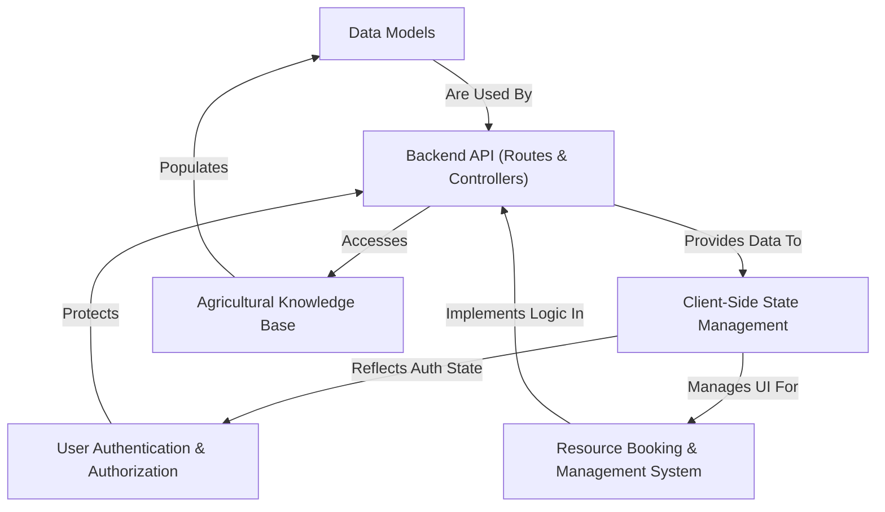

# Tutorial: agri-credit

Agri-credit is a comprehensive **digital platform** designed to _empower farmers_ by providing a central hub for agricultural information and resource management. It offers an **Agricultural Knowledge Base** for crop, soil, disease, and fertilizer advice, and facilitates **resource sharing and booking** of items like organic manures, tractors, and nursery crops within the farming community.

## Visual Overview

## Chapters

1. [Client-Side State Management
   ](01_client_side_state_management_.md)
2. [User Authentication & Authorization
   ](02_user_authentication___authorization_.md)
3. [Agricultural Knowledge Base
   ](03_agricultural_knowledge_base_.md)
4. [Resource Booking & Management System
   ](04_resource_booking___management_system_.md)
5. [Backend API (Routes & Controllers)
   ](05_backend_api__routes___controllers__.md)
6. [Data Models
   ](06_data_models_.md)

---
